# How do I add a game to Archipelago?  
This guide is going to try and be a broad summary of how you can do just that.  
There are two key steps to incorporating a game into Archipelago:  
- Game Modification 
- Archipelago Server Integration

Refer to the following documents as well:
- [network protocol.md](https://github.com/ArchipelagoMW/Archipelago/blob/main/docs/network%20protocol.md) for network communication between client and server.
- [world api.md](https://github.com/ArchipelagoMW/Archipelago/blob/main/docs/world%20api.md) for documentation on server side code and creating a world package.

# Game Modification  
One half of the work required to integrate a game into Archipelago is the development of the game client. This is 
typically done through a modding API or other modification process, described further down.

As an example, modifications to a game typically include (more on this later):
- Hooking into when a 'location check' is completed.
- Networking with the Archipelago server.
- Optionally, UI or HUD updates to show status of the multiworld session or Archipelago server connection.

In order to determine how to modify a game, refer to the following sections.
  
## Engine Identification  
This is a good way to make the modding process much easier. Being able to identify what engine a game was made in is critical. The first step is to look at a game's files. Let's go over what some game files might look like. It’s important that you be able to see file extensions, so be sure to enable that feature in your file viewer of choice.  
Examples are provided below.
  
### Creepy Castle
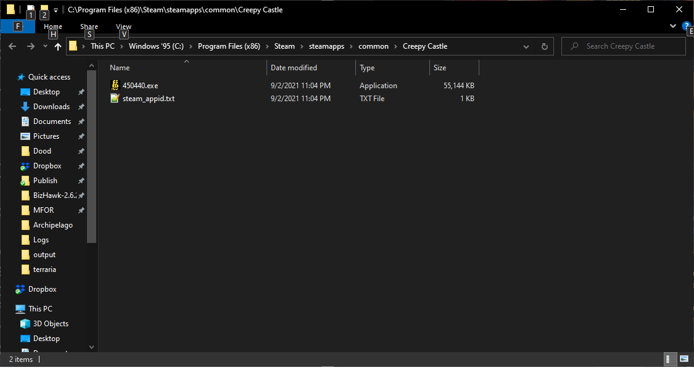  
  
This is the delightful title Creepy Castle, which is a fantastic game that I highly recommend. It’s also your worst-case
scenario as a modder. All that’s present here is an executable file and some meta-information that Steam uses. You have 
basically nothing here to work with. If you want to change this game, the only option you have is to do some pretty nasty 
disassembly and reverse engineering work, which is outside the scope of this tutorial. Let’s look at some other examples 
of game releases.  

### Heavy Bullets
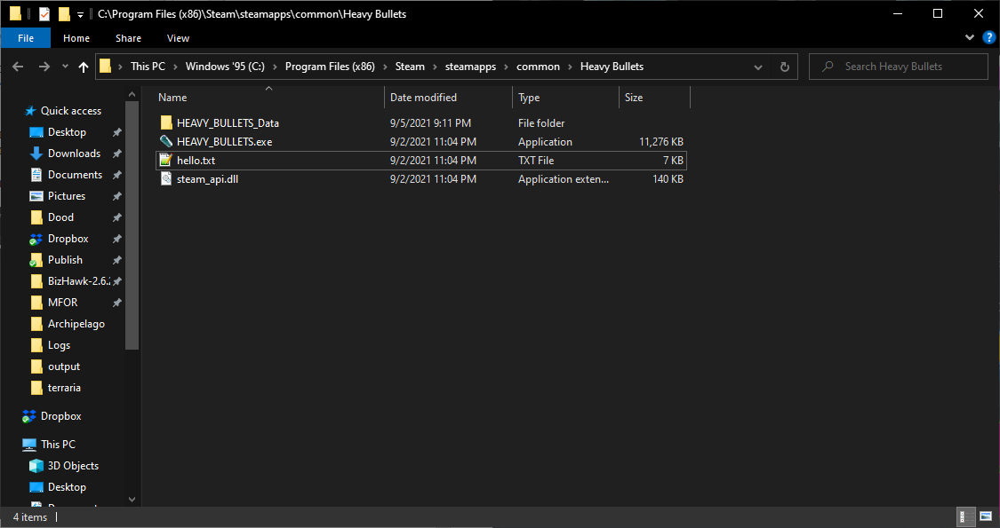  
  
Here’s the release files for another game, Heavy Bullets. We see a .exe file, like expected, and a few more files. 
“hello.txt” is a text file, which we can quickly skim in any text editor. Many games have them in some form, usually 
with a name like README.txt, and they may contain information about a game, such as a EULA, terms of service, licensing 
information, credits, and general info about the game. You usually won’t find anything too helpful here, but it never 
hurts to check. In this case, it contains some credits and a changelog for the game, so nothing too important. 
“steam_api.dll” is a file you can safely ignore, it’s just some code used to interface with Steam. 
The directory “HEAVY_BULLETS_Data”, however, has some good news.  
  
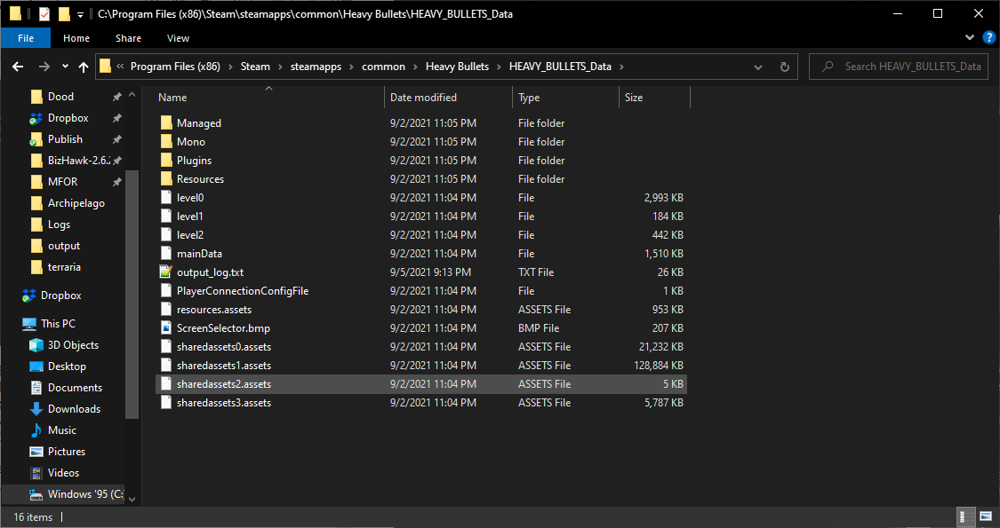  
  
Jackpot! It might not be obvious what you’re looking at here, but I can instantly tell from this folder’s contents that 
what we have is a game made in the Unity Engine. If you look in the sub-folders, you’ll seem some .dll files which affirm 
our suspicions. Telltale signs for this are directories titled “Managed” and “Mono”, as well as the numbered, extension-less 
level files and the sharedassets files. We’ll tell you a bit about why seeing a Unity game is such good news later, 
but for now, this is what one looks like. Also keep your eyes out for an executable with a name like UnityCrashHandler, 
that’s another dead giveaway.  

### Stardew Valley
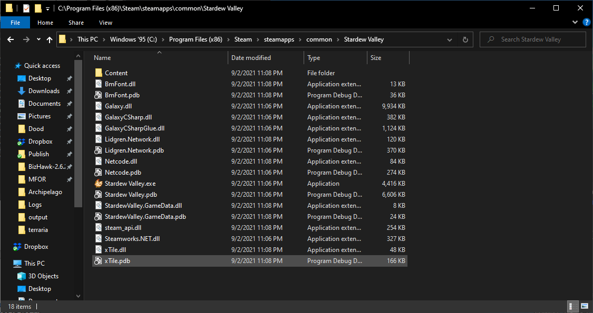  
  
This is the game contents of Stardew Valley. A lot more to look at here, but some key takeaways. 
Notice the .dll files which include “CSharp” in their name. This tells us that the game was made in C#, which is good news. 
More on that later.  

### Gato Roboto
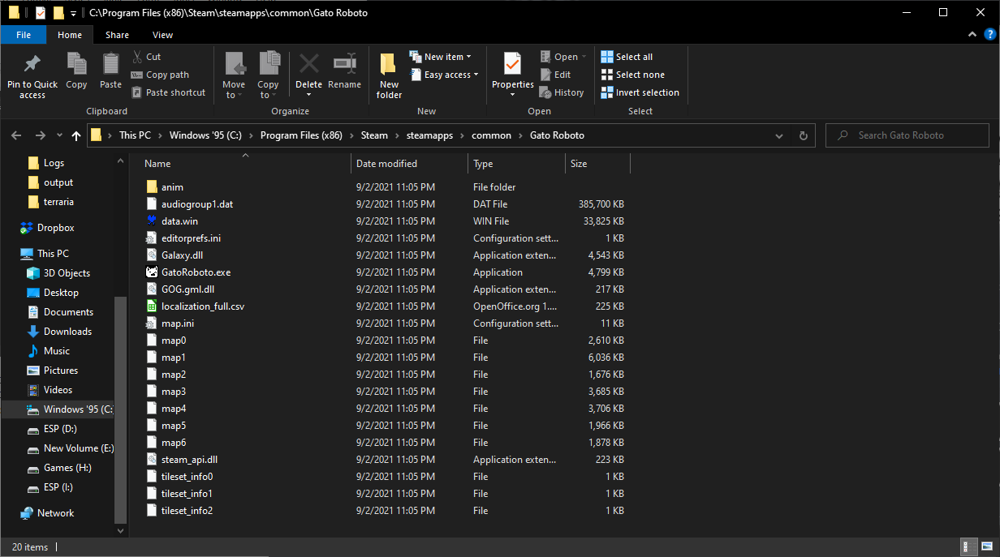  
  
Our last example is the game Gato Roboto. This game is made in GameMaker, which is another green flag to look out for. 
The giveaway is the file titled "data.win". This immediately tips us off that this game was made in GameMaker.  
  
This isn't all you'll ever see looking at game files, but it's a good place to start. 
As a general rule, the more files a game has out in plain sight, the more you'll be able to change. 
This especially applies in the case of code or script files - always keep a lookout for anything you can use to your 
advantage!  
  
## Open or Leaked Source Games
As a side note, many games have either been made open source, or have had source files leaked at some point. 
This can be a boon to any would-be modder, for obvious reasons. 
Always be sure to check - a quick internet search for "(Game) Source Code" might not give results often, but when it 
does you're going to have a much better time.  
  
Be sure never to distribute source code for games that you decompile or find if you do not have express permission to do
so, or to redistribute any materials obtained through similar methods, as this is illegal and unethical.
  
## Modifying Release Versions of Games  
However, for now we'll assume you haven't been so lucky, and have to work with only what’s sitting in your install directory.
Some developers are kind enough to deliberately leave you ways to alter their games, like modding tools, 
but these are often not geared to the kind of work you'll be doing and may not help much. 

As a general rule, any modding tool that lets you write actual code is something worth using.  
  
### Research
The first step is to research your game. Even if you've been dealt the worst hand in terms of engine modification, 
it's possible other motivated parties have concocted useful tools for your game already. 
Always be sure to search the Internet for the efforts of other modders.  
  
### Analysis Tools
Depending on the game’s underlying engine, there may be some tools you can use either in lieu of or in addition to existing game tools.  
  
#### [dnSpy](https://github.com/dnSpy/dnSpy/releases)  
The first tool in your toolbox is dnSpy. 
dnSpy is useful for opening and modifying code files, like .exe and .dll files, that were made in C#. 
This won't work for executable files made by other means, and obfuscated code (code which was deliberately made 
difficult to reverse engineer) will thwart it, but 9 times out of 10 this is exactly what you need. 
You'll want to avoid opening common library files in dnSpy, as these are unlikely to contain the data you're looking to 
modify. 

For Unity games, the file you’ll want to open will be the file (Data Folder)/Managed/Assembly-CSharp.dll, as pictured below:  
  
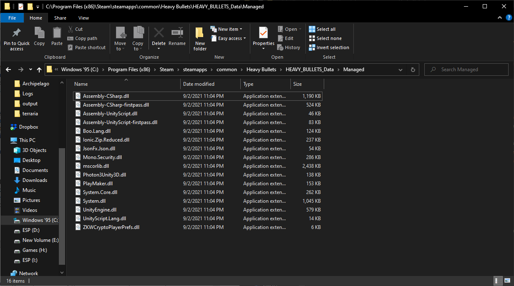  
  
This file will contain the data of the actual game. 
For other C# games, the file you want is usually just the executable itself.  
  
With dnSpy, you can view the game’s C# code, but the tool isn’t perfect. 
Although the names of classes, methods, variables, and more will be preserved, code structures may not remain entirely intact. This is because compilers will often subtly rewrite code to be more optimal, so that it works the same as the original code but uses fewer resources. Compiled C# files also lose comments and other documentation.  
  
#### [UndertaleModTool](https://github.com/krzys-h/UndertaleModTool/releases)  
This is currently the best tool for modifying games made in GameMaker, and supports games made in both GMS 1 and 2. 
It allows you to modify code in GML, if the game wasn't made with the wrong compiler (usually something you don't have 
to worry about). 

You'll want to open the data.win file, as this is where all the goods are kept. 
Like dnSpy, you won’t be able to see comments. 
In addition, you will be able to see and modify many hidden fields on items that GameMaker itself will often hide from 
creators. 

Fonts in particular are notoriously complex, and to add new sprites you may need to modify existing sprite sheets.  
  
#### [CheatEngine](https://cheatengine.org/)  
CheatEngine is a tool with a very long and storied history. 
Be warned that because it performs live modifications to the memory of other processes, it will likely be flagged as 
malware (because this behavior is most commonly found in malware and rarely used by other programs). 
If you use CheatEngine, you need to have a deep understanding of how computers work at the nuts and bolts level, 
including binary data formats, addressing, and assembly language programming. 

The tool itself is highly complex and even I have not yet charted its expanses. 
However, it can also be a very powerful tool in the right hands, allowing you to query and modify gamestate without ever
modifying the actual game itself. 
In theory it is compatible with any piece of software you can run on your computer, but there is no "easy way" to do 
anything with it.  
  
### What Modifications You Should Make to the Game
We talked about this briefly in [Game Modification](#game-modification) section.
The next step is to know what you need to make the game do now that you can modify it. Here are your key goals:  
- Modify the game so that checks are shuffled  
- Know when the player has completed a check, and react accordingly  
- Listen for messages from the Archipelago server  
- Modify the game to display messages from the Archipelago server  
- Add interface for connecting to the Archipelago server with passwords and sessions  
- Add commands for manually rewarding, re-syncing, releasing, and other actions  
  
To elaborate, you need to be able to inform the server whenever you check locations, print out messages that you receive
from the server in-game so players can read them, award items when the server tells you to, sync and re-sync when necessary,
avoid double-awarding items while still maintaining game file integrity, and allow players to manually enter commands in
case the client or server make mistakes. 

Refer to the [Network Protocol documentation](./network%20protocol.md) for how to communicate with Archipelago's servers.  
  
## But my Game is a console game. Can I still add it?  
That depends – what console?  
  
### My Game is a recent game for the PS4/Xbox-One/Nintendo Switch/etc  
Most games for recent generations of console platforms are inaccessible to the typical modder. It is generally advised
that you do not attempt to work with these games as they are difficult to modify and are protected by their copyright
holders. Most modern AAA game studios will provide a modding interface or otherwise deny modifications for their console games.
  
### My Game isn’t that old, it’s for the Wii/PS2/360/etc  
This is very complex, but doable. 
If you don't have good knowledge of stuff like Assembly programming, this is not where you want to learn it. 
There exist many disassembly and debugging tools, but more recent content may have lackluster support.
  
### My Game is a classic for the SNES/Sega Genesis/etc  
That’s a lot more feasible. 
There are many good tools available for understanding and modifying games on these older consoles, and the emulation 
community will have figured out the bulk of the console’s secrets. 
Look for debugging tools, but be ready to learn assembly. 
Old consoles usually have their own unique dialects of ASM you’ll need to get used to. 

Also make sure there’s a good way to interface with a running emulator, since that’s the only way you can connect these
older consoles to the Internet.
There are also hardware mods and flash carts, which can do the same things an emulator would when connected to a computer,
but these will require the same sort of interface software to be written in order to work properly - from your perspective
the two won't really look any different.  
  
### My Game is an exclusive for the Super Baby Magic Dream Boy. It’s this console from the Soviet Union that-  
Unless you have a circuit schematic for the Super Baby Magic Dream Boy sitting on your desk, no. 
Obscurity is your enemy – there will likely be little to no emulator or modding information, and you’d essentially be
working from scratch.  
  
## How to Distribute Game Modifications
**NEVER EVER distribute anyone else's copyrighted work UNLESS THEY EXPLICITLY GIVE YOU PERMISSION TO DO SO!!!**

This is a good way to get any project you're working on sued out from under you.
The right way to distribute modified versions of a game's binaries, assuming that the licensing terms do not allow you
to copy them wholesale, is as patches. 

There are many patch formats, which I'll cover in brief. The common theme is that you can’t distribute anything that
wasn't made by you. Patches are files that describe how your modified file differs from the original one, thus avoiding
the issue of distributing someone else’s original work.

Users who have a copy of the game just need to apply the patch, and those who don’t are unable to play.  

### Patches

#### IPS
IPS patches are a simple list of chunks to replace in the original to generate the output. It is not possible to encode
moving of a chunk, so they may inadvertently contain copyrighted material and should be avoided unless you know it's
fine.

#### UPS, BPS, VCDIFF (xdelta), bsdiff
Other patch formats generate the difference between two streams (delta patches) with varying complexity. This way it is
possible to insert bytes or move chunks without including any original data. Bsdiff is highly optimized and includes
compression, so this format is used by APBP.

Only a bsdiff module is integrated into AP. If the final patch requires or is based on any other patch, convert them to
bsdiff or APBP before adding it to the AP source code as "basepatch.bsdiff4" or "basepatch.apbp".

#### APBP Archipelago Binary Patch
Starting with version 4 of the APBP format, this is a ZIP file containing metadata in `archipelago.json` and additional
files required by the game / patching process. For ROM-based games the ZIP will include a `delta.bsdiff4` which is the
bsdiff between the original and the randomized ROM.

To make using APBP easy, they can be generated by inheriting from `worlds.Files.APDeltaPatch`.

### Mod files
Games which support modding will usually just let you drag and drop the mod’s files into a folder somewhere.
Mod files come in many forms, but the rules about not distributing other people's content remain the same.
They can either be generic and modify the game using a seed or `slot_data` from the AP websocket, or they can be
generated per seed.

If the mod is generated by AP and is installed from a ZIP file, it may be possible to include APBP metadata for easy
integration into the Webhost by inheriting from `worlds.Files.APContainer`.

## Archipelago Integration
Integrating a randomizer into Archipelago involves a few steps.
There are several things that may need to be done, but the most important is to create an implementation of the 
`World` class specific to your game. This implementation should exist as a Python module within the `worlds` folder
in the Archipelago file structure.

This encompasses most of the data for your game – the items available, what checks you have, the logic for reaching those
checks, what options to offer for the player’s yaml file, and the code to initialize all this data.

Here’s an example of what your world module can look like:  
  
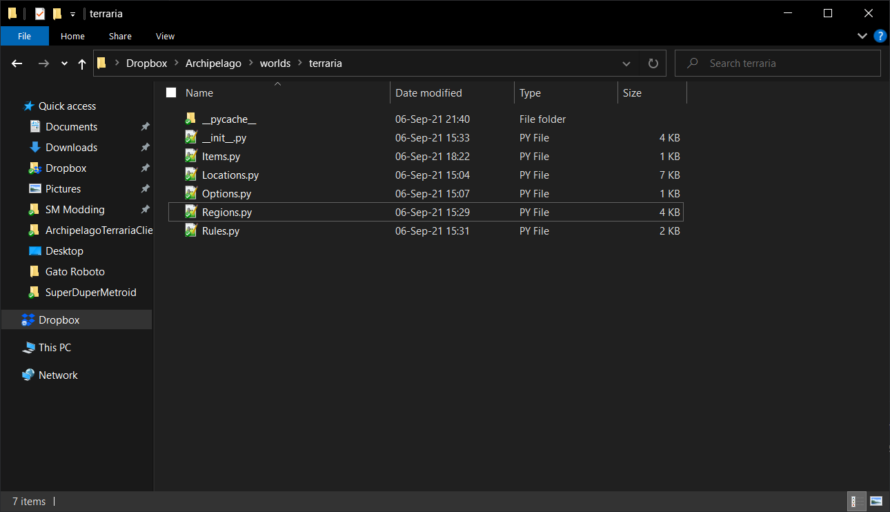

The minimum requirements for a new archipelago world are the package itself (the world folder containing a file named `__init__.py`),
which must define a `World` class object for the game with a game name, create an equal number of items and locations with rules,
a win condition, and at least one `Region` object.
  
Let's give a quick breakdown of what the contents for these files look like.
This is just one example of an Archipelago world - the way things are done below is not an immutable property of Archipelago.  
  
### Items.py  
This file is used to define the items which exist in a given game.  
  
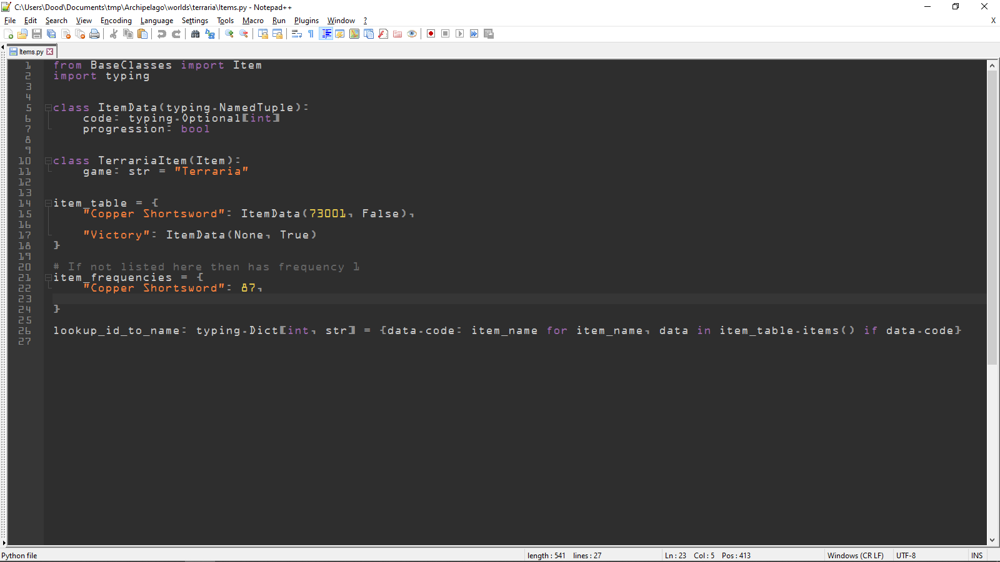  
  
Some important things to note here. The center of our Items.py file is the item_table, which individually lists every
item in the game and associates them with an ItemData.

This file is rather skeletal - most of the actual data has been stripped out for simplicity.
Each ItemData gives a numeric ID to associate with the item and a boolean telling us whether the item might allow the
player to do more than they would have been able to before.  
  
Next there's the item_frequencies. This simply tells Archipelago how many times each item appears in the pool.
Items that appear exactly once need not be listed - Archipelago will interpret absence from this dictionary as meaning
that the item appears once.
  
Lastly, note the `lookup_id_to_name` dictionary, which is typically imported and used in your Archipelago `World`
implementation. This is how Archipelago is told about the items in your world. 

### Locations.py
This file lists all locations in the game.  
  
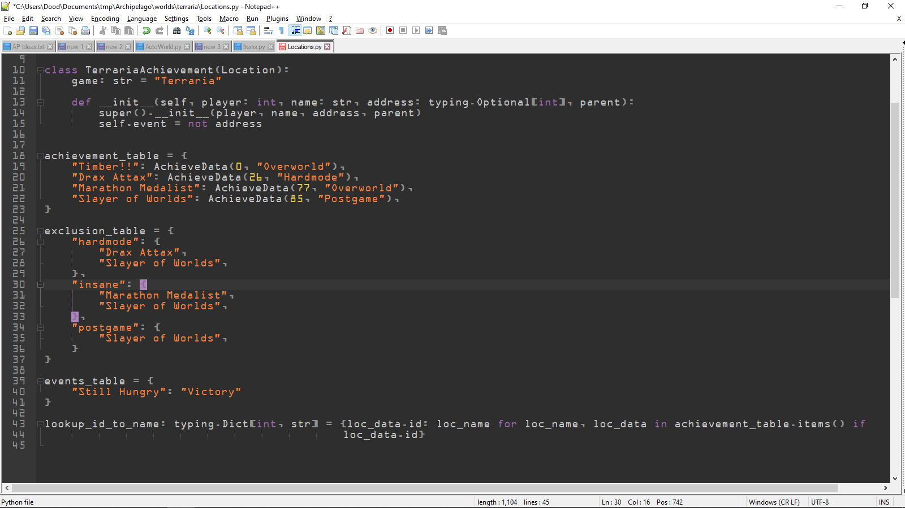  
  
First is the achievement_table. It lists each location, the region that it can be found in (more on regions later),
and a numeric ID to associate with each location.

The exclusion table is a series of dictionaries which are used to exclude certain checks from the pool of progression
locations based on user settings, and the events table associates certain specific checks with specific items.

`lookup_id_to_name` is also present for locations, though this is a separate dictionary, to be clear.  
  
### Options.py  
This file details options to be searched for in a player's YAML settings file.  
  
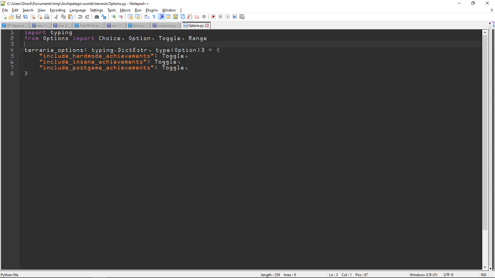  
  
There are several types of option Archipelago has support for.
In our case, we have three separate choices a player can toggle, either On or Off.
You can also have players choose between a number of predefined values, or have them provide a numeric value within a
specified range. 
  
### Regions.py  
This file contains data which defines the world's topology.
In other words, it details how different regions of the game connect to each other.  
  
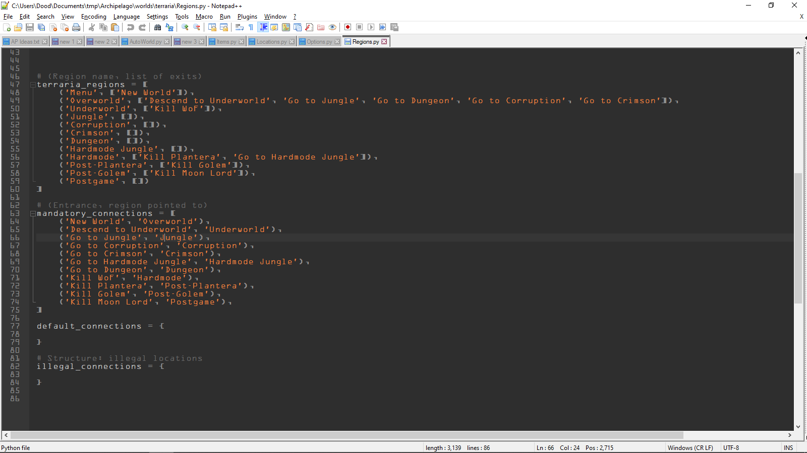  
  
`terraria_regions` contains a list of tuples.
The first element of the tuple is the name of the region, and the second is a list of connections that lead out of the region.

`mandatory_connections` describe where the connection leads.

Above this data is a function called `link_terraria_structures` which uses our defined regions and connections to create
something more usable for Archipelago, but this has been left out for clarity.  
  
### Rules.py  
This is the file that details rules for what players can and cannot logically be required to do, based on items and settings.  
  
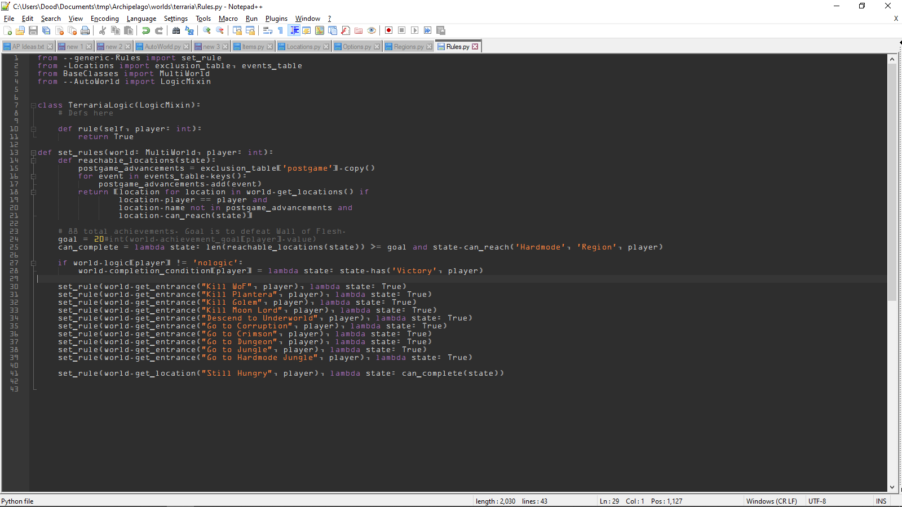  
  
This is the most complicated part of the job, and is one part of Archipelago that is likely to see some changes in the future.
The first class, called `TerrariaLogic`, is an extension of the `LogicMixin` class.
This is where you would want to define methods for evaluating certain conditions, which would then return a boolean to
indicate whether conditions have been met. Your rule definitions should start with some sort of identifier to delineate it
from other games, as all rules are mixed together due to `LogicMixin`. In our case, `_terraria_rule` would be a better name.

The method below, `set_rules()`, is where you would assign these functions as "rules", using lambdas to associate these
functions or combinations of them (or any other code that evaluates to a boolean, in my case just the placeholder `True`)
to certain tasks, like checking locations or using entrances.  
  
### \_\_init\_\_.py  
This is the file that actually extends the `World` class, and is where you expose functionality and data to Archipelago.  
  
  
  
This is the most important file for the implementation, and technically the only one you need, but it's best to keep this
file as short as possible and use other script files to do most of the heavy lifting.
If you've done things well, this will just be where you assign everything you set up in the other files to their associated
fields in the class being extended.

This is also a good place to put game-specific quirky behavior that needs to be managed, as it tends to make things a bit
cluttered if you put these things elsewhere.  
  
The various methods and attributes are documented in `/worlds/AutoWorld.py[World]` and
[world api.md](https://github.com/ArchipelagoMW/Archipelago/blob/main/docs/world%20api.md),
though it is also recommended to look at existing implementations to see how all this works first-hand. 
Once you get all that, all that remains to do is test the game and publish your work.
Make sure to check out [world maintainer.md](./world%20maintainer.md) before publishing.
