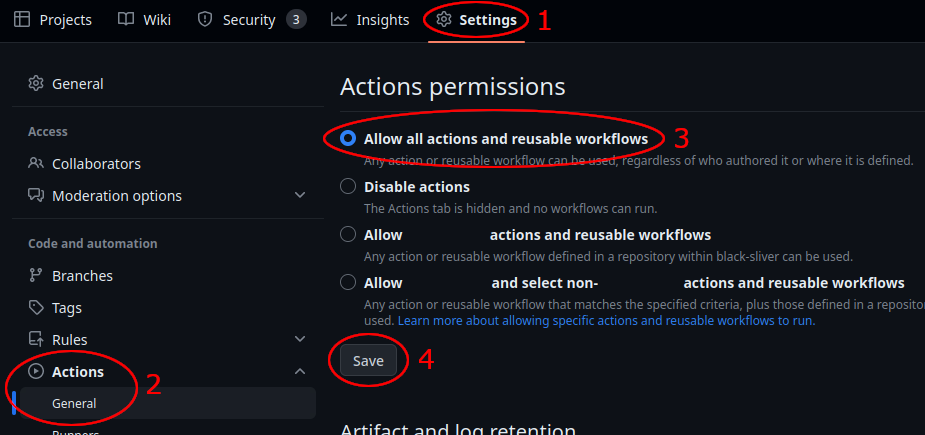

# Contributing
Contributions are welcome. We have a few requests for new contributors:

* **Follow styling guidelines.**
  Please take a look at the [code style documentation](/docs/style.md)
  to ensure ease of communication and uniformity.

* **Ensure that critical changes are covered by tests.** 
It is strongly recommended that unit tests are used to avoid regression and to ensure everything is still working.
If you wish to contribute by adding a new game, please take a look at the [logic unit test documentation](/docs/world%20api.md#tests).
If you wish to contribute to the website, please take a look at [these tests](/test/webhost).

* **Do not introduce unit test failures/regressions.**
Archipelago supports multiple versions of Python. You may need to download older Python versions to fully test
your changes. Currently, the oldest supported version is [Python 3.8](https://www.python.org/downloads/release/python-380/). 
It is recommended that automated github actions are turned on in your fork to have github run all of the unit tests after pushing.
You can turn them on here:  

Other than these requests, we tend to judge code on a case by case basis. 

For contribution to the website, please refer to the [WebHost README](/WebHostLib/README.md).

If you want to contribute to the core, you will be subject to stricter review on your pull requests. It is recommended
that you get in touch with other core maintainers via the [Discord](https://archipelago.gg/discord).

If you want to add Archipelago support for a new game, please take a look at the [adding games documentation](/docs/adding%20games.md), which details what is required 
to implement support for a game, as well as tips for how to get started.
If you want to merge a new game into the main Archipelago repo, please make sure to read the responsibilities as a 
[world maintainer](/docs/world%20maintainer.md).  

For other questions, feel free to explore the [main documentation folder](/docs/) and ask us questions in the #archipelago-dev channel 
of the [Discord](https://archipelago.gg/discord).
