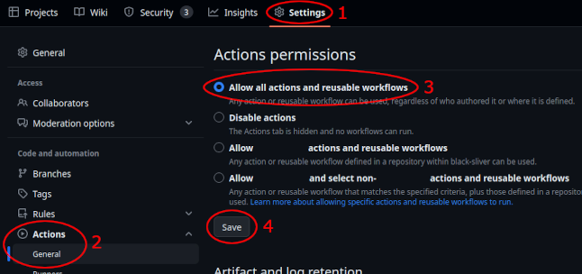

# Contributing

Development happens on GitHub, discussions may happen on [Discord](https://archipelago.gg/discord). Proposing code
changes is done by opening a Pull Request on GitHub.

All contributions are welcome, though we have a few requests of contributors, whether they be for core, webhost, or new 
game contributions:

## Worlds

We consider worlds ("game implementations") as dependencies of Archipelago.

* If you want to contribute to an existing world, please check if the world has contributing guidelines or get in touch
  with the world maintainer. World maintainers are typically listed in the [CODEOWNERS](./CODEOWNERS) file, but the best
  way to get in touch may be via the [Discord](https://archipelago.gg/discord).

* If you want to contribute a new world, or take on world maintainership, please consider the following:
  * Dependencies need to be fit for purpose. This means e.g. reasonable performance, memory usage and load times as
    well as stability (i.e. similar to other games, low failure rate in Multiplayer generations).
    You can make decisions easier for Archipelago ("core") maintainers by employing similar contribution and review
    guidelines as Archipelago has itself.
  * The world maintainer is in charge of the world. Core maintainers should only have to check for security issues,
    however this requires that all changes to a world get properly reviewed/tested by someone if it didn't happen
    already before opening the Pull Request to update the world. If world maintainers open Pull Requests themselves,
    it has to be made clear at what point it is ready to be merged, otherwise the world maintainer's approval means
    it's ready.
  * We strongly recommend making use of unit tests. Please take a look at the
    [logic unit test documentation](/docs/tests.md).
  * We have some expectations of world maintainers, see [world maintainer.md](./world%20maintainer.md).

* For help with adding a new world, please take a look at the [adding games documentation](/docs/adding%20games.md),
  which details what is required to implement support for a game, and has tips on to get started.

## WebHost

The Website has some extra requirements on top of core Archipelago.
Please refer to the [WebHost README](/WebHostLib/README.md).

## Core

* **Follow styling guidelines.**
  Please take a look at the [code style documentation](/docs/style.md)
  to ensure ease of communication and uniformity.

* **Ensure that non-trivial changes are covered by tests.**
  If this is not possible, leave a note in the Pull Request explaining how to test the change.
  For trivial changes, leave a note that the change is trivial.
  If you wish to contribute to the website, take a look at [these tests](/test/webhost).
  While primarily focused on world tests, check [logic unit test documentation](/docs/tests.md)
  to see how to run tests.

* **Do not introduce unit test failures/regressions.**
  Archipelago supports multiple versions of Python. You may need to download older Python versions to fully test
  your changes. See [running from source.md](./running%20from%20source.md)
  for the oldest and newest version currently supported.
  It is recommended that automated GitHub actions are turned on in your fork to have GitHub run unit tests after
  pushing.
  You can turn them on here:  
  

* **Use draft Pull Requests (only) for discussion.**
  Drafts can be used to ask questions about specific code snippets or general design. When opening one, make sure to
  ask your question in the PR. Draft PRs should not receive a full review.
  If the change is not done, and you don't have a question (yet), opening the PR early could hurt visibility later.
  If you want your ongoing work to be discoverable on GitHub, you can open a tracking issue for it.

* **Self-review your code changes**
  according to our [review guidelines](./review%20guidelines.md)
  including static analysis.

* **Follow up on Pull Request comments.**
  if a change was requested, push an update soon or leave a comment.
  Nitpicks that are ignored by the author should still get a reply, so we know when the changes are complete.

* **Help out by reviewing Pull Requests.**
  Everyone can collaborate in testing and reviewing suggested changes, moving the project along faster.
  Please follow the [review guidelines](./review%20guidelines.md) to do a full review, and leave a note that you did,
  or let us know what parts you reviewed or tested in case it was not a full review.
  We cannot determine what "LGTM" means without additional context, so that should not be the norm.

Other than these requests, we tend to judge code on a case-by-case basis.

For other questions, feel free to explore the [main documentation folder](/docs), and ask us questions in the
#ao-core-dev and #ap-world-dev channels of the [Discord](https://archipelago.gg/discord).
