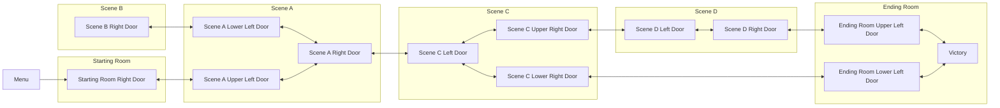
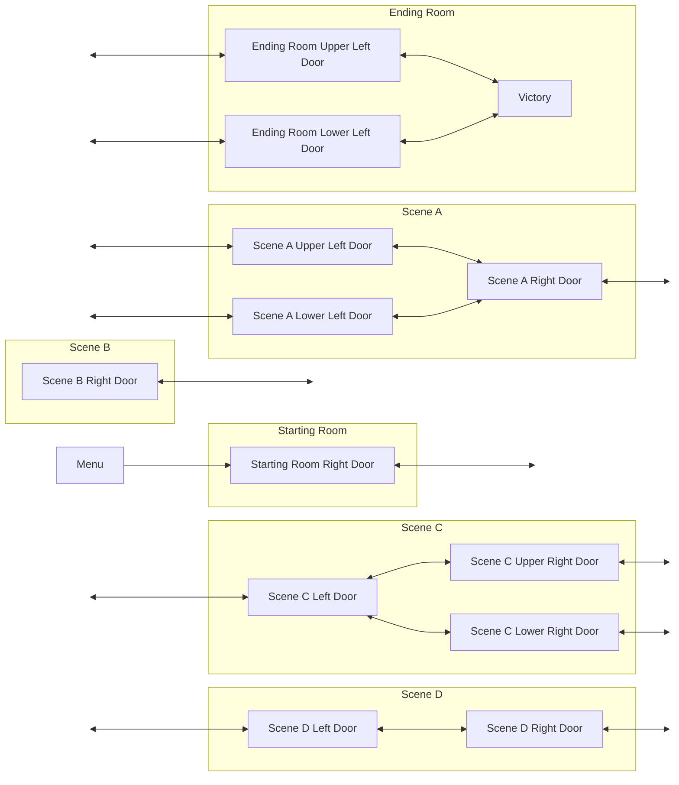
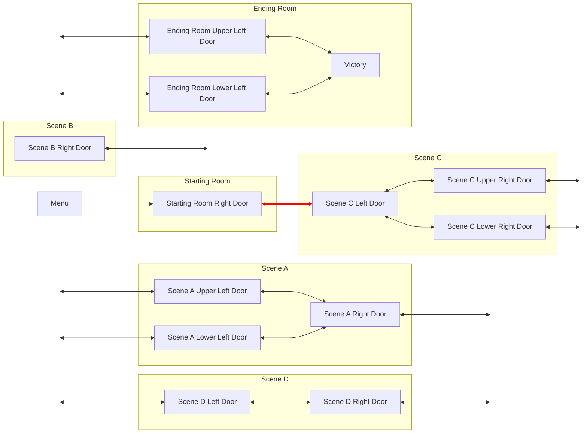
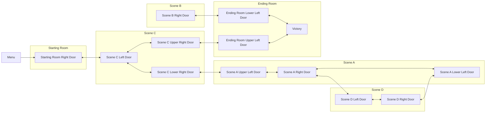
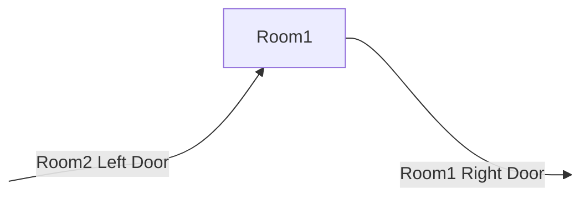
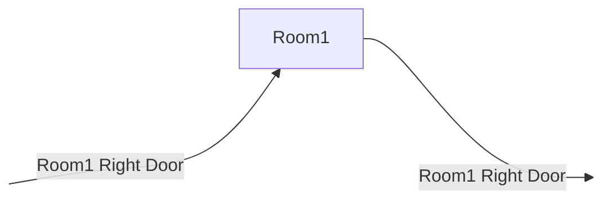

# Entrance Randomization

This document discusses the API and underlying implementation of the generic entrance randomization algorithm
exposed in [entrance_rando.py](/entrance_rando.py). Throughout the doc, entrance randomization is frequently abbreviated
as "ER."

This doc assumes familiarity with Archipelago's graph logic model. If you don't have a solid understanding of how
regions work, you should start there.

## Entrance randomization concepts

### Terminology

Some important terminology to understand when reading this doc and working with ER is listed below.

* Entrance rando - sometimes called "room rando," "transition rando," "door rando," or similar,
  this is a game mode in which the game map itself is randomized.
  In Archipelago, these things are often represented as `Entrance`s in the region graph, so we call it Entrance rando.
* Entrances and exits - entrances are ways into your region, exits are ways out of the region. In code, they are both
  represented as `Entrance` objects. In this doc, the terms "entrances" and "exits" will be used in this sense; the
  `Entrance` class will always be referenced in a code block with an uppercase E.
* Dead end - a connected group of regions which can never help ER progress. This means that it:
  * Is not in any indirect conditions/access rules.
  * Has no plando'd or otherwise preplaced progression items, including events.
  * Has no randomized exits.
* One way transition - a transition that, in the game, is not safe to reverse through (for example, in Hollow Knight,
  some transitions are inaccessible backwards in vanilla and would put you out of bounds). One way transitions are 
  paired together during randomization to prevent such unsafe game states. Most transitions are not one way.

### Basic randomization strategy

The Generic ER algorithm works by using the logic structures you are already familiar with. To give a basic example,
let's assume a toy world is defined with the vanilla region graph modeled below. In this diagram, the smaller boxes
represent regions while the larger boxes represent scenes. Scenes are not an Archipelago concept, the grouping is
purely illustrative.



First, the world begins by splitting the `Entrance`s which should be randomized. This is essentially all that has to be
done on the world side; calling the `randomize_entrances` function will do the rest, using your region definitions and
logic to generate a valid world layout by connecting the partially connected edges you've defined. After you have done
that, your region graph might look something like the following diagram. Note how each randomizable entrance/exit pair
(represented as a bidirectional arrow) is disconnected on one end.

> [!NOTE]
> It is required to use explicit indirect conditions when using Generic ER. Without this restriction,
> Generic ER would have no way to correctly determine that a region may be required in logic,
> leading to significantly higher failure rates due to mis-categorized regions.



From here, you can call the `randomize_entrances` function and Archipelago takes over. Starting from the Menu region,
the algorithm will sweep out to find eligible region exits to randomize. It will then select an eligible target entrance
and connect them, prioritizing giving access to unvisited regions first until all regions are placed. Once the exit has
been connected to the new region, placeholder entrances are deleted. This process is visualized in the diagram below
with the newly connected edge highlighted in red.



This process is then repeated until all disconnected `Entrance`s have been connected or deleted, eventually resulting
in a randomized region layout.



#### ER and minimal accessibility

In general, even on minimal accessibility, ER will prefer to provide access to as many regions as possible. This is for
2 reasons:
1. Generally, having items spread across the world is going to be a more fun/engaging experience for players than
   severely restricting their map. Imagine an ER arrangement with just the start region, the goal region, and exactly
   enough locations in between them to get the goal - this may be the intuitive behavior of minimal, or even the desired
   behavior in some cases, but it is not a particularly interesting randomizer.
2. Giving access to more of the world will give item fill a higher chance to succeed.

However, ER will cull unreachable regions and exits if necessary to save the generation of a beaten minimal.

## Usage

### Defining entrances to be randomized

The first step to using generic ER is defining entrances to be randomized. In order to do this, you will need to
leave partially disconnected exits without a `target_region` and partially disconnected entrances without a
`parent_region`. You can do this either by hand using `region.create_exit` and `region.create_er_target`, or you can
create your vanilla region graph and then use `disconnect_entrance_for_randomization` to split the desired edges.
If you're not sure which to use, prefer the latter approach as it will automatically satisfy the requirements for 
coupled randomization (discussed in more depth later).

> [!TIP]
> It's recommended to give your `Entrance`s non-default names when creating them. The default naming scheme is 
> `f"{parent_region} -> {target_region}"` which is generally not helpful in an entrance rando context - after all,
> the target region will not be the same as vanilla and regions are often not user-facing anyway. Instead consider names
> that describe the location of the exit, such as "Starting Room Right Door."

When creating your `Entrance`s you should also set the randomization type and group. One-way `Entrance`s represent
transitions which are impossible to traverse in reverse. All other transitions are two-ways. To ensure that all
transitions can be accessed in the game, one-ways are only randomized with other one-ways and two-ways are only
randomized with other two-ways. You can set whether an `Entrance` is one-way or two-way using the `randomization_type`
attribute.

`Entrance`s can also set the `randomization_group` attribute to allow for grouping during randomization. This can be
any integer you define and may be based on player options. Some possible use cases for grouping include:
* Directional matching - only match leftward-facing transitions to rightward-facing ones
* Terrain matching - only match water transitions to water transitions and land transitions to land transitions
* Dungeon shuffle - only shuffle entrances within a dungeon/area with each other
* Combinations of the above

By default, all `Entrance`s are placed in the group 0. An entrance can only be a member of one group, but a given group
may connect to many other groups.

### Calling generic ER

Once you have defined all your entrances and exits and connected the Menu region to your region graph, you can call 
`randomize_entrances` to perform randomization.

#### Coupled and uncoupled modes

In coupled randomization, an entrance placed from A to B guarantees that the reverse placement B to A also exists
(assuming that A and B are both two-way doors). Uncoupled randomization does not make this guarantee.

When using coupled mode, there are some requirements for how placeholder ER targets for two-ways are named. 
`disconnect_entrance_for_randomization` will handle this for you. However, if you opt to create your ER targets and
exits by hand, you will need to ensure that ER targets into a region are named the same as the exit they correspond to.
This allows the randomizer to find and connect the reverse pairing after the first pairing is completed. See the diagram
below for an example of incorrect and correct naming.

Incorrect target naming:



Correct target naming:



#### Implementing grouping

When you created your entrances, you defined the group each entrance belongs to. Now you will have to define how groups
should connect with each other. This is done with the `target_group_lookup` and `preserve_group_order` parameters.
There is also a convenience function `bake_target_group_lookup` which can help to prepare group lookups when more
complex group mapping logic is needed. Some recipes for `target_group_lookup` are presented here.

For the recipes below, assume the following groups (if the syntax used here is unfamiliar to you, "bit masking" and 
"bitwise operators" would be the terms to search for):
```python
class Groups(IntEnum):
    # Directions
    LEFT = 1
    RIGHT = 2
    TOP = 3
    BOTTOM = 4
    DOOR = 5
    # Areas
    FIELD = 1 << 3
    CAVE = 2 << 3
    MOUNTAIN = 3 << 3
    # Bitmasks
    DIRECTION_MASK = FIELD - 1
    AREA_MASK = ~0 << 3
```

Directional matching:
```python
direction_matching_group_lookup = {
    # with preserve_group_order = False, pair a left transition to either a right transition or door randomly
    # with preserve_group_order = True, pair a left transition to a right transition, or else a door if no
    #   viable right transitions remain
    Groups.LEFT: [Groups.RIGHT, Groups.DOOR],
    # ...
}
```

Terrain matching or dungeon shuffle:
```python
def randomize_within_same_group(group: int) -> List[int]:
    return [group]
identity_group_lookup = bake_target_group_lookup(world, randomize_within_same_group)
```

Directional + area shuffle:
```python
def get_target_groups(group: int) -> List[int]:
    # example group: LEFT | CAVE
    # example result: [RIGHT | CAVE, DOOR | CAVE]
    direction = group & Groups.DIRECTION_MASK
    area = group & Groups.AREA_MASK
    return [pair_direction | area for pair_direction in direction_matching_group_lookup[direction]]
target_group_lookup = bake_target_group_lookup(world, get_target_groups)
```

#### When to call `randomize_entrances`

The correct step for this is `World.connect_entrances`.

Currently, you could theoretically do it as early as `World.create_regions` or as late as `pre_fill`.
However, there are upcoming changes to Item Plando and Generic Entrance Randomizer to make the two features work better
together.
These changes necessitate that entrance randomization is done exactly in `World.connect_entrances`.
It is fine for your Entrances to be connected differently or not at all before this step.

#### Informing your client about randomized entrances

`randomize_entrances` returns the completed `ERPlacementState`. The `pairings` attribute contains a list of the
created placements by name which can be used to populate slot data.

### Imposing custom constraints on randomization

Generic ER is, as the name implies, generic! That means that your world may have some use case which is not covered by
the ER implementation. To solve this, you can create a custom `Entrance` class which provides custom implementations
for `is_valid_source_transition` and `can_connect_to`. These allow arbitrary constraints to be implemented on
randomization, for instance helping to prevent restrictive sphere 1s or ensuring a maximum distance from a "hub" region.

> [!IMPORTANT]
> When implementing these functions, make sure to use `super().is_valid_source_transition` and `super().can_connect_to`
> as part of your implementation. Otherwise ER may behave unexpectedly.

## Implementation details

This section is a medium-level explainer of the implementation of ER for those who don't want to decipher the code.
However, a basic understanding of the mechanics of `fill_restrictive` will be helpful as many of the underlying
algorithms are shared

ER uses a forward fill approach to create the region layout. First, ER collects `all_state` and performs a region sweep
from Menu, similar to fill. ER then proceeds in stages to complete the randomization:
1. Attempt to connect all non-dead-end regions, prioritizing access to unseen regions so there will always be new exits
   to pair off.
2. Attempt to connect all dead-end regions, so that all regions will be placed
3. Connect all remaining dangling edges now that all regions are placed.
    1. Connect any other dead end entrances (e.g. second entrances to the same dead end regions).
    2. Connect all remaining non-dead-ends amongst each other.

The process for each connection will do the following:
1. Select a randomizable exit of a reachable region which is a valid source transition.
2. Get its group and check `target_group_lookup` to determine which groups are valid targets.
3. Look up ER targets from those groups and find one which is valid according to `can_connect_to`
4. Connect the source exit to the target's target_region and delete the target.
   * In stage 1, before placing the last valid source transition, an additional speculative sweep is performed to ensure
     that there will be an available exit after the placement so randomization can continue.
5. If it's coupled mode, find the reverse exit and target by name and connect them as well.
6. Sweep to update reachable regions.
7. Call the `on_connect` callback.

This process repeats until the stage is complete, no valid source transition is found, or no valid target transition is
found for any source transition. Unlike fill, there is no attempt made to save a failed randomization.