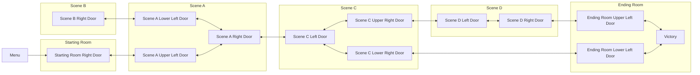
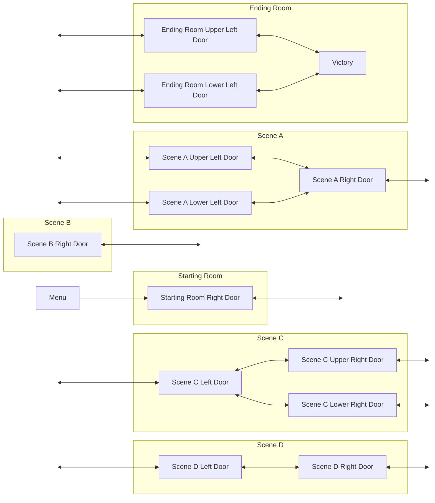
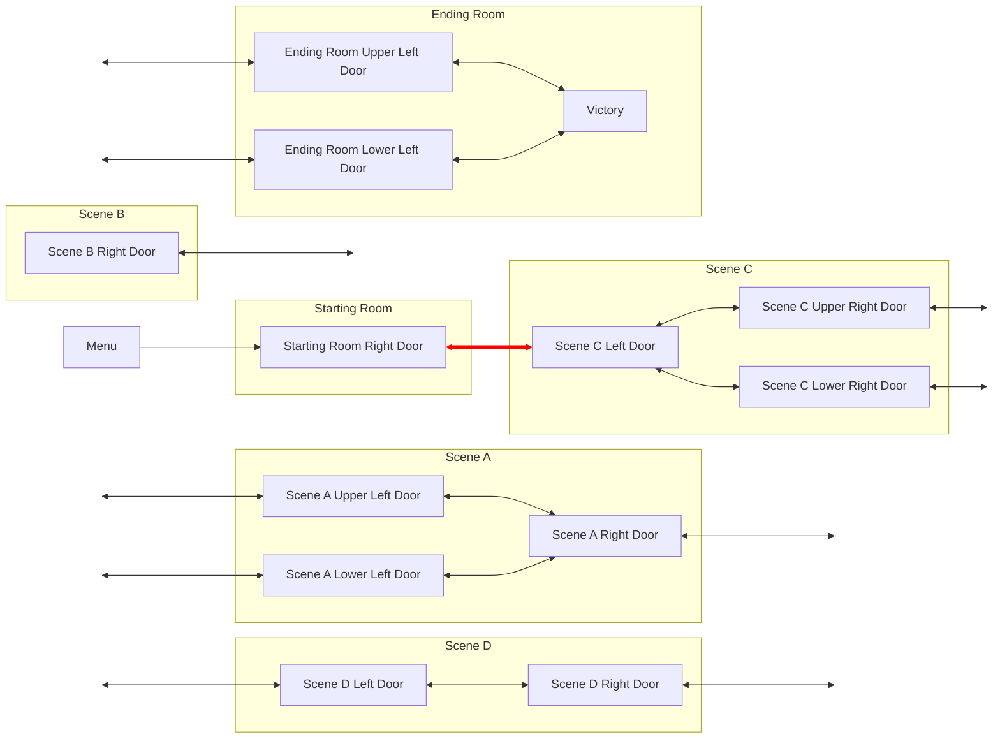
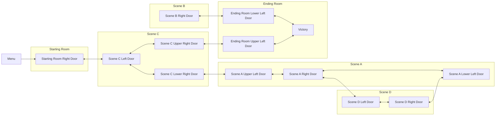

# Entrance Randomization

This document discusses the API and underlying implementation of the generic entrance randomization algorithm
exposed in [entrance_rando.py](/entrance_rando.py). Throughout the doc, entrance randomization is frequently abbreviated
as "ER."

This doc assumes familiarity with Archipelago's graph logic model. If you don't have a solid understanding of how
regions work, you should start there.

## Entrance Randomization Concepts

### Terminology

Some important terminology to understand when reading this doc and working with ER is listed below.

* Entrance rando - sometimes called "room rando," "transition rando," "door rando," or similar,
  this is a game mode in which the game map itself is randomized.
  In Archipelago, these things are often represented as `Entrance`s in the region graph, so we call it Entrance rando.
* Entrances and exits - entrances are ways into your region, exits are ways out of the region. In code, they are both
  represented as `Entrance` objects. In this doc, the terms "entrances" and "exits" will be used in this sense; the
  `Entrance` class will always be referenced in a code block with an uppercase E.
* Dead end - a region which can never give access to additional randomized transitions

### Basic Randomization Strategy

The Generic ER algorithm works by using the logic structures you are already familiar with. To give a basic example,
let's assume a toy world is defined with the vanilla region graph modeled below. In this diagram, the smaller boxes
represent regions while the larger boxes represent scenes. Scenes are not an Archipelago concept, the grouping is
purely illustrative.

First, the world begins by splitting the `Entrance`s which should be randomized. This is essentially all that has to be
done on the world side; calling the `randomize_entrances` function will do the rest, using your region definitions and
logic to generate a valid world layout by connecting the partially connected edges you've defined. After you have done
that, your region graph might look something like the following diagram. Note how each randomizable entrance/exit pair
(represented as a bidirectional arrow) is disconnected on one end.

From here, you can call the `randomize_entrances` function and Archipelago takes over. Starting from the Menu region,
the algorithm will sweep out to find eligible region exits to randomize. It will then select an eligible target entrance
and connect them, prioritizing giving access to unvisited regions first until all regions are placed. Once the exit has
been connected to the new region, placeholder entrances are deleted. This process is visualized in the diagram below
with the newly connected edge highlighted in red.

This process is then repeated until all disconnected `Entrance`s have been connected or deleted, eventually resulting
in a randomized region layout.

## Using Generic ER

### Defining Entrances to be Randomized

### Entrance Groups

### Imposing Custom Constraints on Randomization

## Implementation Details