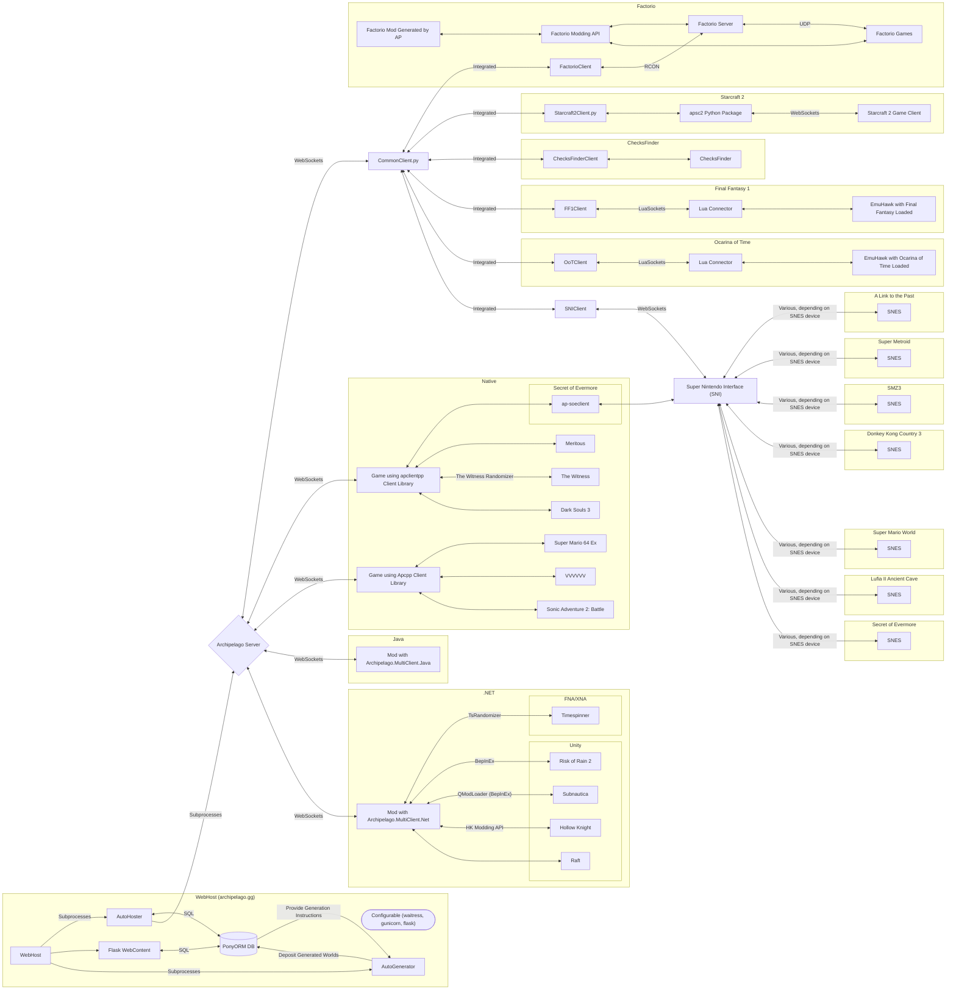

```mermaid
flowchart LR
    %% Diagram arranged specifically so output generates no terrible crossing lines.
    %% AP Server
    AS{Archipelago Server}

    %% CommonClient.py
    CC[CommonClient.py]
    AS <-- WebSockets --> CC

    subgraph "Starcraft 2"
        SC2[Starcraft 2 Game Client]
        SC2C[Starcraft2Client.py]
        SC2AI[apsc2 Python Package]

        SC2C <--> SC2AI <-- WebSockets --> SC2
    end
    CC <-- Integrated --> SC2C

    %% ChecksFinder
    subgraph ChecksFinder
        CFC[ChecksFinderClient]
        CF[ChecksFinder]
        CFC <--> CF
    end
    CC <-- Integrated --> CFC

    %% A Link to the Past
    subgraph A Link to the Past
        LTTP[SNES]
    end
    SNI <-- Various, depending on SNES device --> LTTP

    %% Final Fantasy
    subgraph Final Fantasy 1
        FF1[FF1Client]
        FFLUA[Lua Connector]
        BZFF[EmuHawk with Final Fantasy Loaded]
        FF1 <-- LuaSockets --> FFLUA
        FFLUA <--> BZFF
    end
    CC <-- Integrated --> FF1

    %% Ocarina of Time
    subgraph Ocarina of Time
        OC[OoTClient] 
        LC[Lua Connector]
        OCB[EmuHawk with Ocarina of Time Loaded]
        OC <-- LuaSockets --> LC
        LC <--> OCB
    end
    CC <-- Integrated --> OC

    %% SNI Connectors
    SC[SNIClient]
    SNI["Super Nintendo Interface (SNI)"]
    CC <-- Integrated --> SC
    SC <-- WebSockets --> SNI

    %% Super Metroid
    subgraph Super Metroid
        SM[SNES]
    end
    SNI <-- Various, depending on SNES device --> SM

    %% Super Metroid/A Link to the Past Combo Randomizer
    subgraph "SMZ3"
        SMZ[SNES]
    end
    SNI <-- Various, depending on SNES device --> SMZ

    %% Donkey Kong Country 3
    subgraph Donkey Kong Country 3
        DK3[SNES]
    end
    SNI <-- Various, depending on SNES device --> DK3

    %% Super Mario World
    subgraph Super Mario World
        SMW[SNES]
    end
    SNI <-- Various, depending on SNES device --> SMW

    %% Lufia II Ancient Cave
    subgraph Lufia II Ancient Cave
        L2AC[SNES]
    end
    SNI <-- Various, depending on SNES device --> L2AC

    %% Native Clients or Games
    %% Games or clients which compile to native or which the client is integrated in the game.
    subgraph "Native"
        APCLIENTPP[Game using apclientpp Client Library]
        APCPP[Game using Apcpp Client Library]
        subgraph Secret of Evermore
            SOE[ap-soeclient]
        end
        SM64[Super Mario 64 Ex]
        V6[VVVVVV]
        MT[Meritous]
        TW[The Witness]
        SA2B[Sonic Adventure 2: Battle]
        DS3[Dark Souls 3]

        APCLIENTPP <--> SOE
        APCLIENTPP <--> MT
        APCLIENTPP <-- The Witness Randomizer --> TW
        APCLIENTPP <--> DS3
        APCPP <--> SM64
        APCPP <--> V6
        APCPP <--> SA2B
    end
    SOE <--> SNI <-- Various, depending on SNES device --> SOESNES
    AS <-- WebSockets --> APCLIENTPP
    AS <-- WebSockets --> APCPP

    %% Java Based Games
    subgraph Java
        JM[Mod with Archipelago.MultiClient.Java]
    end
    AS <-- WebSockets --> JM

    %% .NET Based Games
    subgraph .NET
        NM[Mod with Archipelago.MultiClient.Net]
        subgraph FNA/XNA
            TS[Timespinner]
        end
        NM <-- TsRandomizer --> TS
        subgraph Unity
            ROR[Risk of Rain 2]
            SN[Subnautica]
            HK[Hollow Knight]
            R[Raft]
        end
        NM <-- BepInEx --> ROR
        NM <-- "QModLoader (BepInEx)" --> SN
        NM <-- HK Modding API --> HK
        NM <--> R
    end
    AS <-- WebSockets --> NM

    %% Archipelago WebHost
    subgraph "WebHost (archipelago.gg)"
        WHNOTE(["Configurable (waitress, gunicorn, flask)"])
        AH[AutoHoster] 
        PDB[(PonyORM DB)]
        WH[WebHost]
        FWC[Flask WebContent]
        AG[AutoGenerator]

        AH <-- SQL --> PDB
        WH -- Subprocesses --> AH
        FWC <-- SQL --> PDB
        WH --> FWC
        AG -- Deposit Generated Worlds --> PDB
        PDB -- Provide Generation Instructions --> AG
        WH -- Subprocesses --> AG
    end
    AH -- Subprocesses --> AS

    %% Special subgraph for SoE for its SNES connection
    subgraph Secret of Evermore
        SOESNES[SNES]
    end

    %% Factorio
    subgraph Factorio
        FC[FactorioClient] <-- RCON --> FS[Factorio Server]
        FS <-- UDP --> FG[Factorio Games]
        FMOD[Factorio Mod Generated by AP] 
        FMAPI[Factorio Modding API]
        FMAPI <--> FS
        FMAPI <--> FG
        FMOD <--> FMAPI
    end
    CC <-- Integrated --> FC
```
