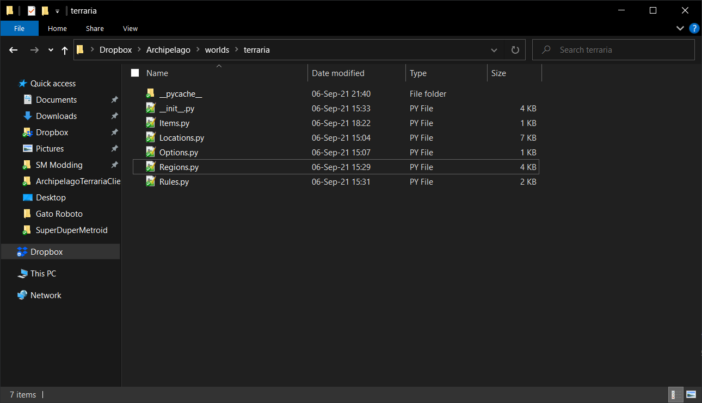
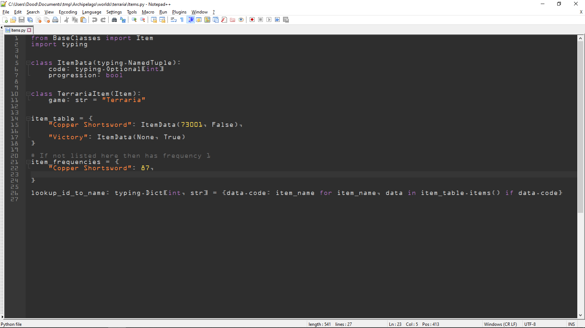
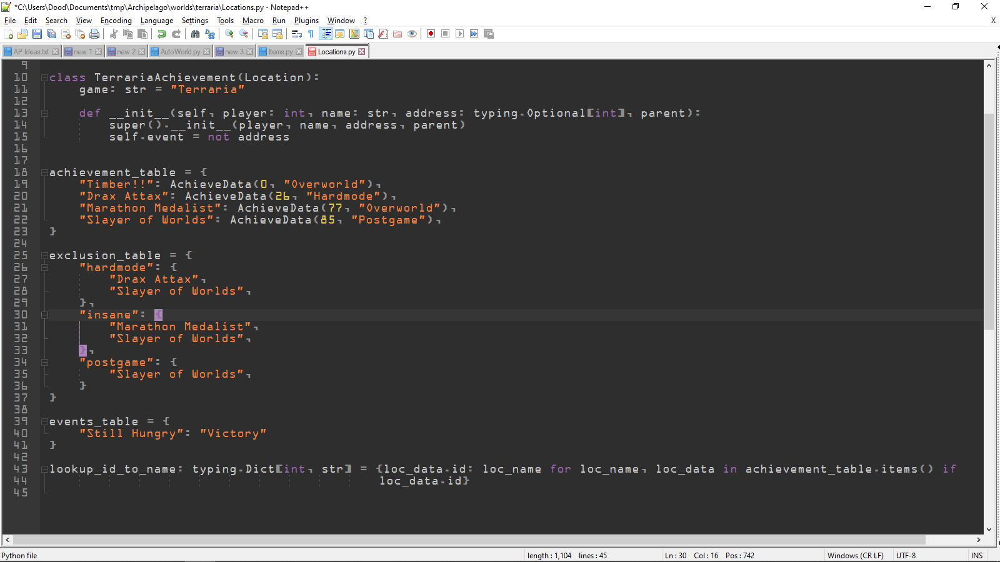
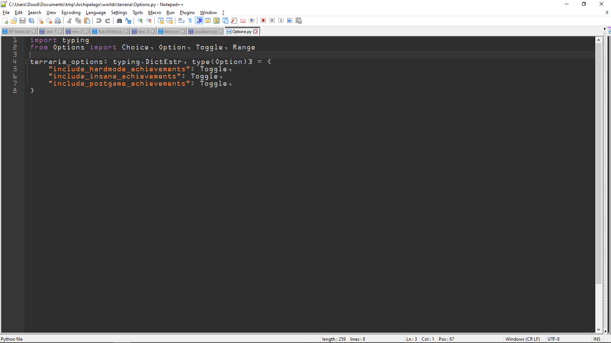
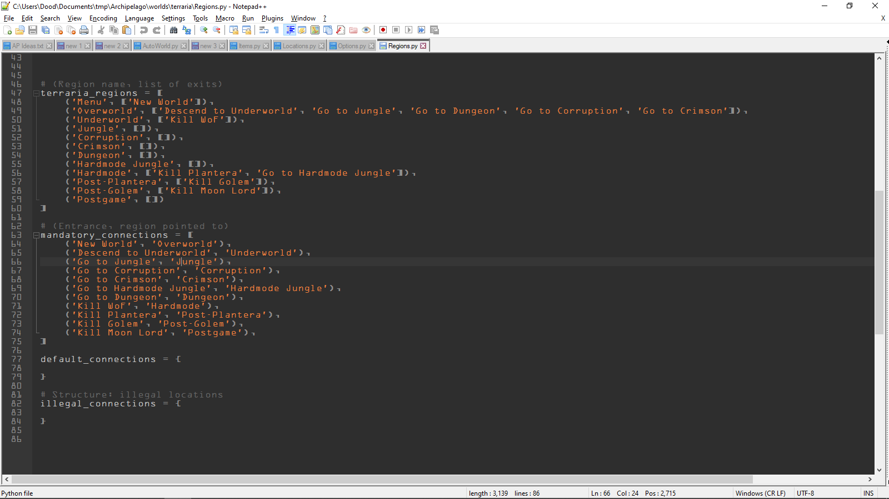
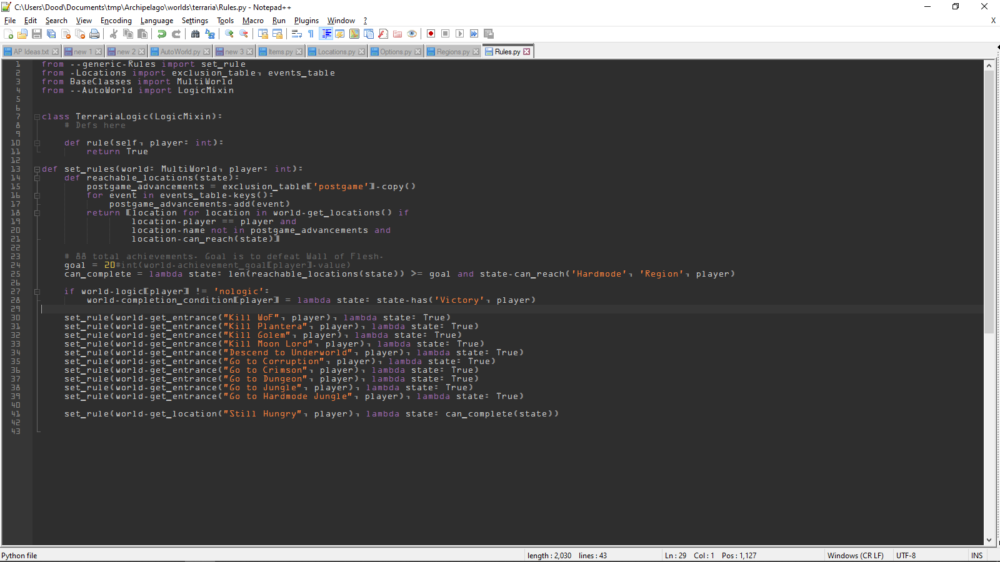
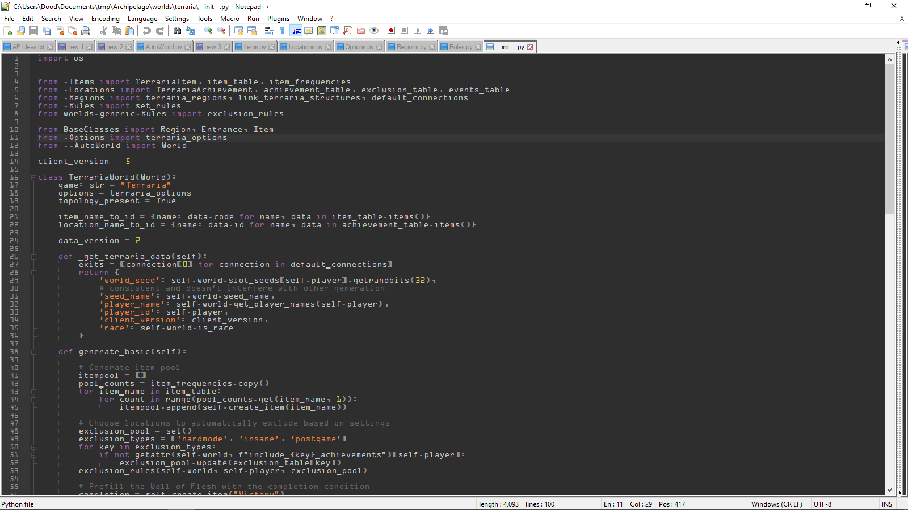

# Archipelago Integration
Integrating a randomizer into Archipelago involves a few steps.
There are several things that may need to be done, but the most important is to create an implementation of the 
`World` class specific to your game. This implementation should exist as a Python module within the `worlds` folder
in the Archipelago file structure.

This encompasses most of the data for your game – the items available, what checks you have, the logic for reaching those
checks, what options to offer for the player’s yaml file, and the code to initialize all this data.

Here’s an example of what your world module can look like:  
  

The minimum requirements for a new archipelago world are the package itself (the world folder containing a file named `__init__.py`),
which must define a `World` class object for the game with a game name, create an equal number of items and locations with rules,
a win condition, and at least one `Region` object.
  
Let's give a quick breakdown of what the contents for these files look like.
This is just one example of an Archipelago world - the way things are done below is not an immutable property of Archipelago.  
  
## Items.py  
This file is used to define the items which exist in a given game.  
  
  
  
Some important things to note here. The center of our Items.py file is the item_table, which individually lists every
item in the game and associates them with an ItemData.

This file is rather skeletal - most of the actual data has been stripped out for simplicity.
Each ItemData gives a numeric ID to associate with the item and a boolean telling us whether the item might allow the
player to do more than they would have been able to before.  
  
Next there's the item_frequencies. This simply tells Archipelago how many times each item appears in the pool.
Items that appear exactly once need not be listed - Archipelago will interpret absence from this dictionary as meaning
that the item appears once.
  
Lastly, note the `lookup_id_to_name` dictionary, which is typically imported and used in your Archipelago `World`
implementation. This is how Archipelago is told about the items in your world. 

## Locations.py
This file lists all locations in the game.  
  
  
  
First is the achievement_table. It lists each location, the region that it can be found in (more on regions later),
and a numeric ID to associate with each location.

The exclusion table is a series of dictionaries which are used to exclude certain checks from the pool of progression
locations based on user settings, and the events table associates certain specific checks with specific items.

`lookup_id_to_name` is also present for locations, though this is a separate dictionary, to be clear.  
  
## Options.py  
This file details options to be searched for in a player's YAML settings file.  
  
  
  
There are several types of option Archipelago has support for.
In our case, we have three separate choices a player can toggle, either On or Off.
You can also have players choose between a number of predefined values, or have them provide a numeric value within a
specified range. 
  
## Regions.py  
This file contains data which defines the world's topology.
In other words, it details how different regions of the game connect to each other.  
  
  
  
`terraria_regions` contains a list of tuples.
The first element of the tuple is the name of the region, and the second is a list of connections that lead out of the region.

`mandatory_connections` describe where the connection leads.

Above this data is a function called `link_terraria_structures` which uses our defined regions and connections to create
something more usable for Archipelago, but this has been left out for clarity.  
  
## Rules.py  
This is the file that details rules for what players can and cannot logically be required to do, based on items and settings.  
  
  
  
This is the most complicated part of the job, and is one part of Archipelago that is likely to see some changes in the future.
The first class, called `TerrariaLogic`, is an extension of the `LogicMixin` class.
This is where you would want to define methods for evaluating certain conditions, which would then return a boolean to
indicate whether conditions have been met. Your rule definitions should start with some sort of identifier to delineate it
from other games, as all rules are mixed together due to `LogicMixin`. In our case, `_terraria_rule` would be a better name.

The method below, `set_rules()`, is where you would assign these functions as "rules", using lambdas to associate these
functions or combinations of them (or any other code that evaluates to a boolean, in my case just the placeholder `True`)
to certain tasks, like checking locations or using entrances.  
  
## \_\_init\_\_.py  
This is the file that actually extends the `World` class, and is where you expose functionality and data to Archipelago.  
  
  
  
This is the most important file for the implementation, and technically the only one you need, but it's best to keep this
file as short as possible and use other script files to do most of the heavy lifting.
If you've done things well, this will just be where you assign everything you set up in the other files to their associated
fields in the class being extended.

This is also a good place to put game-specific quirky behavior that needs to be managed, as it tends to make things a bit
cluttered if you put these things elsewhere.  
  
The various methods and attributes are documented in `/worlds/AutoWorld.py[World]` and
[world api.md](https://github.com/ArchipelagoMW/Archipelago/blob/main/docs/world%20api.md),
though it is also recommended to look at existing implementations to see how all this works first-hand. 
Once you get all that, all that remains to do is test the game and publish your work.