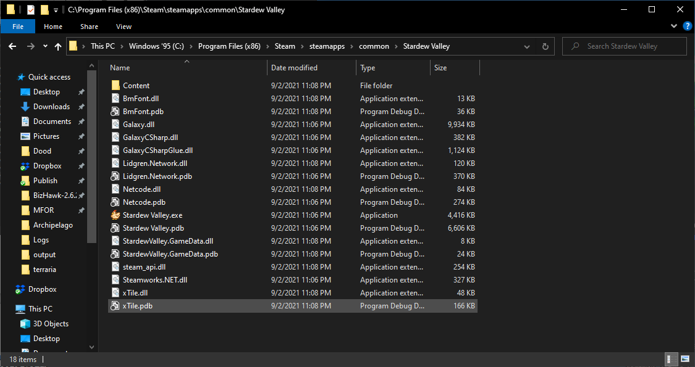

# Adding Games to Archipelago
This guide is going to try and be a broad summary of what is required to add a game integration to Archipelago.

This guide is not an in-depth tutorial on video game modification nor is it a getting started guide to software or 
video game development. The intent is to provide information, tips, and tools, to assist a would-be modder in adding a
game integration to Archipelago.

There are two key steps to incorporating a game into Archipelago:  
- Game Modification 
- Archipelago Server Integration

This document covers game modification. Information on creating the Archipelago server integration may be found in the
[Adding Archipelago Integration](./AddingArchipelagoIntegration.md).

## Game Modification  
One half of the work required to integrate a game into Archipelago is the development of the game client. This is 
typically done through a modding API or other modification process, this is described further down.

As an example, modifications to a game typically include:
- Hooking into when a "location check" is completed.
- Networking with the Archipelago server.
- Optionally, UI or HUD updates to show status of the multiworld session or Archipelago server connection.
  
### Engine Identification  
This is a good way to make the modding process much easier. Being able to identify what engine a game was made in is 
critical. The first step is to look at a game's files. Let's go over what some game files might look like. It’s 
important that you be able to see file extensions, so be sure to enable that feature in your file viewer of choice.

#### Examples
##### Proprietary Game Engine
  
  
This is the game _Creepy Castle_. It’s your worst-case scenario as a modder. All that’s present here is an executable 
file and some meta-information that Steam uses. You have basically nothing here to work with. If you want to change 
this game, the only option you have is to do some pretty nasty disassembly and reverse engineering work, which is 
outside the scope of this tutorial.  

##### Unity Game Engine
  
  
Here’s the release files for another game, _Heavy Bullets_. We see a .exe file, like expected, and a few more files. 
`hello.txt` is a text file, which we can quickly skim in any text editor. Many games have text files in their directories
in some form, usually with a name like `README.txt`. They may contain information about a game, such as a EULA, terms 
of service, licensing information, credits, or other general info about the game. You typically won’t find anything too 
helpful here, but it never hurts to check.

In this case, it contains some credits and a changelog for the game, so nothing too important. 
`steam_api.dll` is a file you can safely ignore, it’s just some code used to interface with Steam. 
The directory `HEAVY_BULLETS_Data`, however, has some good news.  
  
  
  
The contents of the `HEAVY_BULLETS_Data` directory follow the pattern typically used by the Unity game engine. 
If you look in the sub-folders, you’ll seem some .dll files which affirm our suspicions. Telltale signs for this are 
directories titled `Managed` and `Mono`, as well as the numbered, extension-less level files and the sharedassets files.
Also keep your eyes out for an executable with a name like UnityCrashHandler, that’s another dead giveaway.  

##### XNA/FNA
  
  
This is the game contents of _Stardew Valley_. 
A lot more to look at here, but there are some key takeaways. Notice the .dll files which include “CSharp” in their 
name. Also notice the `Content`. These signs point to a game based on the .NET framework and many games following this
style will use the XNA game framework as the base to build their game from.

##### Gato Roboto
  
  
Our last example is the game _Gato Roboto_. Notice the file titled `data.win`. This immediately tips us off that this 
game was made in GameMaker.  

### Open or Leaked Source Games
As a side note, many games have either been made open source, or have had source files leaked at some point. 
This can be a boon to any would-be modder, for obvious reasons. 
Always be sure to check - a quick internet search for "(Game) Source Code" might not give results often, but when it 
does you're going to have a much better time.  
  
Be sure **never** to distribute source code for games that you decompile or find if you do not have express permission 
from the author to do so, nor to redistribute any materials obtained through similar methods, as this is illegal and 
unethical.
  
### Modifying Release Versions of Games
Some developers are kind enough to deliberately leave you ways to alter their games, like modding tools, but these are 
often not geared to the kind of work you'll be doing and may not help much. This is usually assessed on a case-by-case
basis. Games with large modding communities typically grow around the tooling a developer provides or they grow around
the fact that the game is easy to modify in the first place.

As a general rule, any modding tool that lets you write actual code is something worth using.  

### Creating the Mod
#### Research
The first step is to research your game. Even if you've been dealt the worst hand in terms of engine modification, 
it's possible other motivated parties have concocted useful tools for your game already. 
Always be sure to search the Internet for the efforts of other modders.  
  
#### Analysis Tools
Depending on the game’s underlying engine, there may be some tools you can use either in lieu of or in addition to 
existing game tools.  
  
##### ILSpy
You can download ILSpy and see more info about it on the [ILSpy GitHub repository homepage](https://github.com/icsharpcode/ILSpy).

The first tool in your toolbox is ILSpy. ILSpy is a .NET decompiler. The purpose of this program is to take a compiled
.NET assembly (.DLL or .EXE file) and turn it back into human-readable source code. A file is a .NET assembly when it 
was created through the compilation of any programming language targeting the .NET runtime. Usually, the programming
language in question is C# (C Sharp).

Unity games are a combination of native code (compiled in a "native language" such as C++) and .NET code. Most game
developers will write the bulk of their code as C# and this will be compiled by Unity into .NET assemblies. Those files
may then be decompiled with ILSpy to allow you to see the original source code of the game.

For Unity games, the file you’ll typically want to open will be the file (Data Folder)/Managed/Assembly-CSharp.dll, as
pictured below:  
  
  
   
For other .NET based games, which are not made in Unity, the file you want is usually just the executable itself.  

Although the names of classes, methods, variables, and more will be preserved, code structures may not remain entirely
intact. This is because compilers will often subtly rewrite code to be more optimal, so that it works the same as the 
original code but uses fewer resources. Compiled C# files also lose comments and other documentation.  
  
##### UndertaleModTool
You can download and find more info on UndertaleModTool on the [UndertaleModTool GitHub repository homepage](https://github.com/krzys-h/UndertaleModTool/releases).
This is currently the best tool for modifying games made in GameMaker, and supports games made in both GameMaker Studio
1 and 2. It allows you to modify code in GameMaker Language (GML).

Use the tool to open the `data.win` file to see game data and code. 
Like ILSpy, you won’t be able to see comments. 
In addition, you will be able to see and modify many hidden fields on items that GameMaker itself will often hide from 
creators. 

Fonts in particular are notoriously complex, and to add new sprites you may need to modify existing sprite sheets.
  
#### What Modifications You Should Make to the Game
We talked about this briefly in [Game Modification](#game-modification) section.
The next step is to know what you need to make the game do now that you can modify it. Here are your key goals:  
- Modify the game so that checks are shuffled  
- Know when the player has completed a check, and react accordingly  
- Listen for messages from the Archipelago server  
- Modify the game to display messages from the Archipelago server  
- Add interface for connecting to the Archipelago server with passwords and sessions  
- Add commands for manually rewarding, re-syncing, forfeiting, and other actions  
  
To elaborate, you need to be able to inform the server whenever you check locations, print out messages that you receive
from the server in-game so players can read them, award items when the server tells you to, sync and re-sync when necessary,
avoid double-awarding items while still maintaining game file integrity, and allow players to manually enter commands in
case the client or server make mistakes. 

Refer to the [Network Protocol documentation](../NetworkProtocol.md) for how to communicate with Archipelago's servers.  

### Modifying Console Games  
#### My Game is a recent game for the PS4/Xbox-One/Nintendo Switch/etc  
Most games for recent generations of console platforms are inaccessible to the typical modder. It is generally advised
that you do not attempt to work with these games as they are difficult to modify and are protected by their copyright
holders. Most modern AAA game studios will provide a modding interface or otherwise deny modifications for their console
games.

There is some traction on this changing as studios are finding ways to include game modifications in console games.
  
#### My Game isn’t that old, it’s for the Wii/PS2/360/etc  
This is very complex, but doable. 
It is typically necessary to use Assembly (ASM) to modify these games.
If you don't have good knowledge of stuff like Assembly programming, this is not where you want to learn it.
There exist many disassembly and debugging tools, but more recent content may have lackluster support.
  
#### My Game is a classic for the SNES/Sega Genesis/etc  
That’s a lot more feasible. 
There are many good tools available for understanding and modifying games on these older consoles, and the emulation 
community will have figured out the bulk of the console’s secrets. Look for debugging tools, but be ready to learn 
assembly. Old consoles usually have their own unique dialects of ASM you’ll need to get used to. 

Also make sure there’s a good way to interface with a running emulator, since that’s the only way you can connect these
older consoles to the internet. There are also hardware mods and flash carts, which can do the same things an emulator 
would when connected to a computer. These will require the same sort of interface software to be written in order to 
work properly--from your perspective the two won't really look any different.  
  
#### My Game is an exclusive for the Super Baby Magic Dream Boy. It’s this console from the Soviet Union that-  
Unless you have a circuit schematic for the Super Baby Magic Dream Boy sitting on your desk, no. 
Obscurity is your enemy – there will likely be little to no emulator or modding information, and you’d essentially be
working from scratch. You're welcome to try and break ground on something like this, but understand that community
support will range from "extremely limited" to "nonexistent".
  
### How to Distribute Game Modifications
**NEVER EVER distribute anyone else's copyrighted work UNLESS THEY EXPLICITLY GIVE YOU PERMISSION TO DO SO!!!**

The right way to distribute modified versions of a game's binaries is to distribute binary patches. 

The common theme is that you can’t distribute anything that wasn't made by you. Patches are files that describe how 
your modified file differs from the original one without including the original file's content, thus avoiding the issue
of distributing someone else’s original work.

Users who have a copy of the game just need to apply the patch, and those who don’t are unable to play.  

#### Patches
The following patch formats are commonly seen in the game modding scene.

##### IPS
IPS patches are a simple list of chunks to replace in the original to generate the output. It is not possible to encode
moving of a chunk, so they may inadvertently contain copyrighted material and should be avoided unless you know it's
fine.

##### UPS, BPS, VCDIFF (xdelta), bsdiff
Other patch formats generate the difference between two streams (delta patches) with varying complexity. This way it is
possible to insert bytes or move chunks without including any original data. Bsdiff is highly optimized and includes
compression, so this format is used by APBP.

Only a bsdiff module is integrated into AP. If the final patch requires or is based on any other patch, convert them to
bsdiff or APBP before adding it to the AP source code as "basepatch.bsdiff4" or "basepatch.apbp".

##### APBP Archipelago Binary Patch
Starting with version 4 of the APBP format, this is a ZIP file containing metadata in `archipelago.json` and additional
files required by the game / patching process. For ROM-based games the ZIP will include a `delta.bsdiff4` which is the
bsdiff between the original and the randomized ROM.

To make using APBP easy, they can be generated by inheriting from `Patch.APDeltaPatch`.

#### Mod files
Games which support modding will usually just let you drag and drop the mod’s files into a folder somewhere.
Mod files come in many forms, but the rules about not distributing other people's content remain the same.
They can either be generic and modify the game using a seed or `slot_data` from the AP websocket, or they can be
generated per seed.

If the mod is generated by AP and is installed from a ZIP file, it may be possible to include APBP metadata for easy
integration into the Webhost by inheriting from `Patch.APContainer`.
