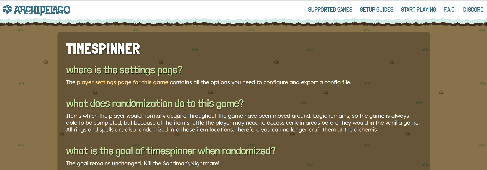
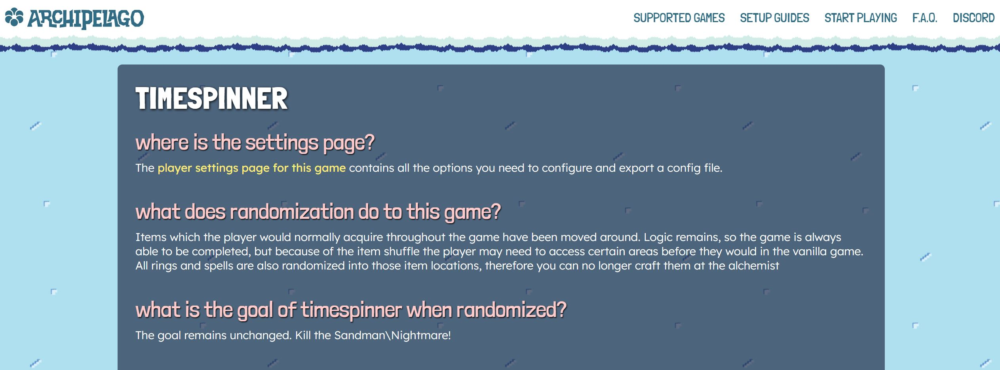

# Archipelago API

This document tries to explain some internals required to implement a game for
Archipelago's generation and server. Once a seed is generated, a client or mod is 
required to send and receive items between the game and server.

Client implementation is out of scope of this document. Please refer to an
existing game that provides a similar API to yours.
Refer to the following documents as well:
- [network protocol.md](https://github.com/ArchipelagoMW/Archipelago/blob/main/docs/network%20protocol.md)
- [adding games.md](https://github.com/ArchipelagoMW/Archipelago/blob/main/docs/adding%20games.md)

Archipelago will be abbreviated as "AP" from now on.


## Language

AP worlds are written in python3.
Clients that connect to the server to sync items can be in any language that
allows using WebSockets.


## Coding style

AP follows [style.md](https://github.com/ArchipelagoMW/Archipelago/blob/main/docs/style.md).
When in doubt use an IDE with coding style linter, for example PyCharm Community Edition.


## Docstrings

Docstrings are strings attached to an object in Python that describe what the
object is supposed to be. Certain docstrings will be picked up and used by AP.
They are assigned by writing a string without any assignment right below a
definition. The string must be a triple-quoted string.
Example:
```python
from worlds.AutoWorld import World
class MyGameWorld(World):
    """This is the description of My Game that will be displayed on the AP
       website."""
```


## Definitions

This section will cover various classes and objects you can use for your world.
While some of the attributes and methods are mentioned here, not all of them are,
but you can find them in `BaseClasses.py`.

### World Class

A `World` class is the class with all the specifics of a certain game to be
included. It will be instantiated for each player that rolls a seed for that
game.

### WebWorld Class

A `WebWorld` class contains specific attributes and methods that can be modified
for your world specifically on the webhost:

`settings_page`, which can be changed to a link instead of an AP generated settings page.

`theme` to be used for your game specific AP pages. Available themes:

| dirt  | grass (default) | grassFlowers | ice  | jungle  | ocean | partyTime | stone |
|---|---|---|---|---|---|---|---|
|  |  |  |  |  |  |  |  |

`bug_report_page` (optional) can be a link to a bug reporting page, most likely a GitHub issue page, that will be placed by the site to help direct users to report bugs.

`tutorials` list of `Tutorial` classes where each class represents a guide to be generated on the webhost.

`game_info_languages` (optional) List of strings for defining the existing gameinfo pages your game supports. The documents must be
prefixed with the same string as defined here. Default already has 'en'.

`options_presets` (optional) A `Dict[str, Dict[str, Any]]` where the keys are the names of the presets and the values 
are the options to be set for that preset. The options are defined as a `Dict[str, Any]` where the keys are the names of
the options and the values are the values to be set for that option. These presets will be available for users to select from on the game's options page.

Note: The values must be a non-aliased value for the option type and can only include the following option types:

  - If you have a `Range`/`NamedRange` option, the value should be an `int` between the `range_start` and `range_end`
    values.
    - If you have a `NamedRange` option, the value can alternatively be a `str` that is one of the 
      `special_range_names` keys.
  - If you have a `Choice` option, the value should be a `str` that is one of the `option_<name>` values. 
  - If you have a `Toggle`/`DefaultOnToggle` option, the value should be a `bool`.
  - `random` is also a valid value for any of these option types.

`OptionDict`, `OptionList`, `OptionSet`, `FreeText`, or custom `Option`-derived classes are not supported for presets on the webhost at this time.

Here is an example of a defined preset:
```python
# presets.py
options_presets = {
    "Limited Potential": {
        "progression_balancing":    0,
        "fairy_chests_per_zone":    2,
        "starting_class":           "random",
        "chests_per_zone":          30,
        "vendors":                  "normal",
        "architect":                "disabled",
        "gold_gain_multiplier":     "half",
        "number_of_children":       2,
        "free_diary_on_generation": False,
        "health_pool":              10,
        "mana_pool":                10,
        "attack_pool":              10,
        "magic_damage_pool":        10,
        "armor_pool":               5,
        "equip_pool":               10,
        "crit_chance_pool":         5,
        "crit_damage_pool":         5,
    }
}

# __init__.py
class RLWeb(WebWorld):
    options_presets = options_presets
    # ...
```

### MultiWorld Object

The `MultiWorld` object references the whole multiworld (all items and locations
for all players) and is accessible through `self.multiworld` inside a `World` object.

### Player

The player is just an integer in AP and is accessible through `self.player`
inside a `World` object.

### Player Options

Players provide customized settings for their World in the form of yamls.
A `dataclass` of valid options definitions has to be provided in `self.options_dataclass`.
(It must be a subclass of `PerGameCommonOptions`.)
Option results are automatically added to the `World` object for easy access.
Those are accessible through `self.options.<option_name>`, and you can get a dictionary of the option values via
`self.options.as_dict(<option_names>)`, passing the desired options as strings. 

### World Settings

Any AP installation can provide settings for a world, for example a ROM file, accessible through
`self.settings.<setting_name>` or `cls.settings.<setting_name>` (new API)
or `Utils.get_options()["<world>_options"]["<setting_name>"]` (deprecated).

Users can set those in their `host.yaml` file. Some settings may automatically open a file browser if a file is missing.

Refer to [settings api.md](https://github.com/ArchipelagoMW/Archipelago/blob/main/docs/settings%20api.md)
for details.

### Locations

Locations are places where items can be located in your game. This may be chests
or boss drops for RPG-like games but could also be progress in a research tree.

Each location has a `name` and an `id` (a.k.a. "code" or "address"), is placed
in a Region, has access rules and a classification.
The name needs to be unique in each game and must not be numeric (has to
contain least 1 letter or symbol). The ID needs to be unique across all games
and is best in the same range as the item IDs.
World-specific IDs are 1 to 2<sup>53</sup>-1, IDs ≤ 0 are global and reserved.

Special locations with ID `None` can hold events.

Classification is one of `LocationProgressType.DEFAULT`, `PRIORITY` or `EXCLUDED`.
The Fill algorithm will force progression items to be placed at priority locations, giving a higher chance of them being
required, and will prevent progression and useful items from being placed at excluded locations.

#### Documenting Locations

Worlds can optionally provide a `location_descriptions` map which contains
human-friendly descriptions of locations or location groups. These descriptions
will show up in location-selection options in the Weighted Options page. Extra
indentation and single newlines will be collapsed into spaces.

```python
# Locations.py

location_descriptions = {
    "Red Potion #6": "In a secret destructible block under the second stairway",
    "L2 Spaceship": """
      The group of all items in the spaceship in Level 2.

      This doesn't include the item on the spaceship door, since it can be
      accessed without the Spaeship Key.
    """
}
```

```python
# __init__.py

from worlds.AutoWorld import World
from .Locations import location_descriptions


class MyGameWorld(World):
    location_descriptions = location_descriptions
```

### Items

Items are all things that can "drop" for your game. This may be RPG items like
weapons, could as well be technologies you normally research in a research tree.

Each item has a `name`, an `id` (can be known as "code"), and a classification.
The most important classification is `progression` (formerly advancement).
Progression items are items which a player may require to progress in
their world. Progression items will be assigned to locations with higher
priority and moved around to meet defined rules and accomplish progression
balancing.

The name needs to be unique in each game, meaning a duplicate item has the
same ID. Name must not be numeric (has to contain at least 1 letter or symbol).

Special items with ID `None` can mark events (read below).

Other classifications include
* `filler`: a regular item or trash item
* `useful`: generally quite useful, but not required for anything logical
* `trap`: negative impact on the player
* `skip_balancing`: denotes that an item should not be moved to an earlier sphere for the purpose of balancing (to be
  combined with `progression`; see below)
* `progression_skip_balancing`: the combination of `progression` and `skip_balancing`, i.e., a progression item that
  will not be moved around by progression balancing; used, e.g., for currency or tokens

#### Documenting Items

Worlds can optionally provide an `item_descriptions` map which contains
human-friendly descriptions of items or item groups. These descriptions will
show up in item-selection options in the Weighted Options page. Extra
indentation and single newlines will be collapsed into spaces.

```python
# Items.py

item_descriptions = {
    "Red Potion": "A standard health potion",
    "Spaceship Key": """
      The key to the spaceship in Level 2.

      This is necessary to get to the Star Realm.
    """
}
```

```python
# __init__.py

from worlds.AutoWorld import World
from .Items import item_descriptions


class MyGameWorld(World):
    item_descriptions = item_descriptions
```

### Events

Events will mark some progress. You define an event location, an
event item, strap some rules to the location (i.e. hold certain
items) and manually place the event item at the event location.

Events can be used to either simplify the logic or to get better spoiler logs.
Events will show up in the spoiler playthrough but they do not represent actual
items or locations within the game.

There is one special case for events: Victory. To get the win condition to show
up in the spoiler log, you create an event item and place it at an event
location with the `access_rules` for game completion. Once that's done, the
world's win condition can be as simple as checking for that item.

By convention the victory event is called `"Victory"`. It can be placed at one
or more event locations based on player options.

### Regions

Regions are logical groups of locations that share some common access rules. If
location logic is written from scratch, using regions greatly simplifies the
definition and allows to somewhat easily implement things like entrance
randomizer in logic.

Regions have a list called `exits`, which are `Entrance` objects representing
transitions to other regions.

There has to be one special region "Menu" from which the logic unfolds. AP
assumes that a player will always be able to return to the "Menu" region by
resetting the game ("Save and quit").

### Entrances

An `Entrance` connects to a region, is assigned to region's exits and has rules
to define if it and thus the connected region is accessible.
They can be static (regular logic) or be defined/connected during generation
(entrance randomizer).

### Access Rules

An access rule is a function that returns `True` or `False` for a `Location` or
`Entrance` based on the current `state` (items that can be collected).

### Item Rules

An item rule is a function that returns `True` or `False` for a `Location` based
on a single item. It can be used to reject placement of an item there.


## Implementation

### Your World

All code for your world implementation should be placed in a python package in
the `/worlds` directory. The starting point for the package is `__init__.py`.
Conventionally, your world class is placed in that file.

World classes must inherit from the `World` class in `/worlds/AutoWorld.py`,
which can be imported as `from worlds.AutoWorld import World` from your package.

AP will pick up your world automatically due to the `AutoWorld` implementation.

### Requirements

If your world needs specific python packages, they can be listed in
`worlds/<world_name>/requirements.txt`. ModuleUpdate.py will automatically
pick up and install them.

See [pip documentation](https://pip.pypa.io/en/stable/cli/pip_install/#requirements-file-format).

### Relative Imports

AP will only import the `__init__.py`. Depending on code size it makes sense to
use multiple files and use relative imports to access them.

e.g. `from .options import MyGameOptions` from your `__init__.py` will load
`world/[world_name]/options.py` and make its `MyGameOptions` accessible.

When imported names pile up it may be easier to use `from . import options`
and access the variable as `options.MyGameOptions`.

Imports from directories outside your world should use absolute imports.
Correct use of relative / absolute imports is required for zipped worlds to
function, see [apworld specification.md](apworld%20specification.md).

### Your Item Type

Each world uses its own subclass of `BaseClasses.Item`. The constructor can be
overridden to attach additional data to it, e.g. "price in shop".
Since the constructor is only ever called from your code, you can add whatever
arguments you like to the constructor.

In its simplest form we only set the game name and use the default constructor
```python
from BaseClasses import Item

class MyGameItem(Item):
    game: str = "My Game"
```
By convention this class definition will either be placed in your `__init__.py`
or your `items.py`. For a more elaborate example see `worlds/oot/Items.py`.

### Your location type

The same we have done for items above, we will do for locations
```python
from BaseClasses import Location

class MyGameLocation(Location):
    game: str = "My Game"

    # override constructor to automatically mark event locations as such
    def __init__(self, player: int, name = "", code = None, parent = None) -> None:
        super(MyGameLocation, self).__init__(player, name, code, parent)
        self.event = code is None
```
in your `__init__.py` or your `locations.py`.

### Options

By convention options are defined in `options.py` and will be used when parsing
the players' yaml files.

Each option has its own class, inherits from a base option type, has a docstring 
to describe it and a `display_name` property for display on the website and in
spoiler logs.

The actual name as used in the yaml is defined via the field names of a `dataclass` that is
assigned to the world under `self.options_dataclass`. By convention, the strings
that define your option names should be in `snake_case`.

Common option types are `Toggle`, `DefaultOnToggle`, `Choice`, `Range`.
For more see `Options.py` in AP's base directory.

#### Toggle, DefaultOnToggle

These don't need any additional properties defined. After parsing the option,
its `value` will either be True or False.

#### Range

Define properties `range_start`, `range_end` and `default`. Ranges will be
displayed as sliders on the website and can be set to random in the yaml.

#### Choice

Choices are like toggles, but have more options than just True and False.
Define a property `option_<name> = <number>` per selectable value and
`default = <number>` to set the default selection. Aliases can be set by
defining a property `alias_<name> = <same number>`.

```python
option_off = 0
option_on = 1
option_some = 2
alias_disabled = 0
alias_enabled = 1
default = 0
```

#### Sample
```python
# options.py

from dataclasses import dataclass
from Options import Toggle, Range, Choice, PerGameCommonOptions

class Difficulty(Choice):
    """Sets overall game difficulty."""
    display_name = "Difficulty"
    option_easy = 0
    option_normal = 1
    option_hard = 2
    alias_beginner = 0  # same as easy
    alias_expert = 2  # same as hard
    default = 1  # default to normal

class FinalBossHP(Range):
    """Sets the HP of the final boss"""
    display_name = "Final Boss HP"
    range_start = 100
    range_end = 10000
    default = 2000

class FixXYZGlitch(Toggle):
    """Fixes ABC when you do XYZ"""
    display_name = "Fix XYZ Glitch"

# By convention, we call the options dataclass `<world>Options`.
# It has to be derived from 'PerGameCommonOptions'.
@dataclass
class MyGameOptions(PerGameCommonOptions):
    difficulty: Difficulty
    final_boss_hp: FinalBossHP
    fix_xyz_glitch: FixXYZGlitch
```

```python
# __init__.py

from worlds.AutoWorld import World
from .options import MyGameOptions  # import the options dataclass


class MyGameWorld(World):
    # ...
    options_dataclass = MyGameOptions  # assign the options dataclass to the world
    options: MyGameOptions  # typing for option results
    # ...
```

### A World Class Skeleton

```python
# world/mygame/__init__.py

import settings
import typing
from .options import MyGameOptions  # the options we defined earlier
from .items import mygame_items  # data used below to add items to the World
from .locations import mygame_locations  # same as above
from worlds.AutoWorld import World
from BaseClasses import Region, Location, Entrance, Item, RegionType, ItemClassification


class MyGameItem(Item):  # or from Items import MyGameItem
    game = "My Game"  # name of the game/world this item is from


class MyGameLocation(Location):  # or from Locations import MyGameLocation
    game = "My Game"  # name of the game/world this location is in


class MyGameSettings(settings.Group):
    class RomFile(settings.SNESRomPath):
        """Insert help text for host.yaml here."""

    rom_file: RomFile = RomFile("MyGame.sfc")


class MyGameWorld(World):
    """Insert description of the world/game here."""
    game = "My Game"  # name of the game/world
    options_dataclass = MyGameOptions  # options the player can set
    options: MyGameOptions  # typing hints for option results
    settings: typing.ClassVar[MyGameSettings]  # will be automatically assigned from type hint
    topology_present = True  # show path to required location checks in spoiler

    # ID of first item and location, could be hard-coded but code may be easier
    # to read with this as a property.
    base_id = 1234
    # Instead of dynamic numbering, IDs could be part of data.

    # The following two dicts are required for the generation to know which
    # items exist. They could be generated from json or something else. They can
    # include events, but don't have to since events will be placed manually.
    item_name_to_id = {name: id for
                       id, name in enumerate(mygame_items, base_id)}
    location_name_to_id = {name: id for
                           id, name in enumerate(mygame_locations, base_id)}

    # Items can be grouped using their names to allow easy checking if any item
    # from that group has been collected. Group names can also be used for !hint
    item_name_groups = {
        "weapons": {"sword", "lance"},
    }
```

### Generation

The world has to provide the following things for generation

* the properties mentioned above 
* additions to the item pool
* additions to the regions list: at least one called "Menu"
* locations placed inside those regions
* a `def create_item(self, item: str) -> MyGameItem` to create any item on demand
* applying `self.multiworld.push_precollected` for world defined start inventory
* `required_client_version: Tuple[int, int, int]`
  Optional client version as tuple of 3 ints to make sure the client is compatible to
  this world (e.g. implements all required features) when connecting.

In addition, the following methods can be implemented and are called in this order during generation

* `stage_assert_generate(cls, multiworld)` is a class method called at the start of
  generation to check the existence of prerequisite files, usually a ROM for
  games which require one.
* `generate_early(self)`
  called per player before any items or locations are created. You can set properties on your world here. Already has
  access to player options and RNG. This is the earliest step where the world should start setting up for the current
  multiworld as any steps before this, the multiworld itself is still getting set up
* `create_regions(self)`
  called to place player's regions and their locations into the MultiWorld's regions list. If it's
  hard to separate, this can be done during `generate_early` or `create_items` as well.
* `create_items(self)`
  called to place player's items into the MultiWorld's itempool. After this step all regions and items have to be in
  the MultiWorld's regions and itempool, and these lists should not be modified afterwards.
* `set_rules(self)`
  called to set access and item rules on locations and entrances. 
  Locations have to be defined before this, or rule application can miss them.
* `generate_basic(self)`
  called after the previous steps. Some placement and player specific
  randomizations can be done here.
* `pre_fill(self)`, `fill_hook(self)` and `post_fill(self)` are called to modify item placement
  before, during and after the regular fill process, before `generate_output`.
  If items need to be placed during pre_fill, these items can be determined
  and created using `get_prefill_items`
* `generate_output(self, output_directory: str)` that creates the output
  files if there is output to be generated. When this is
  called, `self.multiworld.get_locations(self.player)` has all locations for the player, with
  attribute `item` pointing to the item.
  `location.item.player` can be used to see if it's a local item.
* `fill_slot_data(self)` and `modify_multidata(self, multidata: Dict[str, Any])` can be used to modify the data that
  will be used by the server to host the MultiWorld.


#### generate_early

```python
def generate_early(self) -> None:
    # read player settings to world instance
    self.final_boss_hp = self.options.final_boss_hp.value
```

#### create_item

```python
# we need a way to know if an item provides progress in the game ("key item")
# this can be part of the items definition, or depend on recipe randomization
from .items import is_progression  # this is just a dummy

def create_item(self, item: str) -> MyGameItem:
    # This is called when AP wants to create an item by name (for plando) or
    # when you call it from your own code.
    classification = ItemClassification.progression if is_progression(item) else \
                     ItemClassification.filler
    return MyGameItem(item, classification, self.item_name_to_id[item],
                      self.player)

def create_event(self, event: str) -> MyGameItem:
    # while we are at it, we can also add a helper to create events
    return MyGameItem(event, True, None, self.player)
```

#### create_items

```python
def create_items(self) -> None:
    # Add items to the Multiworld.
    # If there are two of the same item, the item has to be twice in the pool.
    # Which items are added to the pool may depend on player settings,
    # e.g. custom win condition like triforce hunt.
    # Having an item in the start inventory won't remove it from the pool.
    # If an item can't have duplicates it has to be excluded manually.

    # List of items to exclude, as a copy since it will be destroyed below
    exclude = [item for item in self.multiworld.precollected_items[self.player]]

    for item in map(self.create_item, mygame_items):
        if item in exclude:
            exclude.remove(item)  # this is destructive. create unique list above
            self.multiworld.itempool.append(self.create_item("nothing"))
        else:
            self.multiworld.itempool.append(item)

    # itempool and number of locations should match up.
    # If this is not the case we want to fill the itempool with junk.
    junk = 0  # calculate this based on player settings
    self.multiworld.itempool += [self.create_item("nothing") for _ in range(junk)]
```

#### create_regions

```python
def create_regions(self) -> None:
    # Add regions to the multiworld. "Menu" is the required starting point.
    # Arguments to Region() are name, player, world, and optionally hint_text
    menu_region = Region("Menu", self.player, self.multiworld)
    self.multiworld.regions.append(menu_region)  # or use += [menu_region...]
    
    main_region = Region("Main Area", self.player, self.multiworld)
    # Add main area's locations to main area (all but final boss)
    main_region.add_locations(main_region_locations, MyGameLocation)
    # or 
    # main_region.locations = \
    #   [MyGameLocation(self.player, location_name, self.location_name_to_id[location_name], main_region]
    self.multiworld.regions.append(main_region)
    
    boss_region = Region("Boss Room", self.player, self.multiworld)
    # Add event to Boss Room
    boss_region.locations.append(MyGameLocation(self.player, "Final Boss", None, boss_region))

    # If entrances are not randomized, they should be connected here,
    # otherwise they can also be connected at a later stage.
    # Create Entrances and connect the Regions
    menu_region.connect(main_region)  # connects the "Menu" and "Main Area", can also pass a rule
    # or
    main_region.add_exits({"Boss Room": "Boss Door"}, {"Boss Room": lambda state: state.has("Sword", self.player)})
    # Connects the "Main Area" and "Boss Room" regions, and places a rule requiring the "Sword" item to traverse
    
    # If setting location access rules from data is easier here, set_rules can
    # possibly omitted.
```

#### generate_basic

```python
def generate_basic(self) -> None:
    # place "Victory" at "Final Boss" and set collection as win condition
    self.multiworld.get_location("Final Boss", self.player)
        .place_locked_item(self.create_event("Victory"))
    self.multiworld.completion_condition[self.player] =
        lambda state: state.has("Victory", self.player)

    # place item Herb into location Chest1 for some reason
    item = self.create_item("Herb")
    self.multiworld.get_location("Chest1", self.player).place_locked_item(item)
    # in most cases it's better to do this at the same time the itempool is
    # filled to avoid accidental duplicates:
    # manually placed and still in the itempool
    
    # for debugging purposes, you may want to visualize the layout of your world. Uncomment the following code to
    # write a PlantUML diagram to the file "my_world.puml" that can help you see whether your regions and locations
    # are connected and placed as desired
    # from Utils import visualize_regions
    # visualize_regions(self.multiworld.get_region("Menu", self.player), "my_world.puml")
```

### Setting Rules

```python
from worlds.generic.Rules import add_rule, set_rule, forbid_item, add_item_rule
from .items import get_item_type


def set_rules(self) -> None:
    # For some worlds this step can be omitted if either a Logic mixin 
    # (see below) is used, it's easier to apply the rules from data during
    # location generation or everything is in generate_basic

    # set a simple rule for an region
    set_rule(self.multiworld.get_entrance("Boss Door", self.player),
             lambda state: state.has("Boss Key", self.player))
    # combine rules to require two items
    add_rule(self.multiworld.get_location("Chest2", self.player),
             lambda state: state.has("Sword", self.player))
    add_rule(self.multiworld.get_location("Chest2", self.player),
             lambda state: state.has("Shield", self.player))
    # or simply combine yourself
    set_rule(self.multiworld.get_location("Chest2", self.player),
             lambda state: state.has("Sword", self.player) and
                           state.has("Shield", self.player))
    # require two of an item
    set_rule(self.multiworld.get_location("Chest3", self.player),
             lambda state: state.has("Key", self.player, 2))
    # require one item from an item group
    add_rule(self.multiworld.get_location("Chest3", self.player),
             lambda state: state.has_group("weapons", self.player))
    # state also has .count() for items, .has_any() and .has_all() for multiple
    # and .count_group() for groups
    # set_rule is likely to be a bit faster than add_rule

    # disallow placing a specific local item at a specific location
    forbid_item(self.multiworld.get_location("Chest4", self.player), "Sword")
    # disallow placing items with a specific property
    add_item_rule(self.multiworld.get_location("Chest5", self.player),
                  lambda item: get_item_type(item) == "weapon")
    # get_item_type needs to take player/world into account
    # if MyGameItem has a type property, a more direct implementation would be
    add_item_rule(self.multiworld.get_location("Chest5", self.player),
                  lambda item: item.player != self.player or\
                               item.my_type == "weapon")
    # location.item_rule = ... is likely to be a bit faster
```

### Logic Mixin

While lambdas and events could do pretty much anything, by convention we
implement more complex logic in logic mixins, even if there is no need to add
properties to the `BaseClasses.CollectionState` state object.

When importing a file that defines a class that inherits from
`worlds.AutoWorld.LogicMixin` the state object's class is automatically extended by
the mixin's members. These members should be prefixed with underscore following
the name of the implementing world. This is due to sharing a namespace with all
other logic mixins.

Typical uses are defining methods that are used instead of `state.has`
in lambdas, e.g.`state.mygame_has(custom, player)` or recurring checks
like `state.mygame_can_do_something(player)` to simplify lambdas.
Private members, only accessible from mixins, should start with `_mygame_`,
public members with `mygame_`.

More advanced uses could be to add additional variables to the state object,
override `World.collect(self, state, item)` and `remove(self, state, item)`
to update the state object, and check those added variables in added methods.
Please do this with caution and only when necessary.

#### Sample

```python
# logic.py

from worlds.AutoWorld import LogicMixin

class MyGameLogic(LogicMixin):
    def mygame_has_key(self, player: int) -> bool:
        # Arguments above are free to choose
        # MultiWorld can be accessed through self.multiworld, explicitly passing in
        # MyGameWorld instance for easy options access is also a valid approach
        return self.has("key", player)  # or whatever
```
```python
# __init__.py

from worlds.generic.Rules import set_rule
import .logic  # apply the mixin by importing its file

class MyGameWorld(World):
    # ...
    def set_rules(self) -> None:
        set_rule(self.multiworld.get_location("A Door", self.player),
                 lambda state: state.mygame_has_key(self.player))
```

### Generate Output

```python
from .mod import generate_mod


def generate_output(self, output_directory: str) -> None:
    # How to generate the mod or ROM highly depends on the game
    # if the mod is written in Lua, Jinja can be used to fill a template
    # if the mod reads a json file, `json.dump()` can be used to generate that
    # code below is a dummy
    data = {
        "seed": self.multiworld.seed_name,  # to verify the server's multiworld
        "slot": self.multiworld.player_name[self.player],  # to connect to server
        "items": {location.name: location.item.name
                  if location.item.player == self.player else "Remote"
                  for location in self.multiworld.get_filled_locations(self.player)},
        # store start_inventory from player's .yaml
        # make sure to mark as not remote_start_inventory when connecting if stored in rom/mod
        "starter_items": [item.name for item
                          in self.multiworld.precollected_items[self.player]],
    }

    # add needed option results to the dictionary
    data.update(self.options.as_dict("final_boss_hp", "difficulty", "fix_xyz_glitch"))
    # point to a ROM specified by the installation
    src = self.settings.rom_file
    # or point to worlds/mygame/data/mod_template
    src = os.path.join(os.path.dirname(__file__), "data", "mod_template")
    # generate output path
    mod_name = self.multiworld.get_out_file_name_base(self.player)
    out_file = os.path.join(output_directory, mod_name + ".zip")
    # generate the file
    generate_mod(src, out_file, data)
```

### Slot Data

If the game client needs to know information about the generated seed, a preferred method of transferring the data
is through the slot data. This can be filled from the `fill_slot_data` method of your world by returning a `Dict[str, Any]`,
but should be limited to data that is absolutely necessary to not waste resources. Slot data is sent to your client once
it has successfully [connected](network%20protocol.md#connected).
If you need to know information about locations in your world, instead
of propagating the slot data, it is preferable to use [LocationScouts](network%20protocol.md#locationscouts) since that
data already exists on the server. The most common usage of slot data is to send option results that the client needs
to be aware of.

```python
def fill_slot_data(self) -> Dict[str, Any]:
    # in order for our game client to handle the generated seed correctly we need to know what the user selected
    # for their difficulty and final boss HP
    # a dictionary returned from this method gets set as the slot_data and will be sent to the client after connecting
    # the options dataclass has a method to return a `Dict[str, Any]` of each option name provided and the option's value
    return self.options.as_dict("difficulty", "final_boss_hp")
```

### Documentation

Each world implementation should have a tutorial and a game info page. These are both rendered on the website by reading
the `.md` files in your world's `/docs` directory.

#### Game Info
The game info page is for a short breakdown of what your game is and how it works in Archipelago. Any additional
information that may be useful to the player when learning your randomizer should also go here. The file name format
is `<language key>_<game name>.md`. While you can write these docs for multiple languages, currently only the english
version is displayed on the website.

#### Tutorials
Your game can have as many tutorials in as many languages as you like, with each one having a relevant `Tutorial`
defined in the `WebWorld`. The file name you use aren't particularly important, but it should be descriptive of what
the tutorial is covering, and the name of the file must match the relative URL provided in the `Tutorial`. Currently,
the JS that determines this ignores the provided file name and will search for `game/document_lang.md`, where
`game/document/lang` is the provided URL.

### Tests

Each world is expected to include unit tests that cover its logic, to ensure no logic bug regressions occur. This can be
done by creating a `/test` package within your world package. The `__init__.py` within this folder is where the world's
TestBase should be defined. This can be inherited from the main TestBase, which will automatically set up a solo
multiworld for each test written using it. Within subsequent modules, classes should be defined which inherit the world
TestBase, and can then define options to test in the class body, and run tests in each test method.

Example `__init__.py`

```python
from test.bases import WorldTestBase


class MyGameTestBase(WorldTestBase):
  game = "My Game"
```

Next using the rules defined in the above `set_rules` we can test that the chests have the correct access rules.

Example `test_chest_access.py`
```python
from . import MyGameTestBase


class TestChestAccess(MyGameTestBase):
    def test_sword_chests(self) -> None:
        """Test locations that require a sword"""
        locations = ["Chest1", "Chest2"]
        items = [["Sword"]]
        # this will test that each location can't be accessed without the "Sword", but can be accessed once obtained.
        self.assertAccessDependency(locations, items)

    def test_any_weapon_chests(self) -> None:
        """Test locations that require any weapon"""
        locations = [f"Chest{i}" for i in range(3, 6)]
        items = [["Sword"], ["Axe"], ["Spear"]]
        # this will test that chests 3-5 can't be accessed without any weapon, but can be with just one of them.
        self.assertAccessDependency(locations, items)
```

For more information on tests check the [tests doc](tests.md).
