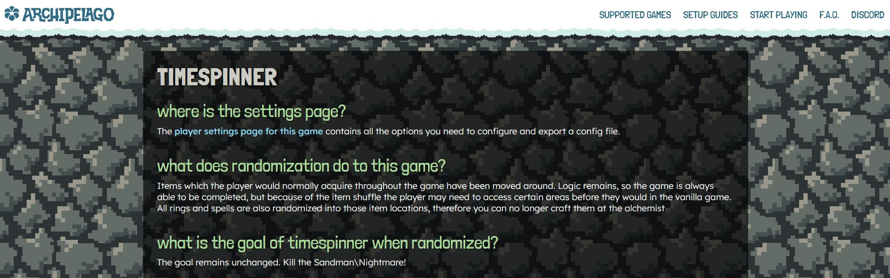

# Archipelago API

This document tries to explain some aspects of the Archipelago World API used when implementing the generation logic of
a game.

Client implementation is out of scope of this document. Please refer to an existing game that provides a similar API to
yours, and the following documents:

* [network protocol.md](https://github.com/ArchipelagoMW/Archipelago/blob/main/docs/network%20protocol.md)
* [adding games.md](https://github.com/ArchipelagoMW/Archipelago/blob/main/docs/adding%20games.md)

Archipelago will be abbreviated as "AP" from now on.

## Language

AP worlds are written in python3.
Clients that connect to the server to sync items can be in any language that allows using WebSockets.

## Coding style

AP follows a [style guide](https://github.com/ArchipelagoMW/Archipelago/blob/main/docs/style.md).
When in doubt, use an IDE with a code-style linter, for example PyCharm Community Edition.

## Docstrings

Docstrings are strings attached to an object in Python that describe what the object is supposed to be. Certain
docstrings will be picked up and used by AP. They are assigned by writing a string without any assignment right below a
definition. The string must be a triple-quoted string, and should
follow [reST style](https://peps.python.org/pep-0287/).

Example:

```python
from worlds.AutoWorld import World


class MyGameWorld(World):
    """This is the description of My Game that will be displayed on the AP website."""
```

## Definitions

This section covers various classes and objects you can use for your world. While some of the attributes and methods
are mentioned here, not all of them are, but you can find them in
[`BaseClasses.py`](https://github.com/ArchipelagoMW/Archipelago/blob/main/BaseClasses.py).

### World Class

A `World` is the class with all the specifics of a certain game that is to be included. A new instance will be created
for each player of the game for any given generated multiworld.

### WebWorld Class

A `WebWorld` class contains specific attributes and methods that can be modified for your world specifically on the
webhost:

* `options_page` can be changed to a link instead of an AP-generated options page.

* `rich_text_options_doc` controls whether [Option documentation] uses plain text (`False`) or rich text (`True`). It
  defaults to `False`, but world authors are encouraged to set it to `True` for nicer-looking documentation that looks
  good on both the WebHost and the YAML template.

  [Option documentation]: /docs/options%20api.md#option-documentation

* `theme` to be used for your game-specific AP pages. Available themes:

  | dirt                                       | grass (default)                             | grassFlowers                                       | ice                                       | jungle                                       | ocean                                       | partyTime                                       | stone                                       |
  |--------------------------------------------|---------------------------------------------|----------------------------------------------------|-------------------------------------------|----------------------------------------------|---------------------------------------------|-------------------------------------------------|---------------------------------------------|
  |  |  |  |  |  |  |  |  |

* `bug_report_page` (optional) can be a link to a bug reporting page, most likely a GitHub issue page, that will be
  placed by the site to help users report bugs.

* `tutorials` list of `Tutorial` classes where each class represents a guide to be generated on the webhost.

* `game_info_languages` (optional) list of strings for defining the existing game info pages your game supports. The
  documents must be prefixed with the same string as defined here. Default already has 'en'.

* `options_presets` (optional) `Dict[str, Dict[str, Any]]` where the keys are the names of the presets and the values
  are the options to be set for that preset. The options are defined as a `Dict[str, Any]` where the keys are the names
  of the options and the values are the values to be set for that option. These presets will be available for users to
  select from on the game's options page.

Note: The values must be a non-aliased value for the option type and can only include the following option types:

* If you have a `Range`/`NamedRange` option, the value should be an `int` between the `range_start` and `range_end`
  values.
    * If you have a `NamedRange` option, the value can alternatively be a `str` that is one of the
      `special_range_names` keys.
* If you have a `Choice` option, the value should be a `str` that is one of the `option_<name>` values.
* If you have a `Toggle`/`DefaultOnToggle` option, the value should be a `bool`.
* `random` is also a valid value for any of these option types.

`OptionDict`, `OptionList`, `OptionSet`, `FreeText`, or custom `Option`-derived classes are not supported for presets on
the webhost at this time.

Here is an example of a defined preset:

```python
# presets.py
options_presets = {
    "Limited Potential": {
        "progression_balancing":    0,
        "fairy_chests_per_zone":    2,
        "starting_class":           "random",
        "chests_per_zone":          30,
        "vendors":                  "normal",
        "architect":                "disabled",
        "gold_gain_multiplier":     "half",
        "number_of_children":       2,
        "free_diary_on_generation": False,
        "health_pool":              10,
        "mana_pool":                10,
        "attack_pool":              10,
        "magic_damage_pool":        10,
        "armor_pool":               5,
        "equip_pool":               10,
        "crit_chance_pool":         5,
        "crit_damage_pool":         5,
    }
}


# __init__.py
class RLWeb(WebWorld):
    options_presets = options_presets
    # ...
```

* `location_descriptions` (optional) WebWorlds can provide a map that contains human-friendly descriptions of locations 
or location groups.

  ```python
  # locations.py
  location_descriptions = {
      "Red Potion #6": "In a secret destructible block under the second stairway",
      "L2 Spaceship": """
        The group of all items in the spaceship in Level 2.
  
        This doesn't include the item on the spaceship door, since it can be
        accessed without the Spaceship Key.
      """
  }
  
  # __init__.py
  from worlds.AutoWorld import WebWorld
  from .locations import location_descriptions
  
  
  class MyGameWeb(WebWorld):
      location_descriptions = location_descriptions
  ```

* `item_descriptions` (optional) WebWorlds can provide a map that contains human-friendly descriptions of items or item 
groups.

  ```python
  # items.py
  item_descriptions = {
      "Red Potion": "A standard health potion",
      "Spaceship Key": """
        The key to the spaceship in Level 2.
  
        This is necessary to get to the Star Realm.
      """,
  }
  
  # __init__.py
  from worlds.AutoWorld import WebWorld
  from .items import item_descriptions
  
  
  class MyGameWeb(WebWorld):
      item_descriptions = item_descriptions
  ```

### MultiWorld Object

The `MultiWorld` object references the whole multiworld (all items and locations for all players) and is accessible
through `self.multiworld` from your `World` object.

### Player

The player is just an `int` in AP and is accessible through `self.player` from your `World` object.

### Player Options

Options are provided by the user as part of the generation process, intended to affect how their randomizer experience
should play out. These can control aspects such as what locations should be shuffled, what items are in the itempool,
etc. Players provide the customized options for their World in the form of yamls.

By convention, options are defined in `options.py` and will be used when parsing the players' yaml files. Each option
has its own class, which inherits from a base option type, a docstring to describe it, and a `display_name` property
shown on the website and in spoiler logs.

The available options are defined by creating a `dataclass`, which must be a subclass of `PerGameCommonOptions`. It has
defined fields for the option names used in the player yamls and used for options access, with their types matching the
appropriate Option class. By convention, the strings that define your option names should be in `snake_case`. The
`dataclass` is then assigned to your `World` by defining its `options_dataclass`. Option results are then automatically
added to the `World` object for easy access, between `World` creation and `generate_early`. These are accessible through
`self.options.<option_name>`, and you can get a dictionary with option values
via `self.options.as_dict(<option_names>)`,
passing the desired option names as strings.

Common option types are `Toggle`, `DefaultOnToggle`, `Choice`, and `Range`.
For more information, see the [options api doc](options%20api.md).

### World Settings

Settings are set by the user outside the generation process. They can be used for those settings that may affect
generation or client behavior, but should remain static between generations, such as the path to a ROM file.
These settings are accessible through `self.settings.<setting_name>` or `cls.settings.<setting_name>`.

Users can set these in their `host.yaml` file. Some settings may automatically open a file browser if a file is missing.

Refer to [settings api.md](https://github.com/ArchipelagoMW/Archipelago/blob/main/docs/settings%20api.md) for details.

### Locations

Locations are places where items can be located in your game. This may be chests or boss drops for RPG-like games, but
could also be progress in a research tree, or even something more abstract like a level up.

Each location has a `name` and an `address` (hereafter referred to as an `id`), is placed in a Region, has access rules,
and has a classification. The name needs to be unique within each game and must not be numeric (must contain least 1
letter or symbol). The ID needs to be unique across all locations within the game. 
Locations and items can share IDs, and locations can share IDs with other games' locations.

World-specific IDs must be in the range 1 to 2<sup>53</sup>-1; IDs ≤ 0 are global and reserved.

Classification is one of `LocationProgressType.DEFAULT`, `PRIORITY` or `EXCLUDED`.
The Fill algorithm will force progression items to be placed at priority locations, giving a higher chance of them being
required, and will prevent progression and useful items from being placed at excluded locations.

### Items

Items are all things that can "drop" for your game. This may be RPG items like weapons, or technologies you normally
research in a research tree.

Each item has a `name`, a `code` (hereafter referred to as `id`), and a classification.
The most important classification is `progression`. Progression items are items which a player *may* require to progress
in their world. If an item can possibly be considered for logic (it's referenced in a location's rules) it *must* be
progression. Progression items will be assigned to locations with higher priority, and moved around to meet defined rules
and satisfy progression balancing.

The name needs to be unique within each game, meaning if you need to create multiple items with the same name, they
will all have the same ID. Name must not be numeric (must contain at least 1 letter or symbol). 
The ID thus also needs to be unique across all items with different names within the game. 
Items and locations can share IDs, and items can share IDs with other games' items.

Other classifications include:

* `filler`: a regular item or trash item
* `useful`: item that is especially useful. Cannot be placed on excluded or unreachable locations. When combined with
another flag like "progression", it means "an especially useful progression item".
* `trap`: negative impact on the player
* `skip_balancing`: denotes that an item should not be moved to an earlier sphere for the purpose of balancing (to be
  combined with `progression`; see below)
* `progression_skip_balancing`: the combination of `progression` and `skip_balancing`, i.e., a progression item that
  will not be moved around by progression balancing; used, e.g., for currency or tokens, to not flood early spheres

### Regions

Regions are logical containers that typically hold locations that share some common access rules. If location logic is
written from scratch, using regions greatly simplifies the requirements and can help with implementing things
like entrance randomization in logic.

Regions have a list called `exits`, containing `Entrance` objects representing transitions to other regions.

There must be one special region (Called "Menu" by default, but configurable using [origin_region_name](https://github.com/ArchipelagoMW/Archipelago/blob/main/worlds/AutoWorld.py#L310-L311)),
from which the logic unfolds. AP assumes that a player will always be able to return to this starting region by resetting the game ("Save and quit").

### Entrances

An `Entrance` has a `parent_region` and `connected_region`, where it is in the `exits` of its parent, and the
`entrances` of its connected region. The `Entrance` then has rules assigned to it to determine if it can be passed
through, making the connected region accessible. They can be static (regular logic) or be defined/connected during
generation (entrance randomization).

### Access Rules

An access rule is a function that returns `True` or `False` for a `Location` or `Entrance` based on the current `state`
(items that have been collected).

The two possible ways to make a [CollectionRule](https://github.com/ArchipelagoMW/Archipelago/blob/main/worlds/generic/Rules.py#L10) are:
- `def rule(state: CollectionState) -> bool:`
- `lambda state: ... boolean expression ...`

An access rule can be assigned through `set_rule(location, rule)`.

Access rules usually check for one of two things.
- Items that have been collected (e.g. `state.has("Sword", player)`)
- Locations, Regions or Entrances that have been reached (e.g. `state.can_reach_region("Boss Room")`)

Keep in mind that entrances and locations implicitly check for the accessibility of their parent region, so you do not need to check explicitly for it.

#### An important note on Entrance access rules:
When using `state.can_reach` within an entrance access condition, you must also use `multiworld.register_indirect_condition`.

For efficiency reasons, every time reachable regions are searched, every entrance is only checked once in a somewhat non-deterministic order.
This is fine when checking for items using `state.has`, because items do not change during a region sweep.
However, `state.can_reach` checks for the very same thing we are updating: Regions.
This can lead to non-deterministic behavior and, in the worst case, even generation failures.
Even doing `state.can_reach_location` or `state.can_reach_entrance` is problematic, as these functions call `state.can_reach_region` on the respective parent region.

**Therefore, it is considered unsafe to perform `state.can_reach` from within an access condition for an entrance**, unless you are checking for something that sits in the source region of the entrance.
You can use `multiworld.register_indirect_condition(region, entrance)` to explicitly tell the generator that, when a given region becomes accessible, it is necessary to re-check a specific entrance.
You **must** use `multiworld.register_indirect_condition` if you perform this kind of `can_reach` from an entrance access rule, unless you have a **very** good technical understanding of the relevant code and can reason why it will never lead to problems in your case.

Alternatively, you can set [world.explicit_indirect_conditions = False](https://github.com/ArchipelagoMW/Archipelago/blob/main/worlds/AutoWorld.py#L301-L304),
avoiding the need for indirect conditions at the expense of performance.

### Item Rules

An item rule is a function that returns `True` or `False` for a `Location` based on a single item. It can be used to
reject the placement of an item there.

### Events (or "generation-only items/locations")

An event item or location is one that only exists during multiworld generation; the server is never made aware of them.
Event locations can never be checked by the player, and event items cannot be received during play.

Events are used to represent in-game actions (that aren't regular Archipelago locations) when either:

* We want to show in the spoiler log when the player is expected to perform the in-game action.
* It's the cleanest way to represent how that in-game action impacts logic.

Typical examples include completing the goal, defeating a boss, or flipping a switch that affects multiple areas.

To be precise: the term "event" on its own refers to the special combination of an "event item" placed on an "event
location". Event items and locations are created the same way as normal items and locations, except that they have an
`id` of `None`, and an event item must be placed on an event location
(and vice versa). Finally, although events are often described as "fake" items and locations, it's important to
understand that they are perfectly real during generation.

The most common way to create an event is to create the event item and the event location, then immediately call
`Location.place_locked_item()`:

```python
victory_loc = MyGameLocation(self.player, "Defeat the Final Boss", None, final_boss_arena_region)
victory_loc.place_locked_item(MyGameItem("Victory", ItemClassification.progression, None, self.player))
self.multiworld.completion_condition[self.player] = lambda state: state.has("Victory", self.player)
set_rule(victory_loc, lambda state: state.has("Boss Defeating Sword", self.player))
```

Requiring an event to finish the game will make the spoiler log display an additional
`Defeat the Final Boss: Victory` line when the player is expected to finish, rather than only showing their last
relevant item. But events aren't just about the spoiler log; a more substantial example of using events to structure
your logic might be:

```python
water_loc = MyGameLocation(self.player, "Water Level Switch", None, pump_station_region)
water_loc.place_locked_item(MyGameItem("Lowered Water Level", ItemClassification.progression, None, self.player))
pump_station_region.locations.append(water_loc)
set_rule(water_loc, lambda state: state.has("Double Jump", self.player))  # the switch is really high up
...
basement_loc = MyGameLocation(self.player, "Flooded House - Basement Chest", None, flooded_house_region)
flooded_house_region.locations += [upstairs_loc, ground_floor_loc, basement_loc]
...
set_rule(basement_loc, lambda state: state.has("Lowered Water Level", self.player))
```

This creates a "Lowered Water Level" event and a regular location whose access rule depends on that
event being reachable. If you made several more locations the same way, this would ensure all of those locations can
only become reachable when the event location is reachable (i.e. when the water level can be lowered), without
copy-pasting the event location's access rule and then repeatedly re-evaluating it. Also, the spoiler log will show
`Water Level Switch: Lowered Water Level` when the player is expected to do this.

To be clear, this example could also be modeled with a second Region (perhaps "Un-Flooded House"). Or you could modify
the game so flipping that switch checks a regular AP location in addition to lowering the water level.
Events are never required, but it may be cleaner to use an event if e.g. flipping that switch affects the logic in
dozens of half-flooded areas that would all otherwise need additional Regions, and you don't want it to be a regular
location. It depends on the game.

## Implementation

### Your World

All code for your world implementation should be placed in a python package in the `/worlds` directory. The starting
point for the package is `__init__.py`. Conventionally, your `World` class is placed in that file.

World classes must inherit from the `World` class in `/worlds/AutoWorld.py`, which can be imported as
`from worlds.AutoWorld import World` from your package.

AP will pick up your world automatically due to the `AutoWorld` implementation.

### Requirements

If your world needs specific python packages, they can be listed in `worlds/<world_name>/requirements.txt`.
ModuleUpdate.py will automatically pick up and install them.

See [pip documentation](https://pip.pypa.io/en/stable/cli/pip_install/#requirements-file-format).

### Relative Imports

AP will only import the `__init__.py`. Depending on code size, it may make sense to use multiple files and use relative
imports to access them.

e.g. `from .options import MyGameOptions` from your `__init__.py` will load `world/[world_name]/options.py` and make
its `MyGameOptions` accessible.

When imported names pile up, it may be easier to use `from . import options` and access the variable as
`options.MyGameOptions`.

Imports from directories outside your world should use absolute imports. Correct use of relative / absolute imports is
required for zipped worlds to function, see [apworld specification.md](apworld%20specification.md).

### Your Item Type

Each world uses its own subclass of `BaseClasses.Item`. The constructor can be overridden to attach additional data to
it, e.g. "price in shop". Since the constructor is only ever called from your code, you can add whatever arguments you
like to the constructor.

In its simplest form, we only set the game name and use the default constructor:

```python
from BaseClasses import Item


class MyGameItem(Item):
    game: str = "My Game"
```

By convention, this class definition will either be placed in your `__init__.py` or your `items.py`. For a more
elaborate example see
[`worlds/oot/Items.py`](https://github.com/ArchipelagoMW/Archipelago/blob/main/worlds/oot/Items.py).

### Your Location Type

The same thing we did for items above, we will now do for locations:

```python
from BaseClasses import Location


class MyGameLocation(Location):
    game: str = "My Game"
```

in your `__init__.py` or your `locations.py`.

### A World Class Skeleton

```python
# world/mygame/__init__.py

import settings
import typing
from .options import MyGameOptions  # the options we defined earlier
from .items import mygame_items  # data used below to add items to the World
from .locations import mygame_locations  # same as above
from worlds.AutoWorld import World
from BaseClasses import Region, Location, Entrance, Item, RegionType, ItemClassification


class MyGameItem(Item):  # or from Items import MyGameItem
    game = "My Game"  # name of the game/world this item is from


class MyGameLocation(Location):  # or from Locations import MyGameLocation
    game = "My Game"  # name of the game/world this location is in


class MyGameSettings(settings.Group):
    class RomFile(settings.SNESRomPath):
        """Insert help text for host.yaml here."""

    rom_file: RomFile = RomFile("MyGame.sfc")


class MyGameWorld(World):
    """Insert description of the world/game here."""
    game = "My Game"  # name of the game/world
    options_dataclass = MyGameOptions  # options the player can set
    options: MyGameOptions  # typing hints for option results
    settings: typing.ClassVar[MyGameSettings]  # will be automatically assigned from type hint
    topology_present = True  # show path to required location checks in spoiler

    # ID of first item and location, could be hard-coded but code may be easier
    # to read with this as a property.
    base_id = 1234
    # instead of dynamic numbering, IDs could be part of data

    # The following two dicts are required for the generation to know which
    # items exist. They could be generated from json or something else. They can
    # include events, but don't have to since events will be placed manually.
    item_name_to_id = {name: id for
                       id, name in enumerate(mygame_items, base_id)}
    location_name_to_id = {name: id for
                           id, name in enumerate(mygame_locations, base_id)}

    # Items can be grouped using their names to allow easy checking if any item
    # from that group has been collected. Group names can also be used for !hint
    item_name_groups = {
        "weapons": {"sword", "lance"},
    }
```

### Generation

The world has to provide the following things for generation:

* the properties mentioned above
* additions to the item pool
* additions to the regions list: at least one named after the world class's origin_region_name ("Menu" by default)
* locations placed inside those regions
* a `def create_item(self, item: str) -> MyGameItem` to create any item on demand
* applying `self.multiworld.push_precollected` for world-defined start inventory

In addition, the following methods can be implemented and are called in this order during generation:

* `stage_assert_generate(cls, multiworld: MultiWorld)`
  a class method called at the start of generation to check for the existence of prerequisite files, usually a ROM for
  games which require one.
* `generate_early(self)`
  called per player before any items or locations are created. You can set properties on your
  world here. Already has access to player options and RNG. This is the earliest step where the world should start
  setting up for the current multiworld, as the multiworld itself is still setting up before this point.
  You cannot modify `local_items`, or `non_local_items` after this step.
* `create_regions(self)`
  called to place player's regions and their locations into the MultiWorld's regions list.
  If it's hard to separate, this can be done during `generate_early` or `create_items` as well.
* `create_items(self)`
  called to place player's items into the MultiWorld's itempool. By the end of this step all regions, locations and
  items have to be in the MultiWorld's regions and itempool. You cannot add or remove items, locations, or regions after
  this step. Locations cannot be moved to different regions after this step. This includes event items and locations.
* `set_rules(self)`
  called to set access and item rules on locations and entrances.
* `connect_entrances(self)`
  by the end of this step, all entrances must exist and be connected to their source and target regions.
  Entrance randomization should be done here.
* `generate_basic(self)`
  player-specific randomization that does not affect logic can be done here.
* `pre_fill(self)`, `fill_hook(self)` and `post_fill(self)`
  called to modify item placement before, during, and after the regular fill process; all finishing before
  `generate_output`. Any items that need to be placed during `pre_fill` should not exist in the itempool, and if there
  are any items that need to be filled this way, but need to be in state while you fill other items, they can be
  returned from `get_pre_fill_items`.
* `generate_output(self, output_directory: str)`
  creates the output files if there is output to be generated. When this is called,
  `self.multiworld.get_locations(self.player)` has all locations for the player, with attribute `item` pointing to the
  item. `location.item.player` can be used to see if it's a local item.
* `fill_slot_data(self)` and `modify_multidata(self, multidata: MultiData)` can be used to modify the data that
  will be used by the server to host the MultiWorld.

All instance methods can, optionally, have a class method defined which will be called after all instance methods are
finished running, by defining a method with `stage_` in front of the method name. These class methods will have the
args `(cls, multiworld: MultiWorld)`, followed by any other args that the relevant instance method has.

#### generate_early

```python
def generate_early(self) -> None:
    # read player options to world instance
    self.final_boss_hp = self.options.final_boss_hp.value
```

#### create_regions

```python
def create_regions(self) -> None:
    # Add regions to the multiworld. One of them must use the origin_region_name as its name ("Menu" by default).
    # Arguments to Region() are name, player, multiworld, and optionally hint_text
    menu_region = Region("Menu", self.player, self.multiworld)
    self.multiworld.regions.append(menu_region)  # or use += [menu_region...]

    main_region = Region("Main Area", self.player, self.multiworld)
    # add main area's locations to main area (all but final boss)
    main_region.add_locations(main_region_locations, MyGameLocation)
    # or 
    # main_region.locations = \
    #   [MyGameLocation(self.player, location_name, self.location_name_to_id[location_name], main_region]
    self.multiworld.regions.append(main_region)

    boss_region = Region("Boss Room", self.player, self.multiworld)
    # add event to Boss Room
    boss_region.locations.append(MyGameLocation(self.player, "Final Boss", None, boss_region))

    # if entrances are not randomized, they should be connected here, otherwise they can also be connected at a later stage
    # create Entrances and connect the Regions
    menu_region.connect(main_region)  # connects the "Menu" and "Main Area", can also pass a rule
    # or
    main_region.add_exits({"Boss Room": "Boss Door"}, {"Boss Room": lambda state: state.has("Sword", self.player)})
    # connects the "Main Area" and "Boss Room" regions, and places a rule requiring the "Sword" item to traverse

    # if setting location access rules from data is easier here, set_rules can possibly be omitted
```

#### create_item

```python
# we need a way to know if an item provides progress in the game ("key item") this can be part of the items definition,
# or depend on recipe randomization
from .items import is_progression  # this is just a dummy


def create_item(self, item: str) -> MyGameItem:
    # this is called when AP wants to create an item by name (for plando, start inventory, item links) or when you call it from your own code
    classification = ItemClassification.progression if is_progression(item) else ItemClassification.filler
    return MyGameItem(item, classification, self.item_name_to_id[item], self.player)


def create_event(self, event: str) -> MyGameItem:
    # while we are at it, we can also add a helper to create events
    return MyGameItem(event, ItemClassification.progression, None, self.player)
```

#### create_items

```python
def create_items(self) -> None:
    # Add items to the Multiworld.
    # If there are two of the same item, the item has to be twice in the pool.
    # Which items are added to the pool may depend on player options, e.g. custom win condition like triforce hunt.
    # Having an item in the start inventory won't remove it from the pool.
    # If you want to do that, use start_inventory_from_pool

    for item in map(self.create_item, mygame_items):
        self.multiworld.itempool.append(item)

    # itempool and number of locations should match up.
    # If this is not the case we want to fill the itempool with junk.
    junk = 0  # calculate this based on player options
    self.multiworld.itempool += [self.create_item("nothing") for _ in range(junk)]
```

### Setting Rules

```python
from worlds.generic.Rules import add_rule, set_rule, forbid_item, add_item_rule
from .items import get_item_type


def set_rules(self) -> None:
    # For some worlds this step can be omitted if either a Logic mixin 
    # (see below) is used or it's easier to apply the rules from data during
    # location generation

    # set a simple rule for an region
    set_rule(self.multiworld.get_entrance("Boss Door", self.player),
             lambda state: state.has("Boss Key", self.player))
    # location.access_rule = ... is likely to be a bit faster
    # combine rules to require two items
    add_rule(self.multiworld.get_location("Chest2", self.player),
             lambda state: state.has("Sword", self.player))
    add_rule(self.multiworld.get_location("Chest2", self.player),
             lambda state: state.has("Shield", self.player))
    # or simply combine yourself
    set_rule(self.multiworld.get_location("Chest2", self.player),
             lambda state: state.has("Sword", self.player) and
                           state.has("Shield", self.player))
    # require two of an item
    set_rule(self.multiworld.get_location("Chest3", self.player),
             lambda state: state.has("Key", self.player, 2))
    # require one item from an item group
    add_rule(self.multiworld.get_location("Chest3", self.player),
             lambda state: state.has_group("weapons", self.player))
    # state also has .count() for items, .has_any() and .has_all() for multiple
    # and .count_group() for groups
    # set_rule is likely to be a bit faster than add_rule

    # disallow placing a specific local item at a specific location
    forbid_item(self.multiworld.get_location("Chest4", self.player), "Sword")
    # disallow placing items with a specific property
    add_item_rule(self.multiworld.get_location("Chest5", self.player),
                  lambda item: get_item_type(item) == "weapon")
    # get_item_type needs to take player/world into account
    # if MyGameItem has a type property, a more direct implementation would be
    add_item_rule(self.multiworld.get_location("Chest5", self.player),
                  lambda item: item.player != self.player or
                               item.my_type == "weapon")
    # location.item_rule = ... is likely to be a bit faster

    # place "Victory" at "Final Boss" and set collection as win condition
    self.multiworld.get_location("Final Boss", self.player).place_locked_item(self.create_event("Victory"))

    self.multiworld.completion_condition[self.player] = lambda state: state.has("Victory", self.player)

# for debugging purposes, you may want to visualize the layout of your world. Uncomment the following code to
# write a PlantUML diagram to the file "my_world.puml" that can help you see whether your regions and locations
# are connected and placed as desired
# from Utils import visualize_regions
# visualize_regions(self.multiworld.get_region("Menu", self.player), "my_world.puml")
```

### Custom Logic Rules

Custom methods can be defined for your logic rules. The access rule that ultimately gets assigned to the Location or
Entrance should be
a [`CollectionRule`](https://github.com/ArchipelagoMW/Archipelago/blob/main/worlds/generic/Rules.py#L10).
Typically, this is done by defining a lambda expression on demand at the relevant bit, typically calling other
functions, but this can also be achieved by defining a method with the appropriate format and assigning it directly.
For an example, see [The Messenger](/worlds/messenger/rules.py).

```python
# logic.py

from BaseClasses import CollectionState


def mygame_has_key(self, state: CollectionState, player: int) -> bool:
    # More arguments above are free to choose, since you can expect this is only called in your world
    # MultiWorld can be accessed through state.multiworld.
    # Explicitly passing in MyGameWorld instance for easy options access is also a valid approach, but it's generally
    # better to check options before rule assignment since the individual functions can be called thousands of times
    return state.has("key", player)  # or whatever
```

```python
# __init__.py

from worlds.generic.Rules import set_rule
from . import logic


class MyGameWorld(World):
    # ...
    def set_rules(self) -> None:
        set_rule(self.multiworld.get_location("A Door", self.player),
                 lambda state: logic.mygame_has_key(state, self.player))
```

### Logic Mixin

While lambdas and events can do pretty much anything, more complex logic can be handled in logic mixins.

When importing a file that defines a class that inherits from `worlds.AutoWorld.LogicMixin`, the `CollectionState` class
is automatically extended by the mixin's members. These members should be prefixed with the name of the implementing
world since the namespace is shared with all other logic mixins.

LogicMixin is handy when your logic is more complex than one-to-one location-item relationships.  
A game in which "The red key opens the red door" can just express this relationship through a one-line access rule.  
But now, consider a game with a heavy focus on combat, where the main logical consideration is which enemies you can
defeat with your current items.  
There could be dozens of weapons, armor pieces, or consumables that each improve your ability to defeat
specific enemies to varying degrees. It would be useful to be able to keep track of "defeatable enemies" as a state variable,
and have this variable be recalculated as necessary based on newly collected/removed items.
This is the capability of LogicMixin: Adding custom variables to state that get recalculated as necessary.

In general, a LogicMixin class should have at least one mutable variable that is tracking some custom state per player,
as well as `init_mixin` and `copy_mixin` functions so that this variable gets initialized and copied correctly when
`CollectionState()` and `CollectionState.copy()` are called respectively.

```python
from BaseClasses import CollectionState, MultiWorld
from worlds.AutoWorld import LogicMixin

class MyGameState(LogicMixin):
    mygame_defeatable_enemies: Dict[int, Set[str]]  # per player

    def init_mixin(self, multiworld: MultiWorld) -> None:
        # Initialize per player with the corresponding "nothing" value, such as 0 or an empty set.
        # You can also use something like Collections.defaultdict
        self.mygame_defeatable_enemies = {
            player: set() for player in multiworld.get_game_players("My Game")
        }

    def copy_mixin(self, new_state: CollectionState) -> CollectionState:
        # Be careful to make a "deep enough" copy here!
        new_state.mygame_defeatable_enemies = {
            player: enemies.copy() for player, enemies in self.mygame_defeatable_enemies.items()
        }
```

After doing this, you can now access `state.mygame_defeatable_enemies[player]` from your access rules.

Usually, doing this coincides with an override of `World.collect` and `World.remove`, where the custom state variable 
gets recalculated when a relevant item is collected or removed.

```python
# __init__.py

def collect(self, state: CollectionState, item: Item) -> bool:
    change = super().collect(state, item)
    if change and item in COMBAT_ITEMS:
        state.mygame_defeatable_enemies[self.player] |= get_newly_unlocked_enemies(state)
    return change

def remove(self, state: CollectionState, item: Item) -> bool:
    change = super().remove(state, item)
    if change and item in COMBAT_ITEMS:
        state.mygame_defeatable_enemies[self.player] -= get_newly_locked_enemies(state)
    return change
```

Using LogicMixin can greatly slow down your code if you don't use it intelligently. This is because `collect`
and `remove` are called very frequently during fill. If your `collect` & `remove` cause a heavy calculation
every time, your code might end up being *slower* than just doing calculations in your access rules.

One way to optimise recalculations is to make use of the fact that `collect` should only unlock things,
and `remove` should only lock things.  
In our example, we have two different functions: `get_newly_unlocked_enemies` and `get_newly_locked_enemies`.  
`get_newly_unlocked_enemies` should only consider enemies that are *not already in the set*
and check whether they were **unlocked**.  
`get_newly_locked_enemies` should only consider enemies that are *already in the set*
and check whether they **became locked**.

Another impactful way to optimise LogicMixin is to use caching.  
Your custom state variables don't actually need to be recalculated on every `collect` / `remove`, because there are
often multiple calls to `collect` / `remove` between access rule calls. Thus, it would be much more efficient to hold
off on recaculating until the an actual access rule call happens.  
A common way to realize this is to define a `mygame_state_is_stale` variable that is set to True in `collect`, `remove`,
and `init_mixin`. The calls to the actual recalculating functions are then moved to the start of the relevant
access rules like this:

```python
def can_defeat_enemy(state: CollectionState, player: int, enemy: str) -> bool:
    if state.mygame_state_is_stale[player]:
        state.mygame_defeatable_enemies[player] = recalculate_defeatable_enemies(state)
        state.mygame_state_is_stale[player] = False

    return enemy in state.mygame_defeatable_enemies[player]
```

Only use LogicMixin if necessary. There are often other ways to achieve what it does, like making clever use of
`state.prog_items`, using event items, pseudo-regions, etc.

#### pre_fill

```python
def pre_fill(self) -> None:
    # place item Herb into location Chest1 for some reason
    item = self.create_item("Herb")
    self.multiworld.get_location("Chest1", self.player).place_locked_item(item)
    # in most cases it's better to do this at the same time the itempool is
    # filled to avoid accidental duplicates, such as manually placed and still in the itempool
```

### Generate Output

```python
from .mod import generate_mod


def generate_output(self, output_directory: str) -> None:
    # How to generate the mod or ROM highly depends on the game.
    # If the mod is written in Lua, Jinja can be used to fill a template.
    # If the mod reads a json file, `json.dump()` can be used to generate that.
    # code below is a dummy
    data = {
        "seed": self.multiworld.seed_name,  # to verify the server's multiworld
        "slot": self.multiworld.player_name[self.player],  # to connect to server
        "items": {location.name: location.item.name
                  if location.item.player == self.player else "Remote"
                  for location in self.multiworld.get_filled_locations(self.player)},
        # store start_inventory from player's .yaml
        # make sure to mark as not remote_start_inventory when connecting if stored in rom/mod
        "starter_items": [item.name for item in self.multiworld.precollected_items[self.player]],
    }

    # add needed option results to the dictionary
    data.update(self.options.as_dict("final_boss_hp", "difficulty", "fix_xyz_glitch"))
    # point to a ROM specified by the installation
    src = self.settings.rom_file
    # or point to worlds/mygame/data/mod_template
    src = os.path.join(os.path.dirname(__file__), "data", "mod_template")
    # generate output path
    mod_name = self.multiworld.get_out_file_name_base(self.player)
    out_file = os.path.join(output_directory, mod_name + ".zip")
    # generate the file
    generate_mod(src, out_file, data)
```

### Slot Data

If a client or tracker needs to know information about the generated seed, a preferred method of transferring the data 
is through the slot data. This is filled with the `fill_slot_data` method of your world by returning a `dict` with 
`str` keys that can be serialized with json. However, to not waste resources, it should be limited to data that is 
absolutely necessary. Slot data is sent to your client once it has successfully 
[connected](network%20protocol.md#connected).

If you need to know information about locations in your world, instead of propagating the slot data, it is preferable
to use [LocationScouts](network%20protocol.md#locationscouts), since that data already exists on the server. Adding 
item/location pairs is unnecessary since the AP server already retains and freely gives that information to clients 
that request it. The most common usage of slot data is sending option results that the client needs to be aware of.

```python
def fill_slot_data(self) -> Dict[str, Any]:
    # In order for our game client to handle the generated seed correctly we need to know what the user selected
    # for their difficulty and final boss HP.
    # A dictionary returned from this method gets set as the slot_data and will be sent to the client after connecting.
    # The options dataclass has a method to return a `Dict[str, Any]` of each option name provided and the relevant
    # option's value.
    return self.options.as_dict("difficulty", "final_boss_hp")
```

### Documentation

Each world implementation should have a tutorial and a game info page. These are both rendered on the website by reading
the `.md` files in your world's `/docs` directory.

#### Game Info

The game info page is for a short breakdown of what your game is and how it works in Archipelago. Any additional
information that may be useful to the player when learning your randomizer should also go here. The file name format
is `<language key>_<game name>.md`. While you can write these docs for multiple languages, currently only the english
version is displayed on the website.

#### Tutorials

Your game can have as many tutorials in as many languages as you like, with each one having a relevant `Tutorial`
defined in the `WebWorld`. The file name you use isn't particularly important, but it should be descriptive of what
the tutorial covers, and the name of the file must match the relative URL provided in the `Tutorial`. Currently,
the JS that determines this ignores the provided file name and will search for `game/document_lang.md`, where
`game/document/lang` is the provided URL.

### Tests

Each world is expected to include unit tests that cover its logic, to ensure no logic bug regressions occur. This can be
done by creating a `/test` package within your world package. The `__init__.py` within this folder is where the world's
TestBase should be defined. This can be inherited from the main TestBase, which will automatically set up a solo
multiworld for each test written using it. Within subsequent modules, classes should be defined which inherit the world
TestBase, and can then define options to test in the class body, and run tests in each test method.

Example `__init__.py`

```python
from test.bases import WorldTestBase


class MyGameTestBase(WorldTestBase):
    game = "My Game"
```

Next, using the rules defined in the above `set_rules` we can test that the chests have the correct access rules.

Example `test_chest_access.py`

```python
from . import MyGameTestBase


class TestChestAccess(MyGameTestBase):
    def test_sword_chests(self) -> None:
        """Test locations that require a sword"""
        locations = ["Chest1", "Chest2"]
        items = [["Sword"]]
        # this will test that each location can't be accessed without the "Sword", but can be accessed once obtained
        self.assertAccessDependency(locations, items)

    def test_any_weapon_chests(self) -> None:
        """Test locations that require any weapon"""
        locations = [f"Chest{i}" for i in range(3, 6)]
        items = [["Sword"], ["Axe"], ["Spear"]]
        # this will test that chests 3-5 can't be accessed without any weapon, but can be with just one of them
        self.assertAccessDependency(locations, items)
```

For more information on tests, check the [tests doc](tests.md).
