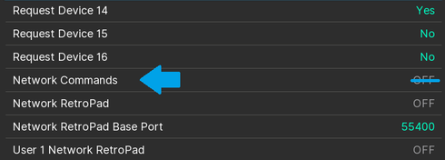

# A Link to the Past Randomizer Setup Guide

## Required Software

- [Archipelago](https://github.com/ArchipelagoMW/Archipelago/releases).
- [SNI](https://github.com/alttpo/sni/releases). This is automatically included with your Archipelago installation above.
- SNI is not compatible with (Q)Usb2Snes.
- Hardware or software capable of loading and playing SNES ROM files, including:
    - An emulator capable of connecting to SNI
      ([snes9x-nwa](https://github.com/Skarsnik/snes9x-emunwa/releases), [snes9x-rr](https://github.com/gocha/snes9x-rr/releases),
       [BSNES-plus](https://github.com/black-sliver/bsnes-plus),
       [BizHawk](http://tasvideos.org/BizHawk.html), or
       [RetroArch](https://retroarch.com?page=platforms) 1.10.1 or newer)
    - An SD2SNES, [FXPak Pro](https://krikzz.com/store/home/54-fxpak-pro.html), or other compatible hardware. **note: 
modded SNES minis are currently not supported by SNI. Some users have claimed success with QUsb2Snes for this system,
but it is not supported.**
- Your Japanese v1.0 ROM file, probably named `Zelda no Densetsu - Kamigami no Triforce (Japan).sfc`

## Installation Procedures

1. Download and install [Archipelago](<https://github.com/ArchipelagoMW/Archipelago/releases/latest>). **The installer 
   file is located in the assets section at the bottom of the version information.**
2. The first time you do local generation or patch your game, you will be asked to locate your base ROM file.
   This is your Japanese Link to the Past ROM file. This only needs to be done once.

3. If you are using an emulator, you should assign your Lua capable emulator as your default program for launching ROM
   files.
    1. Extract your emulator's folder to your Desktop, or somewhere you will remember.
    2. Right-click on a ROM file and select **Open with...**
    3. Check the box next to **Always use this app to open .sfc files**
    4. Scroll to the bottom of the list and click the grey text **Look for another App on this PC**
    5. Browse for your emulator's `.exe` file and click **Open**. This file should be located inside the folder you
       extracted in step one.

### Obtain your patch file and create your ROM

When you join a multiworld game, you will be asked to provide your config file to whoever is hosting. Once that is done,
the host will provide you with either a link to download your patch file, or with a zip file containing everyone's patch
files. Your patch file should have a `.aplttp` extension.

Put your patch file on your desktop or somewhere convenient, and double click it. This should automatically launch the
client, and will also create your ROM in the same place as your patch file.

### Connect to the client

#### With an emulator

When the client launched automatically, SNI should have also automatically launched in the background. If this is its
first time launching, you may be prompted to allow it to communicate through the Windows Firewall.

#### snes9x-nwa

1. Click on the Network Menu and check **Enable Emu Network Control**
2. Load your ROM file if it hasn't already been loaded.

##### snes9x-rr

1. Load your ROM file if it hasn't already been loaded.
2. Click on the File menu and hover on **Lua Scripting**
3. Click on **New Lua Script Window...**
4. In the new window, click **Browse...**
5. Select the connector lua file included with your client
    - Look in the Archipelago folder for `/SNI/lua/`.
6. If you see an error while loading the script that states `socket.dll missing` or similar, navigate to the folder of 
the lua you are using in your file explorer and copy the `socket.dll` to the base folder of your snes9x install.

#### BSNES-Plus

1. Load your ROM file if it hasn't already been loaded.
2. The emulator should automatically connect while SNI is running.

##### BizHawk

1. Ensure you have the BSNES core loaded. This is done with the main menubar, under:
    - (≤ 2.8) `Config` 〉 `Cores` 〉 `SNES` 〉 `BSNES`
    - (≥ 2.9) `Config` 〉 `Preferred Cores` 〉 `SNES` 〉 `BSNESv115+`
2. Load your ROM file if it hasn't already been loaded.
   If you changed your core preference after loading the ROM, don't forget to reload it (default hotkey: Ctrl+R).
3. Drag+drop the `Connector.lua` file that you downloaded above onto the main EmuHawk window.
    - Look in the Archipelago folder for `/SNI/lua/`.
    - You could instead open the Lua Console manually, click `Script` 〉 `Open Script`, and navigate to `Connector.lua`
      with the file picker.

##### RetroArch 1.10.1 or newer

You only have to do these steps once.

1. Enter the RetroArch main menu screen.
2. Go to Settings --> User Interface. Set "Show Advanced Settings" to ON.
3. Go to Settings --> Network. Set "Network Commands" to ON. (It is found below Request Device 16.) Leave the default
   Network Command Port at 55355. \
   
4. Go to Main Menu --> Online Updater --> Core Downloader. Scroll down and select "Nintendo - SNES / SFC (bsnes-mercury
   Performance)".

When loading a ROM, be sure to select a **bsnes-mercury** core. These are the only cores that allow external tools to
read ROM data.

#### With hardware

This guide assumes you have downloaded the correct firmware for your device. If you have not done so already, please do
this now. SD2SNES and FXPak Pro users may download the appropriate firmware
[here](https://github.com/RedGuyyyy/sd2snes/releases). Other hardware may find helpful information
[on this page](http://usb2snes.com/#supported-platforms).

1. Close your emulator, which may have auto-launched.
2. Power on your device and load the ROM.

### Connect to the Archipelago Server

The patch file which launched your client should have automatically connected you to the AP Server. There are a few
reasons this may not happen however, including if the game is hosted on the website but was generated elsewhere. If the
client window shows "Server Status: Not Connected", simply ask the host for the address of the server, and copy/paste it
into the "Server" input field then press enter.

The client will attempt to reconnect to the new server address, and should momentarily show "Server Status: Connected".

### Play the game

When the client shows both SNES Device and Server as connected, you're ready to begin playing. Congratulations on
successfully joining a multiworld game! You can execute various commands in your client. For more information regarding
these commands you can use `/help` for local client commands and `!help` for server commands.
