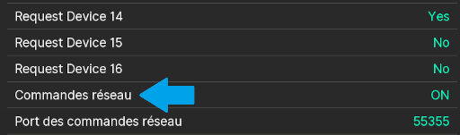

# Final Fantasy Mystic Quest Setup Guide

## Logiciels requis

- [Archipelago](https://github.com/ArchipelagoMW/Archipelago/releases)
- Une solution logicielle ou matérielle capable de charger et de lancer des fichiers ROM de SNES
    - Un émulateur capable d'éxécuter des scripts Lua
      - snes9x-rr de: [snes9x rr](https://github.com/gocha/snes9x-rr/releases),
      - BizHawk from: [BizHawk Website](http://tasvideos.org/BizHawk.html),
      - RetroArch 1.10.1 or newer from: [RetroArch Website](https://retroarch.com?page=platforms). Ou,
    - Un SD2SNES, [FXPak Pro](https://krikzz.com/store/home/54-fxpak-pro.html), ou une autre solution matérielle
      compatible
- Le fichier ROM de la v1.0 ou v1.1 NA de Final Fantasy Mystic Quest obtenu légalement, sûrement nommé `Final Fantasy - Mystic Quest (U) (V1.0).sfc` ou `Final Fantasy - Mystic Quest (U) (V1.1).sfc`
La communauté d'Archipelago ne peut vous fournir avec ce fichier.

## Procédure d'installation

### Installation sur Linux

1. Téléchargez et installez [Archipelago](<https://github.com/ArchipelagoMW/Archipelago/releases/latest>). 
** Le fichier d'installation est situé dans la section "assets" dans le bas de la fenêtre d'information de la version. Vous voulez probablement le `.AppImage`**
2. L'utilisation de RetroArch ou BizHawk est recommandé pour les utilisateurs linux, puisque snes9x-rr n'est pas compatible.

### Installation sur Windows

1. Téléchargez et installez [Archipelago](<https://github.com/ArchipelagoMW/Archipelago/releases/latest>). 
** Le fichier d'installation est situé dans la section "assets" dans le bas de la fenêtre d'information de la version.**
2. Si vous utilisez un émulateur, il est recommandé d'assigner votre émulateur capable d'éxécuter des scripts Lua comme
   programme par défaut pour ouvrir vos ROMs.
    1. Extrayez votre dossier d'émulateur sur votre Bureau, ou à un endroit dont vous vous souviendrez.
    2. Faites un clic droit sur un fichier ROM et sélectionnez **Ouvrir avec...**
    3. Cochez la case à côté de **Toujours utiliser cette application pour ouvrir les fichiers `.sfc`**
    4. Descendez jusqu'en bas de la liste et sélectionnez **Rechercher une autre application sur ce PC**
    5. Naviguez dans les dossiers jusqu'au fichier `.exe` de votre émulateur et choisissez **Ouvrir**. Ce fichier
       devrait se trouver dans le dossier que vous avez extrait à la première étape.

## Créer son fichier de configuration (.yaml)

### Qu'est-ce qu'un fichier de configuration et pourquoi en ai-je besoin ?

Votre fichier de configuration contient un ensemble d'options de configuration pour indiquer au générateur 
comment il devrait générer votre seed. Chaque joueur d'un multiworld devra fournir son propre fichier de configuration. Cela permet
à chaque joueur d'apprécier une expérience personalisée. Les différents joueurs d'un même multiworld
pouront avoir des options de génération différentes.
Vous pouvez lire le [guide pour créer un YAML de base](/tutorial/Archipelago/setup/en) en anglais.

### Où est-ce que j'obtiens un fichier de configuration ?

La [page d'options sur le site](/games/Final%20Fantasy%20Mystic%20Quest/player-options) vous permet de choisir vos
options de génération et de les exporter vers un fichier de configuration.
Il vous est aussi possible de trouver le fichier de configuration modèle de Mystic Quest dans votre répertoire d'installation d'Archipelago, 
dans le dossier Players/Templates.

### Vérifier son fichier de configuration

Si vous voulez valider votre fichier de configuration pour être sûr qu'il fonctionne, vous pouvez le vérifier sur la page du
[Validateur de YAML](/mysterycheck).

## Générer une partie pour un joueur

1. Aller sur la page [Génération de partie](/games/Final%20Fantasy%20Mystic%20Quest/player-options), configurez vos options,
   et cliquez sur le bouton "Generate Game".
2. Il vous sera alors présenté une page d'informations sur la seed
3. Cliquez sur le lien "Create New Room".
4. Vous verrez s'afficher la page du server, de laquelle vous pourrez télécharger votre fichier patch `.apmq`.
5. Rendez-vous sur le [site FFMQR](https://ffmqrando.net/Archipelago).
Sur cette page, sélectionnez votre ROM Final Fantasy Mystic Quest original dans le boîte "ROM", puis votre ficher patch `.apmq` dans la boîte "Load Archipelago Config File".
Cliquez sur "Generate". Un téléchargement avec votre ROM aléatoire devrait s'amorcer.
6. Puisque cette partie est à un seul joueur, vous n'avez plus besoin du client Archipelago ni du serveur, sentez-vous libre de les fermer.

## Rejoindre un MultiWorld

### Obtenir son patch et créer sa ROM

Quand vous rejoignez un multiworld, il vous sera demandé de fournir votre fichier de configuration à celui qui héberge la partie ou
s'occupe de la génération. Une fois cela fait, l'hôte vous fournira soit un lien pour télécharger votre patch, soit un
fichier `.zip` contenant les patchs de tous les joueurs. Votre patch devrait avoir l'extension `.apmq`.

Allez au [site FFMQR](https://ffmqrando.net/Archipelago) et sélectionnez votre ROM Final Fantasy Mystic Quest original dans le boîte "ROM", puis votre ficher patch `.apmq` dans la boîte "Load Archipelago Config File".
Cliquez sur "Generate". Un téléchargement avec votre ROM aléatoire devrait s'amorcer.

Ouvrez le client SNI (sur Windows ArchipelagoSNIClient.exe, sur Linux ouvrez le `.appImage` puis cliquez sur SNI Client), puis ouvrez le ROM téléchargé avec votre émulateur choisi.

### Se connecter au client

#### Avec un émulateur

Quand le client se lance automatiquement, QUsb2Snes devrait également se lancer automatiquement en arrière-plan. Si
c'est la première fois qu'il démarre, il vous sera peut-être demandé de l'autoriser à communiquer à travers le pare-feu
Windows.

##### snes9x-rr

1. Chargez votre ROM si ce n'est pas déjà fait.
2. Cliquez sur le menu "File" et survolez l'option **Lua Scripting**
3. Cliquez alors sur **New Lua Script Window...**
4. Dans la nouvelle fenêtre, sélectionnez **Browse...**
5. Sélectionnez le fichier connecteur lua fourni avec votre client
    - Regardez dans le dossier Archipelago et cherchez `/SNI/lua/x64` ou `/SNI/lua/x86`, dépendemment de si votre emulateur 
      est 64-bit ou 32-bit.
6. Si vous obtenez une erreur `socket.dll missing` ou une erreur similaire lorsque vous chargez le script lua, vous devez naviguer dans le dossier 
contenant le script lua, puis copier le fichier `socket.dll` dans le dossier d'installation de votre emulateur snes9x.

##### BizHawk

1. Assurez vous d'avoir le coeur BSNES chargé. Cela est possible en cliquant sur le menu "Tools" de BizHawk et suivant
   ces options de menu :
   `Config --> Cores --> SNES --> BSNES`  
   Une fois le coeur changé, vous devez redémarrer BizHawk.
2. Chargez votre ROM si ce n'est pas déjà fait.
3. Cliquez sur le menu "Tools" et cliquez sur **Lua Console**
4. Cliquez sur le bouton pour ouvrir un nouveau script Lua, soit par le bouton avec un icône "Ouvrir un dossier", 
    en cliquant `Open Script...` dans le menu Script ou en appuyant sur `ctrl-O`.
5. Sélectionnez le fichier `Connector.lua` inclus avec le client
    - Regardez dans le dossier Archipelago et cherchez `/SNI/lua/x64` ou `/SNI/lua/x86`, dépendemment de si votre emulateur 
      est 64-bit ou 32-bit. Notez que les versions les plus récentes de BizHawk ne sont que 64-bit.

##### RetroArch 1.10.1 ou plus récent

Vous ne devez faire ces étapes qu'une fois. À noter que RetroArch 1.9.x ne fonctionnera pas puisqu'il s'agit d'une version moins récente que 1.10.1.

1. Entrez dans le menu principal de RetroArch.
2. Allez dans Settings --> User Interface. Activez l'option "Show Advanced Settings".
3. Allez dans Settings --> Network. Activez l'option "Network Commands", qui se trouve sous "Request Device 16". 
   Laissez le "Network Command Port" à sa valeur par defaut, qui devrait être 55355. \
   
4. Allez dans le Menu Principal --> Online Updater --> Core Downloader. Trouvez et sélectionnez "Nintendo - SNES / SFC (bsnes-mercury
   Performance)".

Lorsque vous chargez un ROM pour Archipelago, assurez vous de toujours sélectionner le coeur **bsnes-mercury**. 
Ce sont les seuls coeurs qui permettent à des outils extérieurs de lire les données du ROM.

#### Avec une solution matérielle

Ce guide suppose que vous avez téléchargé le bon micro-logiciel pour votre appareil. Si ce n'est pas déjà le cas, faites
le maintenant. Les utilisateurs de SD2SNES et de FXPak Pro peuvent télécharger le micro-logiciel approprié
[ici](https://github.com/RedGuyyyy/sd2snes/releases). Pour les autres solutions, de l'aide peut être trouvée
[sur cette page](http://usb2snes.com/#supported-platforms).

1. Fermez votre émulateur, qui s'est potentiellement lancé automatiquement.
2. Ouvrez votre appareil et chargez le ROM.

### Se connecter au MultiServer

Puisque vous avez lancé SNI manuellement, vous devrez probablement lui indiquer l'adresse à laquelle il doit se connecter.
Si le serveur est hébergé sur le site d'Archipelago, vous verrez l'adresse à laquelle vous connecter dans le haut de la page, dernière ligne avant la liste des mondes.
Tapez `/connect adresse` (ou le "adresse" est remplacé par l'adresse archipelago, par exemple `/connect archipelago.gg:12345`) dans la boîte de commande au bas de votre client SNI, ou encore écrivez l'adresse dans la boîte "server" dans le haut du client, puis cliquez `Connect`.
Si le serveur n'est pas hébergé sur le site d'Archipelago, demandez à l'hôte l'adresse du serveur, puis tapez `/connect adresse` (ou "adresse" est remplacé par l'adresse fourni par l'hôte) ou copiez/collez cette adresse dans le champ "Server" puis appuyez sur "Connect".

Le client essaiera de vous reconnecter à la nouvelle adresse du serveur, et devrait mentionner "Server Status:
Connected". Si le client ne se connecte pas après quelques instants, il faudra peut-être rafraîchir la page de
l'interface Web.

### Jouer au jeu

Une fois que l'interface Web affiche que la SNES et le serveur sont connectés, vous êtes prêt à jouer. Félicitations
pour avoir rejoint un multiworld !

## Héberger un MultiWorld

La méthode recommandée pour héberger une partie est d'utiliser le service d'hébergement fourni par
Archipelago. Le processus est relativement simple :

1. Récupérez les fichiers de configuration (.yaml) des joueurs.
2. Créez une archive zip contenant ces fichiers de configuration.
3. Téléversez l'archive zip sur le lien ci-dessous.
     - Generate page: [WebHost Seed Generation Page](/generate)
4. Attendez un moment que la seed soit générée.
5. Lorsque la seed est générée, vous serez redirigé vers une page d'informations "Seed Info".
6. Cliquez sur "Create New Room". Cela vous amènera à la page du serveur. Fournissez le lien de cette page aux autres
   joueurs afin qu'ils puissent récupérer leurs patchs.  
7. Remarquez qu'un lien vers le traqueur du MultiWorld est en haut de la page de la salle. Vous devriez également
   fournir ce lien aux joueurs pour qu'ils puissent suivre la progression de la partie. N'importe quelle personne voulant
   observer devrait avoir accès à ce lien.
8. Une fois que tous les joueurs ont rejoint, vous pouvez commencer à jouer.
