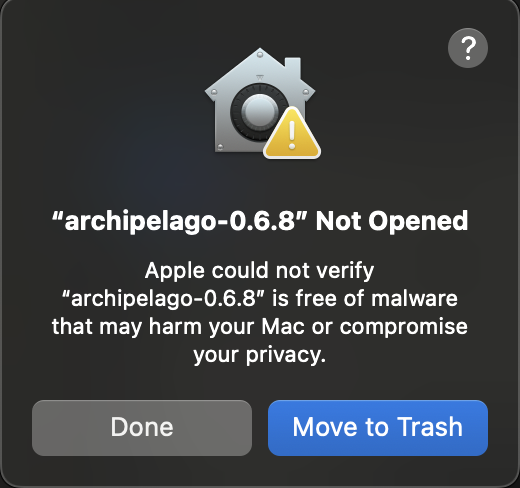
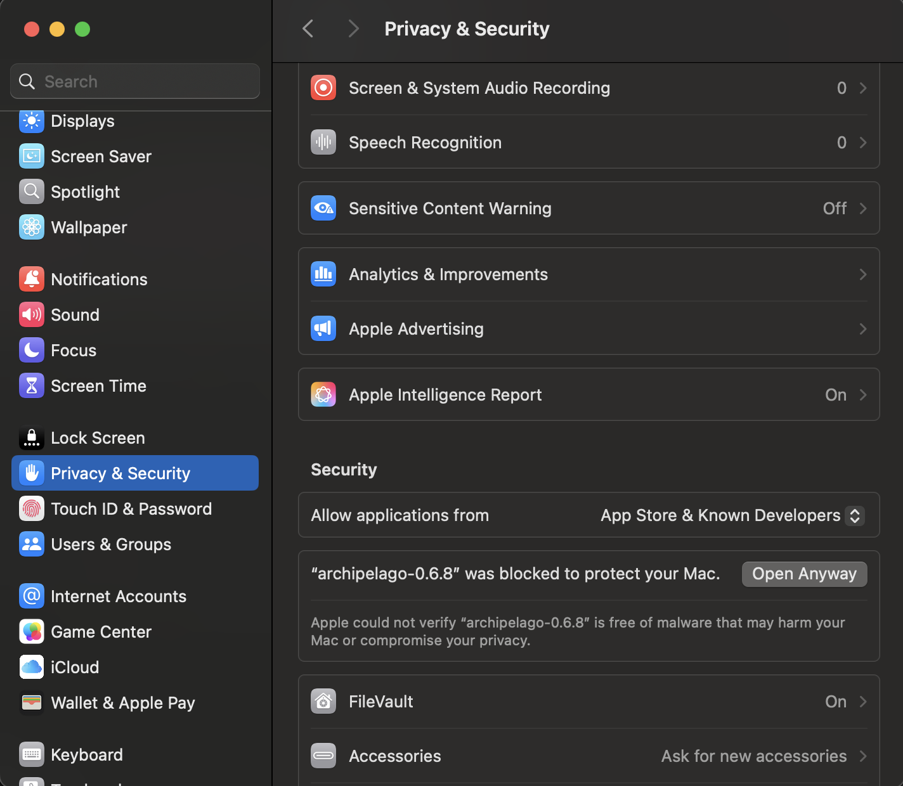
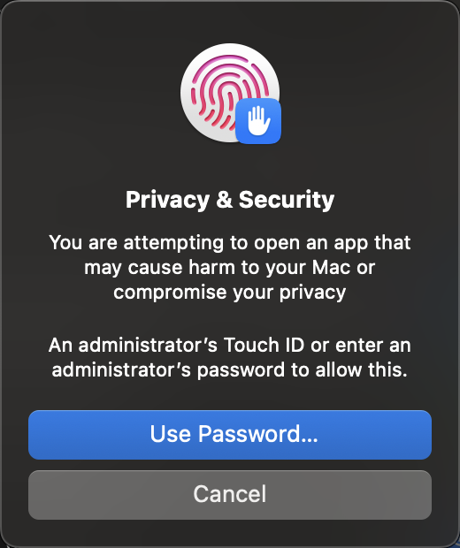
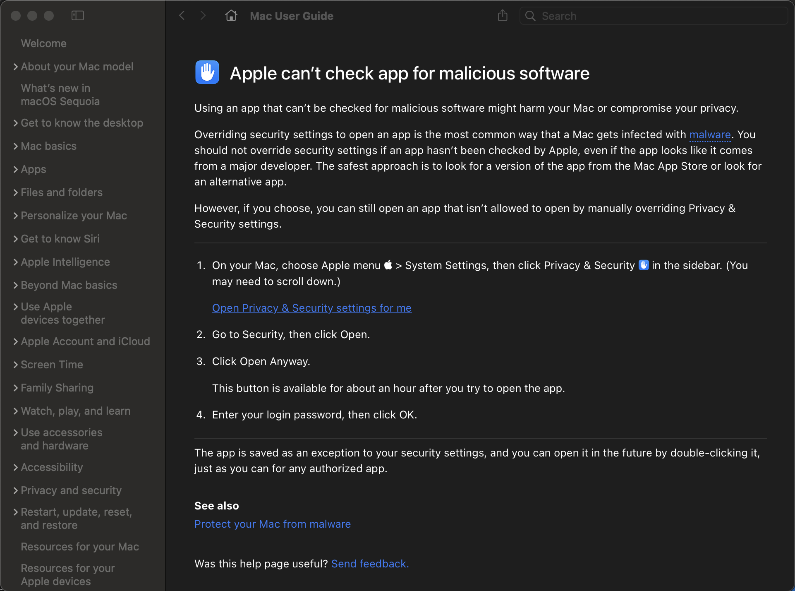

# Guide to Run Archipelago on macOS

There are two ways to run Archipelago on macOS: install the prebuilt App from the
`.dmg` released on GitHub (easiest), or run from source code (described later in this
guide).

## Installing the Prebuilt App (.dmg)
The prebuilt App is currently only available for Apple Silicon (M1 and newer). On an
Intel Mac, run from source code instead (see below).
1. Download the `Archipelago_<version>_macos-arm64.dmg` asset from the
   [Archipelago releases page](https://github.com/ArchipelagoMW/Archipelago/releases).
2. Double-click the `.dmg` to open it, then drag `Archipelago.app` into your
   `Applications` folder.

### "Apple could not verify Archipelago is free of malware"
The App is signed, but not notarized by Apple, so the first launch is blocked by
Gatekeeper. This is expected for an open-source app distributed without a paid Apple
Developer ID, and it is safe to open anyway. On macOS Sequoia (15) and newer, follow
these steps once; afterwards the App launches normally.

1. Double-click the App. You'll see a dialog saying it could not be verified to be free
   of malware. Click **Done** (do **not** click *Move to Trash*).

   

2. Open **System Settings → Privacy & Security** and scroll down to the **Security**
   section. You'll see a message that the App "was blocked to protect your Mac" with an
   **Open Anyway** button next to it. Click **Open Anyway**.

   

3. Confirm with Touch ID or your administrator password when prompted.

   

The App now opens, and from then on you can launch it normally by double-clicking.

Apple documents this same override flow in the
[Mac User Guide](https://support.apple.com/guide/mac-help/mh40616/mac); you can also
reach it from the **?** button on the first dialog.

> **Terminal alternative:** instead of the steps above, you can clear the quarantine
> flag directly: `xattr -dr com.apple.quarantine /Applications/Archipelago.app`

# Running Archipelago from Source Code on macOS
If you prefer not to use the prebuilt App, or you are on an Intel Mac, you can run from
source code instead. This section expects you to have some experience with running
software from the terminal.
## Prerequisite Software
Here is a list of software to install and source code to download.
1. Python 3.11.9 "universal2" or newer from the [macOS Python downloads page](https://www.python.org/downloads/macos/).
   **Python 3.14 is not supported yet.**
2. Xcode from the [macOS App Store](https://apps.apple.com/us/app/xcode/id497799835).
3. The source code from the [Archipelago releases page](https://github.com/ArchipelagoMW/Archipelago/releases).
4. The asset with darwin in the name from the [SNI Github releases page](https://github.com/alttpo/sni/releases).
5. If you would like to generate Enemized seeds for ALTTP locally (not on the website), you may need the EnemizerCLI from its [Github releases page](https://github.com/Ijwu/Enemizer/releases).
6. An Emulator of your choosing for games that need an emulator. For SNES games, I recommend RetroArch, entirely because it was the easiest for me to setup on macOS. It can be downloaded at the [RetroArch downloads page](https://www.retroarch.com/?page=platforms)
## Extracting the Archipelago Directory
1. Double click on the Archipelago source code zip file to extract the files to an Archipelago directory.
2. Move this Archipelago directory out of your downloads directory.
3. Open terminal and navigate to your Archipelago directory.
## Setting up a Virtual Environment
It is generally recommended that you use a virtual environment to run python based software to avoid contamination that can break some software. If Archipelago is the only piece of software you use that runs from python source code however, it is not necessary to use a virtual environment. 
1. Open terminal and navigate to the Archipelago directory. Alternatively, right click on the Archipelago folder in Finder and select 'New Terminal at Folder'.
2. Run the command `python3 -m venv venv` to create a virtual environment. Running this command will create a new directory at the specified path, so make sure that path is clear for a new directory to be created.
3. Run the command `source venv/bin/activate` to activate the virtual environment.
4. If you want to exit the virtual environment, run the command `deactivate`.
## Building the App
1. Run the command `python3 setup.py bdist_mac` to build an App Bundle.  This step may take a while.
2. Back in Finder, go to the new `build` subdirectory, and copy the Archipelago app you just made to your Applications directory.
## Steps to Run the Clients 
1. Launch the Archipelago Launcher
2. If your game doesn't have a patch file, just click the desired client in the right side column.
3. If your game does have a patch file, click the 'Open Patch' button and navigate to your patch file (the filename extension will look something like apsm, aplttp, apsmz3, etc.).
4. If the patching process needs a rom, but cannot find it, it will ask you to navigate to your legally obtained rom.
5. Your client should now be running and rom created (where applicable).
## Additional Steps for SNES Games
1. If using RetroArch, the instructions to set up your emulator [here in the Link to the Past setup guide](/tutorial/A%20Link%20to%20the%20Past/multiworld/en) also work on the macOS version of RetroArch.
2. Double click on the SNI tar.gz download to extract the files to an SNI directory. If it isn't already, rename this directory to SNI to make some steps easier.
3. Move the SNI directory out of the downloads directory, preferably into the Archipelago directory created earlier.
4. If the SNI directory is correctly named and moved into the Archipelago directory, it should auto run with the SNI client. If it doesn't automatically run, open up the SNI directory and run the SNI executable file manually.
5. If using EnemizerCLI, extract that downloaded directory and rename it to EnemizerCLI.
6. Move the EnemizerCLI directory into the Archipelago directory so that Generate.py can take advantage of it. 
7. Now that SNI, the client, and the emulator are all running, you should be good to go.
