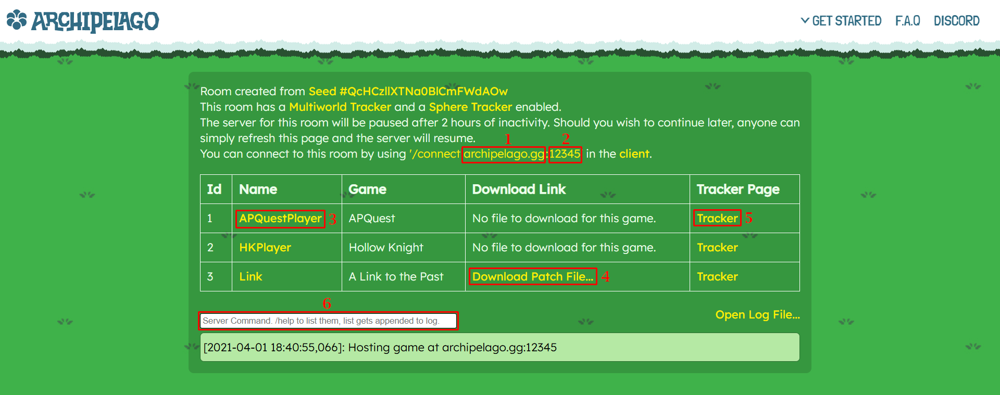

# Guide d'installation d'Archipelago

Ce guide a pour but de fournir une vue d'ensemble de la façon de :
- Installer, configurer et lancer le logiciel multimonde Archipelago
- Générer et héberger des multimondes
- Se connecter au multimonde une fois l'hébergement démarré

Ceci est une vue d'ensemble générale. Pour des étapes plus précises, référez-vous au [guide d'installation](/tutorial) du jeu concerné.

Certaines étapes supposent également l'utilisation de Windows et peuvent donc varier selon votre système d'exploitation.

## Installer le logiciel Archipelago

La version publique la plus récente d'Archipelago est disponible sur GitHub :
[Dernière version d'Archipelago](https://github.com/ArchipelagoMW/Archipelago/releases/latest).

Exécutez le fichier exe puis, après avoir accepté le contrat de licence, on vous demandera quels composants vous souhaitez installer.

Les installations d'Archipelago sont automatiquement fournies avec plusieurs programmes. Ceux-ci comprennent un lanceur, un générateur, un serveur et quelques clients.

- Le lanceur vous permet d'accéder rapidement aux différents composants et programmes d'Archipelago. Il porte le nom
  `ArchipelagoLauncher` et se trouve dans le répertoire principal de votre installation Archipelago.

- Le générateur vous permet de générer des parties multimonde sur votre ordinateur. Référez-vous à la section
  « Générer une partie » de ce guide pour plus d'informations à son sujet.

- Le serveur vous permet d'héberger le multimonde sur votre machine. L'hébergement sur votre machine nécessite de rediriger
  le port sur lequel vous hébergez. Le port par défaut d'Archipelago est `38281`. Si vous ne savez pas comment procéder, il
  existe de nombreux autres guides sur Internet mieux adaptés à votre matériel.

- Les clients servent à connecter votre jeu au multimonde. Certains jeux utilisent un client qui est automatiquement
  installé avec une installation d'Archipelago. Vous pouvez accéder à ces clients via le lanceur ou en parcourant votre
  installation Archipelago.

## Générer une partie

### Qu'est-ce qu'un YAML ?

Le YAML est le format de fichier qu'Archipelago utilise pour configurer le monde d'un joueur. Il vous permet de déterminer
à quel jeu vous allez jouer ainsi que les options que vous souhaitez pour ce jeu.

Le YAML est un format très similaire au JSON, mais conçu pour être plus lisible par les humains. Si vous avez un doute sur
la validité de votre fichier YAML, vous pouvez le vérifier en le téléversant sur la page de vérification du site
Archipelago : [Page de validation des YAML](/check)

### Créer un YAML

Les fichiers YAML peuvent être générés sur le site Archipelago en visitant la [page des jeux](/games) et en cliquant sur
le lien "Options Page" sous le jeu concerné. Cliquer sur "Export Options" dans la page d'options d'un jeu téléchargera le
YAML sur votre système.

Vous pouvez aussi lancer `ArchipelagoLauncher.exe` et cliquer sur `Generate Template Options` pour créer un ensemble de
YAMLs modèles pour chaque jeu de votre installation Archipelago (y compris pour les APWorlds). Ils seront placés dans votre
dossier `Players/Templates`.

Dans un multimonde, il doit y avoir un YAML par monde. N'importe quel nombre de joueurs peut jouer sur chaque monde, soit
en utilisant le système coopératif natif du jeu, soit en utilisant le support coopératif d'Archipelago. Chaque monde
occupera un slot dans le multimonde et aura un nom de slot ainsi que, si le jeu concerné le nécessite, des fichiers pour
l'associer à ce multimonde.

Si plusieurs personnes prévoient de jouer ensemble sur un même monde en coopération, elles n'auront besoin que d'un seul
YAML pour leur monde coopératif. Si chaque joueur prévoit de jouer à sa propre partie, alors chacun aura besoin de son
propre YAML.

### Générer une partie solo

#### Sur le site web

La façon la plus simple de commencer à jouer à une partie générée par Archipelago, après avoir suivi la configuration de
base du guide d'installation du jeu, est de trouver le jeu dans la [liste des jeux d'Archipelago](/games), de cliquer sur
`Options Page`, de définir les options selon votre façon de jouer, puis de cliquer sur `Generate Game` en bas de la page.
Cela créera une page pour la seed, à partir de laquelle vous pourrez créer une salle, puis vous
[connecter](#se-connecter-à-un-serveur-archipelago).

Si vous avez téléchargé les options, ou créé un fichier d'options manuellement, ce fichier peut être téléversé sur la
[page de génération](/generate) où vous pouvez également définir des paramètres d'hébergement spécifiques.

#### Sur votre installation locale

Pour générer une partie sur votre machine locale, assurez-vous d'avoir installé le logiciel Archipelago. Parcourez votre
installation Archipelago (généralement C:\ProgramData\Archipelago) et placez le fichier d'options que vous avez créé ou
téléchargé depuis le site dans le dossier `Players`.

Lancez `ArchipelagoGenerate.exe`, ou cliquez sur `Generate` dans le lanceur, et il vous indiquera si la génération a
réussi ou non. En cas de succès, un fichier zip de sortie se trouvera dans le dossier `output` (généralement nommé quelque
chose comme `AP_XXXXX.zip`). Il contiendra toutes les informations pertinentes pour la session, y compris le spoiler log,
s'il en a été généré un.

Veuillez noter que certains jeux nécessitent que vous possédiez leurs fichiers ROM pour pouvoir générer avec eux, car ils
sont nécessaires à la création des fichiers patch correspondants. Lorsque vous générez avec un jeu à ROM pour la première
fois, on vous demandera de localiser son fichier ROM de base. Cette étape n'a besoin d'être effectuée qu'une seule fois.

### Générer une partie multijoueur

Archipelago est une architecture multimonde multi-jeux, donc n'importe quel nombre de joueurs et n'importe quel nombre de
jeux peuvent être utilisés pour la génération. À noter que le site web a actuellement une limite de 30 joueurs par
génération. Si vous souhaitez générer une partie plus grande que cela, cela doit être fait sur une installation locale. En
général, il est préférable de générer localement afin de libérer les ressources du serveur, puis d'héberger le multimonde
obtenu sur le site web.

#### Rassembler tous les YAMLs des joueurs

Tous les joueurs qui souhaitent jouer dans le multimonde généré doivent disposer d'un fichier YAML contenant les options
avec lesquelles ils veulent jouer. Une personne doit rassembler tous les fichiers de tous les participants au multimonde
généré. Il est possible pour un même joueur d'avoir plusieurs jeux, ou même plusieurs slots d'un même jeu, mais chaque YAML
doit avoir un nom de joueur unique.

#### Sur le site web

Rassemblez tous les fichiers YAML des joueurs au même endroit, puis rendez-vous sur la [page de génération](/generate).
Sélectionnez les paramètres d'hébergement souhaités, cliquez sur `Upload File(s)` et sélectionnez tous les fichiers YAML
des joueurs. Le site accepte également les archives `zip` contenant des fichiers YAML.

Après un certain temps, vous serez redirigé vers une page d'informations sur la seed qui affichera la seed générée,
l'heure de sa création, le nombre de joueurs, le spoiler (s'il en a été créé un) et toutes les salles créées à partir de
cette seed.

#### Sur votre installation locale

Il est possible de générer le multimonde localement, à l'aide d'une installation Archipelago locale. Pour ce faire, entrez
dans le dossier d'installation d'Archipelago (généralement C:\ProgramData\Archipelago) et placez chaque fichier YAML dans
le dossier `Players`. Si le dossier n'existe pas, il faut le créer manuellement. Les fichiers placés ici ne doivent pas
être compressés.

Une fois le dossier `Players` rempli, lancez `ArchipelagoGenerate.exe` ou cliquez sur `Generate` dans le lanceur. Le
résultat de la génération est placé dans le dossier `output` (généralement nommé quelque chose comme `AP_XXXXX.zip`).

Veuillez noter que si un joueur de la partie que vous voulez générer joue à un jeu nécessitant un fichier ROM pour la
génération, vous aurez besoin des fichiers ROM correspondants.

##### Modifier les paramètres d'hébergement locaux pour la génération

Il arrive que vous souhaitiez modifier divers paramètres avant de générer une seed, comme activer le mode course (race
mode), la libération automatique (auto-release), le support du plando, ou définir un mot de passe.

Tous ces paramètres, et bien d'autres, peuvent être modifiés en éditant le fichier `host.yaml` dans le dossier
d'installation d'Archipelago. Vous pouvez accéder rapidement à ce fichier en cliquant sur `Open host.yaml` dans le
lanceur. Les paramètres choisis ici sont intégrés dans le fichier `.archipelago` produit avec les autres fichiers après
la génération ; donc si vous générez localement, assurez-vous que ce fichier est édité à votre convenance **avant** de
générer la seed. Ce fichier est écrasé lors de l'exécution du logiciel d'installation d'Archipelago. Si vous avez modifié
des paramètres dans ce fichier et souhaitez les conserver, vous pouvez renommer le fichier en `options.yaml`.

### Jouer avec des mondes personnalisés

Si vous générez localement, vous pouvez jouer avec des mondes qui ne sont pas inclus dans l'installation d'Archipelago. Ces
mondes sont empaquetés sous forme de fichiers `.apworld`. Pour ajouter un monde à votre installation, cliquez sur le bouton
"Install APWorld" dans le lanceur et sélectionnez le fichier `.apworld` que vous souhaitez installer. Vous pouvez aussi
glisser le fichier `.apworld` sur le lanceur ou double-cliquer sur le fichier lui-même (sous Windows). Une fois le monde
installé, il fonctionnera comme les mondes déjà fournis avec Archipelago. Notez également que, bien que la génération avec
des mondes personnalisés doive se faire localement, ces parties peuvent ensuite être téléversées sur le site web pour être
hébergées et jouées normalement.

Nous vous recommandons fortement de vous assurer que la source du fichier `.apworld` est sûre et digne de confiance avant
de jouer avec un monde personnalisé. Les APWorlds installés sont capables d'exécuter du code arbitraire sur votre
ordinateur chaque fois que vous ouvrez Archipelago.

#### Versions alternatives des mondes inclus

Si vous voulez jouer avec une version alternative d'un jeu déjà inclus dans Archipelago, vous devez également retirer
l'APWorld d'origine après avoir effectué l'installation ci-dessus. Pour ce faire, allez dans le dossier d'installation
d'Archipelago et accédez au répertoire `lib/worlds`. Déplacez ensuite le fichier `.apworld` ou le dossier correspondant au
jeu dont vous voulez jouer une version alternative vers un autre emplacement, en guise de sauvegarde. Si vous voulez
rejouer à cette version d'origine, restaurez la version d'origine dans `lib/worlds` et retirez la version alternative, qui
se trouve dans le dossier `custom_worlds`.

Remarque : actuellement, cela n'est pas possible avec la version Linux AppImage.

## Héberger un serveur Archipelago

Lorsqu'une seed multimonde est générée, les multidata sont produites sous la forme d'un fichier `.archipelago`. Si la
partie a été générée localement, un dossier compressé se trouvera dans `/output` et contiendra le fichier `.archipelago`,
le spoiler log et tous les fichiers pertinents pour les jeux générés.

### Héberger sur le site web

Une fois qu'une page de seed a été créée sur le site web, cliquer sur `Create Room` créera une nouvelle instance de
serveur, ainsi qu'une page dont le lien peut être partagé avec les autres joueurs, afin qu'ils puissent tous voir les
informations de connexion, obtenir leurs fichiers de données et se connecter au multimonde. Il suffit de cliquer sur l'url
dans la barre de titre, de copier le lien et de l'envoyer à vos amis. Le serveur d'une salle s'arrête après 2 heures
d'inactivité, en sauvegardant la progression du multimonde. En revenant sur la page de la salle, le serveur peut
être redémarré et le multimonde peut continuer à être joué. Si le lien vers la salle est perdu, le créateur de la salle peut
le retrouver sur sa [page de contenu utilisateur](/user-content). La personne qui a créé la salle en devient le
« propriétaire » (owner) et a, à ce titre, accès à la console du serveur. Effacer les cookies supprimera l'accès à cette
console, sans aucun moyen de le récupérer. Si un mot de passe de serveur a été défini lors de la génération de la partie
multimonde, des privilèges d'administrateur du serveur peuvent être obtenus en entrant `!admin <password>` depuis
l'`ArchipelagoTextClient.exe`.

#### La page de la salle

1. Nom du serveur / de l'hôte (Server/Host Name)
2. Port
3. Nom de slot (Slot Name)
4. Lien de téléchargement des fichiers de données
5. Lien vers la page de tracker de ce joueur

#### À partir d'une partie générée sur le site web

Après avoir généré une partie sur le site web, vous serez redirigé vers la page de la seed. Pour commencer à jouer, cliquez
sur `Create Room` afin de créer une nouvelle page de salle et un serveur pour votre partie.

#### À partir d'une partie générée localement

Après avoir généré une partie, un dossier compressé sera produit dans le dossier `/output`. Rendez-vous sur la
[page d'hébergement de partie d'Archipelago](/uploads), cliquez sur `Upload File`, parcourez votre installation Archipelago
et sélectionnez le dossier généré. Cela créera une nouvelle page de seed à partir des informations contenues dans ce
dossier.

### Héberger sur une machine locale

Le fichier `.archipelago` peut être extrait du fichier compressé. Double-cliquer sur ce fichier ouvrira alors
`ArchipelagoServer.exe` afin d'héberger le multimonde sur la machine locale. Vous pouvez aussi lancer `ArchipelagoServer.exe`
et indiquer, dans la fenêtre de sélection de fichier qui apparaît, le fichier `.archipelago` ou le dossier compressé généré
pour démarrer l'hébergement.

## Se connecter à un serveur Archipelago

La méthode de connexion exacte varie selon le jeu, suivez donc le guide d'installation de ce jeu, mais tous les jeux
utilisent les mêmes informations de connexion générales indiquées ici.

### Informations de connexion

Pour vous connecter du jeu au serveur, les informations de connexion sont nécessaires pour n'importe quel client de jeu.
Les jeux qui utilisent des fichiers de données contiennent généralement les informations de connexion dans ces fichiers,
lorsqu'ils sont hébergés sur le site web d'Archipelago. Si les informations doivent être saisies manuellement, elles se
composent généralement de quatre parties différentes.

* `Server`, `Server Name` ou `Host Name` sont utilisés de manière interchangeable pour désigner le domaine ou l'adresse IP
du serveur. Si la partie est hébergée sur le site web principal d'Archipelago, ce sera `archipelago.gg`. Si la partie est
hébergée sur votre propre machine locale, `localhost` fonctionnera. Si la partie est hébergée sur l'ordinateur d'une autre
personne, vous saisissez l'adresse IP publique de cette personne.
* `Port` correspond au port du domaine ou de l'adresse IP sur lequel la partie est hébergée. Sur les pages de salle du site
web, il est affiché sous la forme `archipelago.gg:<port>`. La plupart des clients acceptent que cette information soit
saisie directement telle quelle. Si l'information doit être saisie séparément, alors le port est la suite de chiffres après
le `:`, et le `:` n'a pas besoin d'être saisi. Si une partie est hébergée depuis l'`ArchipelagoServer.exe`, la valeur par
défaut sera `38281` mais peut être modifiée dans le `host.yaml`.
* `Slot Name` est le nom de votre slot de joueur auquel vous vous connectez. C'est le même que le nom défini lors de la
création de votre [fichier YAML](#créer-un-yaml). Si la partie est hébergée sur le site web, il est également affiché sur la
page de la salle. Le nom est sensible à la casse.
* `Password` est le mot de passe défini par l'hôte pour rejoindre le multimonde. Par défaut, il est vide et n'est presque
jamais requis, mais un mot de passe peut être défini lors de la génération de la partie. En général, laissez ce champ vide
lorsqu'il est présent, sauf si vous savez qu'un mot de passe a été défini et quel est ce mot de passe.
