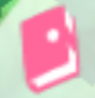

# PokéPark Wii: Pikachu's Adventure

## What does randomization do to this game?

Pokémon friendship and unlocking Pokémon in the overworld are randomized. Befriending Pokémon, completing
events, quests and playing minigames are treated as locations.

The story has been removed, and a few small changes were made to the game’s logic to support randomization.

## Special Locations

Some locations are only accessible once certain other locations have been checked. For example, Caterpie will only
appear if its unlock location has been checked. This means the location for befriending Caterpie becomes available only
after its unlock location is checked.

The following locations are affected:

| Zone         | Friendship Location | Unlock Location                          |
|--------------|---------------------|------------------------------------------|
| Cavern Zone  | Magnemite 1         | Magnemite Crate Dash Entrance Area       |
| Cavern Zone  | Magnemite 2         | Magnemite Crate Dash Magma Zone Entrance |
| Cavern Zone  | Magnemite 3         | Magnemite Crate Dash Magma Zone Entrance |
| Cavern Zone  | Diglett             | Diglett Crate Dash                       |
| Magma Zone   | Baltoy              | Baltoy Crate Dash                        |
| Haunted Zone | Metapod             | Metapod Tree Dash left Entrance Side     |
| Haunted Zone | Kakuna              | Kakuna Tree Dash right Entrance Side     |
| Haunted Zone | Voltorb             | Voltorb vase dash blue gem room          |

## Zone Unlocks

The spawn region is the Treehouse. Other zones are unlocked through the corresponding item, but the visual state of the
gates leading to these zones depends on the world state. As a result, the gates may appear open, but access is only
possible once the corresponding zone unlock item has been obtained.

## Instruction

The client modifies assembly instructions through memory manipulation. However, since Dolphin caches instructions, it is
necessary to connect the client at the main menu to ensure that all necessary modified instructions are properly
overwritten.

## Modified Game Logic

When interacting with Pokémon in the overworld, if their corresponding friendship location is unchecked, the friendship
is deactivated, and the diary logo indicating friendship status will be missing. However, if the friendship location has
already been checked, the Pokémon's friendship is set during the interaction, and the diary logo will appear, indicating
that the friendship location has been checked.

## Known Issues / Limitations

- The first time completing the Prisma Shard goal in a minigame will cause the player to be ejected, which is required
  to check the Prisma location.
- Tracker is currently missing.
- Item classifications are heavily focused on progression items.
- Minigames and friendships still reward Berries (currency). This is intentional for now, as removing it leads
  potentially to
  excessive grinding.

## Future

- Adding configuration options for battle count Pokemon (e.g Scyther) and friendship count Pokemon (e.g Leafeon)
- Adding more event Pokemon as Locations
- Visualizing closed Zone Gates
- Creating own Zone Unlock for Magma Zone
- Model Randomization

